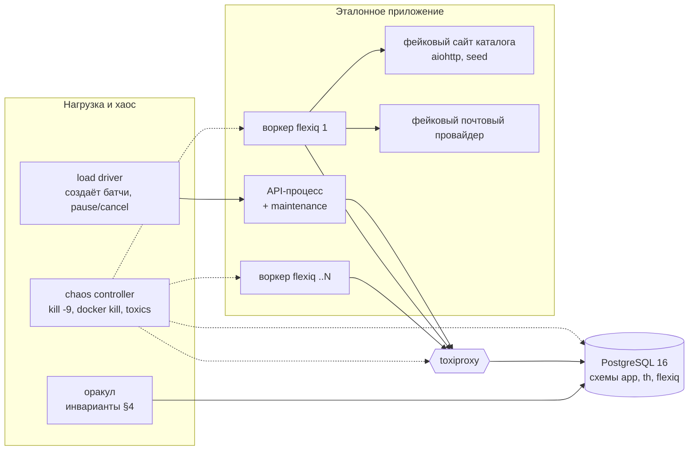

# tallyho — правила приёмки v1

> Версия 1.0-draft · 2026-09-30 · к [ARCHITECTURE.md](ARCHITECTURE.md) v2.1
> Релиз v1 принимается, только если **все** критерии этого документа зелёные на эталонном стенде, а nightly-прогоны зелёные 3 раза подряд без перезапусков.

## Содержание

1. [Принципы](#1-принципы)
2. [Стенд](#2-стенд)
3. [Эталонное тестовое приложение](#3-эталонное-тестовое-приложение)
4. [Оракул консистентности: инварианты](#4-оракул-консистентности-инварианты)
5. [A-DB: транзакции с доменными таблицами](#5-a-db-транзакции-с-доменными-таблицами)
6. [A-CH: горячие отказы (хаос)](#6-a-ch-горячие-отказы-хаос)
7. [A-UC: сценарии использования](#7-a-uc-сценарии-использования)
8. [A-FQ: интеграция с flexiq](#8-a-fq-интеграция-с-flexiq)
9. [A-PERF: производительность](#9-a-perf-производительность)
10. [A-NF: нефункциональные требования](#10-a-nf-нефункциональные-требования)
11. [Процедура приёмки](#11-процедура-приёмки)

---

## 1. Принципы

1. **Всё на реальной инфраструктуре.** PostgreSQL в контейнере, настоящие воркеры flexiq в отдельных процессах. `InlineBroker` допустим только в юнит-тестах, в приёмке — нет.
2. **Каждая задача пишет в доменные таблицы в одной транзакции со своим завершением** (`th.item.complete_in(session)`). Каждый хук пишет в домен. Проверяем ровно тот путь, которым будут пользоваться.
3. **Сеть эмулируется всегда.** В каждой задаче — случайный `asyncio.sleep` от 1 до 5 с. Дополнительно toxiproxy между процессами и PostgreSQL.
4. **Корректность проверяет оракул, а не глаза.** После каждого прогона автоматически проверяются инварианты §4. Один нарушенный инвариант — прогон красный.
5. **Воспроизводимость.** Вся случайность (задержки, ошибки, моменты отказов, данные) — от одного `seed`. Упавший прогон воспроизводится командой `make acceptance SEED=...`.
6. **Отказ — это норма.** Хаос-сценарии (§6) идут поверх каждого use case (§7), а не отдельно от них.

---

## 2. Стенд



| Компонент | Функциональные прогоны | Эталонный стенд производительности |
|---|---|---|
| PostgreSQL | 16, docker, `fsync=on`, `synchronous_commit=on` | 16, 8 vCPU / 32 ГБ / NVMe, настройки из доки tallyho |
| Воркеры flexiq | 4 процесса, `pool="thread"`, `async_concurrency=100` | 8–16 процессов на отдельных хостах |
| Хранилище flexiq | тот же PostgreSQL, схема `flexiq` | то же |
| Maintenance | в lifespan API-процесса, 2 реплики API (проверка лидерства) | то же |
| toxiproxy | между всеми процессами и PG | выключен (кроме P-05) |
| Версии | Python 3.11 и 3.13; flexiq 2.0.x (последний патч) и master | Python 3.13, flexiq последний релиз |

---

## 3. Эталонное тестовое приложение

Лежит в репозитории (`tests/acceptance/app`) и заодно служит примером. Три домена по трём обязательным сценариям.

### 3.1 Общие правила для каждой задачи

```python
async def network() -> None:
    await asyncio.sleep(rng_for(th.item.id()).uniform(1.0, 5.0))    # детерминировано seed + item_id

@fq.task(max_retries=3, retry_on=[TransientError])
async def some_task(...):
    await network()                                       # «внешний вызов»
    maybe_fail(p_transient=0.05, p_permanent=0.01)        # инъекция ошибок
    async with db.begin() as s:
        if rng.random() < 0.2:
            await network()                               # 20% задач держат транзакцию открытой 1–5 с
        s.add(DomainRow(item_id=th.item.id(), ...))       # UNIQUE(item_id) — эффект ровно один раз
        th.item.ok("done")
        await th.item.complete_in(s)                      # доменная запись и завершение — одна транзакция
```

* Каждая доменная строка несёт `item_id` с `UNIQUE`. По этому ключу оракул проверяет «эффект ровно один раз».
* Хуки `on_finalized` / `on_progress` / `on_policy_breach` пишут в доменные таблицы и **дополнительно** в журнал `hook_log(batch_id, hook, seq, state, txid, at)` той же транзакцией. Журнал нужен для проверки единственности и порядка.
* Побочные эффекты вне БД (фейковый сайт, фейковый почтовый провайдер) ведут свой журнал вызовов.

### 3.2 Сценарии-домены

| Сценарий | Домен | Структура tallyho | Объём (функц. / перф.) |
|---|---|---|---|
| **S1. Известное число задач** | `invoices` → `render_invoice(invoice_id)` пишет `invoice_files(item_id UNIQUE)` и `invoices.status='rendered'` | один батч, `map` на всё, `seal` | 20 000 / 1 000 000 |
| **S2. Неизвестное число задач** | кампания рассылки из ARCHITECTURE §12: `expand_audience` → `send_email`; `deliveries(item_id UNIQUE, label)` | корень + этапы `expand` → `send` (`fed_by`), 1% дублей адресов | аудитория 20 000 / 1 000 000 |
| **S3. Конвейер парсинга** | фейковый сайт: страницы → карточки → PDF; `cards(item_id UNIQUE)`, `pdf_files(item_id UNIQUE, bytes)` | корень + `pages` → `cards` → `pdfs` (`fed_by`), `max_items`, `max_depth=1` | 50 страниц / 2 000 страниц |

Генератор фейкового сайта для S3 (все параметры от seed):
* 20–60 карточек на странице, 0–6 PDF на карточке;
* 5% ссылок-дублей между страницами и карточками;
* 3% ответов 404 (ошибка без ретраев) и 5% ответов 503 (ретраи);
* 2% пустых страниц, 1% карточек без PDF;
* 1% циклических ссылок «страница → уже разобранная страница» (проверка `max_depth` и дедупликации);
* вариант «пустой этап»: у каталога нет ни одного PDF.

Генератор знает **эталонную истину**: сколько уникальных карточек и PDF должно получиться, сколько дублей и сколько 404. Оракул сверяет с ней.

---

## 4. Оракул консистентности: инварианты

Проверяются после каждого прогона, когда хаос остановлен и прошло время восстановления `T_rec = lease_ttl + 2 × sweep_interval + 30 с` (по умолчанию ≈ 100 с).

| ID | Инвариант | Как проверяется |
|---|---|---|
| **I-01** | Ничего не зависло: все батчи терминальны | `SELECT count(*) FROM th_batch WHERE state IN (open, sealed, finalizing)` = 0 |
| **I-02** | Нет хвостов | `th_outbox`, `th_lease`, `th_counter_delta` пусты |
| **I-03** | Финализация ровно одна | в `hook_log` ровно одна запись `on_finalized` на батч (+1 на каждый `retry_failed`, если сценарий его вызывал) |
| **I-04** | Доменный эффект задачи ровно один раз | для каждого батча: `count(доменные строки) = ok`; строк у Items в `error/skip/cancelled` нет |
| **I-05** | Счётчики = источник истины | `th_counter + th_counter_delta` = `count(*) GROUP BY state` по `th_item`; `th_metric` labels = `count(*) GROUP BY label` |
| **I-06** | Домен = tallyho | итоговые цифры, записанные `on_finalized` в доменную строку, равны финальным счётчикам (`view()` до retention) |
| **I-07** | Эталонная истина | S2: `found(send)` = уникальные адреса, `duplicates` = дубли. S3: `found(cards)`, `found(pdfs)`, `duplicates`, `skipped_by_limit`, число 404 совпадают с генератором |
| **I-08** | Монотонность снимков | в `hook_log` для `on_progress` `seq` строго растёт; нет ни одного `on_progress`, закоммиченного после `on_finalized` того же батча; доменный `progress` не убывает |
| **I-09** | Порядок в дереве | для каждого этапа `finished_at ≥ max(finished_at источников)`; `on_finalized` детей закоммичен раньше родительского (по `txid`/`at` в `hook_log`) |
| **I-10** | Статус Item соответствует брокеру | каждый Item, джоба которого в DLQ flexiq, в tallyho имеет класс `error`; нет Items в `ok` без доменной строки |
| **I-11** | Побочные эффекты вне БД под контролем | число вызовов внешних сервисов ≤ `ok + skip + error + ретраи + число kill -9 в момент выполнения`. Повторные письма допустимы **только** если воркер убит между `send` и commit. Их число ≤ числа таких убийств и отражается в отчёте |
| **I-12** | Итог точный после seal | у каждого закрытого батча `expected = found`, `expected_is_estimate = false` |
| **I-13** | Дерево согласовано | нет этапа в `open`, у которого все источники терминальны; нет Items у отменённого батча в `active` |
| **I-14** | Retention ничего не потерял | после retention доменные итоги (I-06) на месте; `BatchPurged` только у батчей, прошедших retention и `release` |

---

## 5. A-DB: транзакции с доменными таблицами

| ID | Проверка | Ожидаемый результат |
|---|---|---|
| A-DB-01 | `complete_in` + доменная запись, затем исключение до commit | нет ни доменной строки, ни завершения Item; Item выполнится повторно и завершится один раз (I-04) |
| A-DB-02 | Создание батча в транзакции пользователя + доменная строка, затем rollback | нет ни батча, ни доменной строки; шпион брокера видит 0 отправок |
| A-DB-03 | `pause`/`resume`/`cancel`/`reschedule`/`release` в транзакции пользователя, затем rollback | состояние tallyho не изменилось |
| A-DB-04 | `on_finalized` пишет в домен; инъекция ошибки в хуке (20% вызовов) | финализация не происходит, пока хук не закоммитится; повторы с backoff; итог один (I-03, I-06) |
| A-DB-05 | `commit()` / `rollback()` внутри хука | исключение `HookTransactionError`, финализации нет |
| A-DB-06 | Пользователь в транзакции `REPEATABLE READ` и `SERIALIZABLE` вызывает `complete_in`, `batch()`, `pause()` при нагрузке | 0 ошибок `40001` из-за таблиц tallyho (конфликты на своей строке Item допустимы и документированы) |
| A-DB-07 | 20% задач держат транзакцию открытой 1–5 с внутри `complete_in` | остальные завершения не ждут блокировок: в `pg_locks` нет ожиданий на `th_counter` дольше 100 мс |
| A-DB-08 | Код пользователя блокирует доменную строку и вызывает `handle.pause`, пока идёт финализация с хуком по той же строке | 0 дедлоков, дошедших до пользователя (внутренние `40P01` повторяются автоматически и видны в метрике) |
| A-DB-09 | `complete_in` внутри `session.begin_nested()`, savepoint откатывается | Item не завершён, доменной записи нет |
| A-DB-10 | Приём сессий: `AsyncSession`, `AsyncConnection`, сессия с `autoflush=False`, `expire_on_commit=False` | всё работает одинаково |
| A-DB-11 | pgbouncer в режиме transaction pooling (asyncpg с `statement_cache_size=0`, psycopg 3) | все сценарии §7 зелёные |
| A-DB-12 | Доменная таблица в другой схеме той же БД | всё работает; в другой БД — явная ошибка конфигурации при регистрации хука |

---

## 6. A-CH: горячие отказы (хаос)

Каждый хаос-сценарий запускается поверх **S1, S2 и S3** с эмуляцией сети. Критерий прохождения: все инварианты §4 зелёные и восстановление после последнего отказа уложилось в `T_rec`.

| ID | Отказ | Как | Дополнительно ожидаем |
|---|---|---|---|
| A-CH-01 | Горячее выключение воркеров | `kill -9` случайного воркера каждые 5–30 с, супервизор поднимает его заново | Items убитого воркера переотправлены после истечения lease; повторы писем — только по I-11 |
| A-CH-02 | Горячее выключение БД | `docker kill postgres` (и отдельно `pg_ctl stop -m immediate`) в случайный момент; подъём через 5–60 с | процессы переподключаются сами; ни одной потерянной или задвоенной финализации; outbox досылается |
| A-CH-03 | Выключение БД во время финализации с хуком | триггер: `kill` PG, когда в `pg_stat_activity` виден запрос хука `on_finalized` | финализация выполнится после восстановления, ровно один раз |
| A-CH-04 | Выключение БД во время flush Completer | триггер по метрике «flush in progress» | задачи, чьи завершения не закоммичены, выполняются повторно; доменный эффект один (I-04) |
| A-CH-05 | Сетевой разрыв воркер ↔ PG | toxiproxy `timeout` на 10–60 с для одного воркера | lease истекает, Items уходят другим воркерам; после восстановления сети отставший воркер получает CAS = 0 строк и не портит данные |
| A-CH-06 | Задержки и джиттер сети до БД | toxiproxy `latency` 50–500 мс, `jitter` 100 мс, весь прогон | только замедление, корректность полная |
| A-CH-07 | Смена лидера maintenance | `kill -9` API-процесса-лидера | второй экземпляр берёт лидерство ≤ 2 × `sweep_interval`; relay, sweeper и снимки продолжаются |
| A-CH-08 | Мягкая остановка воркеров | `SIGTERM` при нагрузке | выполняющиеся задачи дорабатывают или освобождают lease сразу, без ожидания `lease_ttl` |
| A-CH-09 | Рассинхрон часов | libfaketime ±5 мин на части воркеров | lease, `start_at`, дедлайны считаются по часам БД; поведение не отличается от прогона без смещения |
| A-CH-10 | Повторная доставка | `requeue_job`, `replay`, `retry_dead` flexiq для 10% случайных джоб | повторные выполнения — no-op (claim), I-03 и I-04 зелёные |
| A-CH-11 | Долгая транзакция в кластере | открытая транзакция, держащая `backend_xmin`, на 10 минут во время нагрузки | корректность полная; деградацию скорости фиксируем в отчёте, после закрытия транзакции скорость восстанавливается |
| A-CH-12 | Всё сразу | 30 минут: A-CH-01 + 02 + 05 + 06 + 10 со случайным расписанием | все инварианты |

Длительность: nightly — по 10 минут на комбинацию «сценарий × отказ», pre-release — по 60 минут и A-CH-12 два часа на каждом сценарии.

---

## 7. A-UC: сценарии использования

### 7.1 Обязательные (по требованиям)

| ID | Сценарий | Шаги | Ожидаемый результат |
|---|---|---|---|
| **A-UC-01** | Батч с известным числом задач (S1) | `batch` → `map` 20 000 → `seal` в одной транзакции с доменной записью «запуск»; воркеры с сетью 1–5 с и ошибками 5%/1% | итог `completed_with_errors` с ≈1% ошибок; `found = 20 000` с первой секунды; `expected` точный сразу; прогресс в домене монотонный; I-01…I-14 |
| **A-UC-02** | Батч с неизвестным числом задач (S2) | кампания `expand → send`, аудитория 20 000 с 1% дублей, `expected_total` задан | `send` стартует до конца `expand`; `send` закрывается сам после `expand`; `duplicates = 200`; итог и `breakdown` в `campaigns` совпадают с эталоном |
| **A-UC-03** | То же без `expected_total` | S2, но размер аудитории не передан | оценка итога появляется после `min(20, 5%)` страниц, становится точной после финализации `expand`; I-12 |
| **A-UC-04** | Конвейер парсинга (S3) | `pages → cards → pdfs`, генератор сайта из §3.2 | `cards` и `pdfs` работают параллельно с `pages`; каскад seal; числа совпадают с эталоном генератора (I-07); `in_flight` показывает `th.item.progress` скачивания |
| **A-UC-05** | Конвейер с пустым этапом | каталог без PDF | `pdfs` закрыт и финализирован при `found = 0`, корень финализирован, статус в домене — `completed` |
| **A-UC-06** | Упавший источник | 100% ошибок на `cards`: `on_feeder_failed="seal"`, затем `"cancel"` | `pdfs` закрывается и доделывает полученное / получает запрос отмены; итоги в домене соответствуют |

### 7.2 Дополнительные

| ID | Сценарий | Ожидаемый результат |
|---|---|---|
| A-UC-07 | Вложенные под-батчи глубиной 3 (`sub_batch` из задачи) | родитель финализируется только после детей; I-09 |
| A-UC-08 | `start_at` + `reschedule` + отмена до старта | до `start_at` 0 отправок; после переноса — старт в новое время; отмена до старта → `on_finalized(cancelled)`, 0 выполнений |
| A-UC-09 | Пауза и продолжение под нагрузкой (S1, S2, S3) | после `pause` новые выполнения прекращаются ≤ 1 с (кроме уже выполняющихся), пришедшие из брокера паркуются; после `resume` всё доделывается |
| A-UC-10 | Авто-пауза по политике | набор с 8% `hard_bounce` → пауза всего дерева после `min_processed`, `on_policy_breach` записал причину |
| A-UC-11 | Отмена посреди работы | остаток `cancelled`, выполняющиеся доделываются, `on_finalized(cancelled)` один раз |
| A-UC-12 | Дедлайн | по истечении → `failed(reason=deadline)`, остаток отменён |
| A-UC-13 | `retry_failed` батча и корня конвейера | перезапускаются только упавшие; `on_finalized` вызывается повторно с новым итогом; ошибка `DownstreamFinalized` там, где положено |
| A-UC-14 | Retention и `release` | без `release_required` — удаление через TTL; с ним — только после `release()`; I-14 |
| A-UC-15 | Лимиты | циклические ссылки S3 упираются в `max_depth`; `max_items` на дерево не превышен больше чем на размер одного flush на процесс; `skipped_by_limit` совпадает с эталоном |
| A-UC-16 | Идемпотентность | повторный `batch(kind, key)` возвращает тот же батч; повторный `sub_batch(key)` — тот же этап; spawn с тем же `key` — дубль, а не новый Item |
| A-UC-17 | Хук не импортирован в процессе | воркер без `hook_modules` не финализирует батч, метрика `th_hook_missing`; финализирует maintenance с хуком |
| A-UC-18 | Правило записи в этап | spawn `into=` в этап, для которого текущий батч не источник → `SpawnTargetError`; продюсер не может `add` в этап с `fed_by` |
| A-UC-19 | Прогресс | `view()` и снимки: оценка появляется по правилу `min(20, 5%)`; ETA есть, когда известен `expected`; доля не откатывается в домене благодаря `GREATEST` |
| A-UC-20 | `watch()` | при 10 000 изменений в секунду подписчик получает обновления не чаще `watch_throttle` на батч и не пропускает финальное состояние |

---

## 8. A-FQ: интеграция с flexiq

Требование: **постановка отслеживаемой задачи поддерживает все возможности flexiq**, кроме явно перечисленных несовместимых, которые дают понятную ошибку (ARCHITECTURE §11.4).

| ID | Проверка | Ожидаемый результат |
|---|---|---|
| A-FQ-01 | Аргументы: позиционные, именованные, значения по умолчанию, `*args`, `**kwargs`, `None`, unicode, большие (1 МБ), dataclass/pydantic через `serializer`/`codecs` | функция получает ровно то, что передано; служебный `_th` в функцию не попадает; имя задачи во flexiq не изменилось |
| A-FQ-02 | `metadata` | во flexiq (`get_job().metadata`) и в DLQ — **байт в байт** то, что передал пользователь, включая `None` |
| A-FQ-03 | `notes` | без изменений; невалидные `notes` (16 ключей, > 4096 байт) — ошибка **при постановке в продюсере**, а не при отправке relay'ем |
| A-FQ-04 | `priority`, `queue`, `max_retries`, `timeout`, `expires`, `result_ttl` | видны в джобе flexiq и влияют на исполнение: приоритет соблюдается, очередь та, `expires` отбрасывает просроченную джобу → Item `error("expired")` |
| A-FQ-05 | `delay` | задача стартует не раньше `отправка + delay`; вместе со `start_at` — не раньше `start_at + delay` |
| A-FQ-06 | `idempotency_key`, `unique_key`, `idempotent=True` пользователя | передаются как есть; повторная отправка relay'ем не создаёт второго выполнения |
| A-FQ-07 | Несовместимые: `depends_on`, `debounce*`, `@task(batch=...)` | явная ошибка `UnsupportedOption` с подсказкой (этапы `fed_by`) |
| A-FQ-08 | Ретраи: `max_retries`, `retry_backoff`, `retry_delays`, `max_retry_delay`, `retry_on`, `dont_retry_on` | число выполнений = число попыток flexiq; итог Item: `ok` после успешной попытки, `error("exhausted")` после последней |
| A-FQ-09 | `retry_budget`, `circuit_breaker` отправляют в DLQ вопреки вердикту `RETRY` | Item становится `error` через `on_dead_letter` или сверку DLQ ≤ `sweep_interval`; батч не зависает |
| A-FQ-10 | `timeout` (жёсткий) — поток продолжает работать после таймаута; `soft_timeout` + `check_timeout()` | жёсткий: ретрай flexiq отсекается живым lease, итог один; мягкий: `SoftTimeoutError` → ретрай или `error` |
| A-FQ-11 | `cancel_job`, `cancel_running_job` + `check_cancelled()` из flexiq | отменённая джоба → Item `cancelled`; батч финализируется |
| A-FQ-12 | `rate_limit`, `max_concurrent`, `max_in_flight_per_task` вместе с нашим `max_in_flight` | действуют оба ограничения, фактическая параллельность ≤ минимума |
| A-FQ-13 | Своя middleware пользователя (глобальная и на задаче), `inject`, `predicate` | вызываются как без tallyho; наша обёртка не мешает `before/after` |
| A-FQ-14 | `retry_dead`, `replay`, авто-ретрай DLQ из flexiq | новые id джоб → no-op по claim; перезапуск упавших — только `retry_failed` (документировано) |
| A-FQ-15 | `pool="prefork"` | явная ошибка при `install`; sync-функция под `@fq.task` — ошибка при декорировании |
| A-FQ-16 | Совместная работа с обычными задачами flexiq | неотслеживаемые задачи в тех же очередях работают как раньше; `th.item.current()` в них — `None` |
| A-FQ-17 | Совместимость версий | весь §8 зелёный на flexiq 2.0.x (последний патч) и master; при несовместимом API — понятная ошибка при `install` |

---

## 9. A-PERF: производительность

Целевые значения ниже — **стартовые**. После первого замера на эталонном стенде их фиксирует владелец продукта, и дальше они не снижаются без явного решения. Всё меряется с включённым оракулом на выборке, корректность на нагрузке обязательна.

| ID | Что меряем | Условия | Критерий |
|---|---|---|---|
| P-01 | Накладные расходы tallyho | пустые задачи, та же конфигурация flexiq с tallyho и без | пропускная способность ≥ 80% от «голого» flexiq; добавленная p99-задержка на задачу ≤ 50 мс |
| P-02 | Абсолютная пропускная способность | S1 без сна, 8 процессов × 100, 30 минут | ≥ 5 000 завершений/с устойчиво; без роста очереди Completer |
| P-03 | Масштабирование по воркерам | 1 → 2 → 4 → 8 → 16 процессов | рост ≥ 0,7 от линейного, пока CPU PostgreSQL < 80% |
| P-04 | Масштаб по числу батчей и Items | матрица ARCHITECTURE §14: 1k×1k, 50k×1k, 1k×50k, конвейер 5M, режим «история 50M» | p99 каждой операции в конце ≤ 1,5× p99 в начале; EXPLAIN-гард без `Seq Scan` |
| P-05 | Реалистичная нагрузка | сеть 1–5 с, 8 × 100 параллельности | пропускная способность ≥ 90% от `параллельность / средний сон` (≈ 240 из 267 задач/с) — библиотека не узкое место |
| P-06 | Путь «завершение в транзакции пользователя» | S1 с `complete_in` и 20% транзакций, открытых 1–5 с | ожидания блокировок на таблицах tallyho < 1% времени; пропускная способность ≥ 80% от P-05 |
| P-07 | Каскад конвейера | S3 на 5M Items | от финализации источника до seal этапа p99 ≤ 1 с; до финализации пустого этапа p99 ≤ 2 с |
| P-08 | Снимки прогресса | 10 000 активных деревьев, `every=2s` | отставание снимков ≤ 1 интервала; CPU лидера < 1 ядра |
| P-09 | Восстановление | A-CH-01 и A-CH-02 на P-02 | возврат к ≥ 90% пропускной способности ≤ `T_rec` после восстановления |
| P-10 | Ресурсы БД | 1 час P-02 | WAL на завершение и рост `th_counter`/`th_lease` (pgstattuple) — в отчёте; autovacuum успевает (dead tuples не растут монотонно) |
| P-11 | Retention | удаление деревьев на 50M Items | не блокирует рабочую нагрузку: p99 finish во время retention ≤ 1,2× без неё |

---

## 10. A-NF: нефункциональные требования

| ID | Требование | Проверка |
|---|---|---|
| A-NF-01 | Установка в схему пользователя | `migrate()` и миграции Alembic в схему `app`; две независимые установки в разных схемах одной БД не видят друг друга |
| A-NF-02 | Онлайн-миграции | обновление схемы v1 → v1.1 на базе с 10M Items без блокировок дольше 1 с (`lock_timeout` в миграциях) |
| A-NF-03 | Безопасность идентификаторов | имена схем и префиксов экранируются; `key`, `label`, `kind` со спецсимволами и SQL-фрагментами хранятся как данные |
| A-NF-04 | Типизация | публичный API и примеры проходят `pyright --strict`; `th.call(fn, ...)` ловит неверные аргументы на этапе типизации |
| A-NF-05 | Архитектурные границы | `import-linter` из ARCHITECTURE §3.3 зелёный |
| A-NF-06 | Покрытие | `tallyho.engine`, `tallyho.storage` ≥ 90% строк и ветвлений; мутационное тестирование критичных CAS-запросов (mutmut) без выживших мутантов |
| A-NF-07 | Документация | все примеры кода из доки выполняются в CI; ARCHITECTURE §12 и §13 собраны как рабочее тестовое приложение (§3) |
| A-NF-08 | Наблюдаемость | метрики из доки экспортируются (`th_hook_failures`, `th_hook_missing`, лаг relay, размер буфера Completer, возраст самого старого lease); OpenTelemetry-спаны на create/claim/finish/finalize |
| A-NF-09 | Логи | нет секретов и аргументов задач в логах по умолчанию; ошибки хуков логируются с `batch_id`, `kind`, попыткой |
| A-NF-10 | Совместимость Python | 3.11, 3.12, 3.13 |

---

## 11. Процедура приёмки

| Уровень | Когда | Что входит | Время |
|---|---|---|---|
| PR | на каждый PR | юнит-тесты, интеграция с PG, A-DB, A-UC-01/02/04 на малом объёме без хаоса, EXPLAIN-гард, типизация, import-linter | ≤ 15 мин |
| Nightly | каждую ночь | весь §5, §7, §8; §6 по 10 мин на комбинацию; P-01, P-04 (1k×1k + история 5M) | ≤ 4 ч |
| Pre-release | перед релизом | всё; §6 по 60 мин + A-CH-12 по 2 ч; весь §9 на эталонном стенде | ≤ 24 ч |

**Артефакты прогона**: отчёт оракула (инварианты с числами), графики пропускной способности и p99, журнал хаоса (что и когда убито), seed. Всё прикладывается к релизу.

**Чек-лист подписания релиза**

- [ ] Все A-DB, A-CH, A-UC, A-FQ, A-NF зелёные на pre-release прогоне
- [ ] Все A-PERF в пределах зафиксированных целей, отчёт приложен
- [ ] Nightly зелёный 3 раза подряд без перезапусков
- [ ] Нет открытых дефектов с меткой `consistency` или `data-loss` любого приоритета
- [ ] Флейки: 0. Каждый флейк — дефект с найденной причиной, а не перезапуск
- [ ] Ограничения v1 (только PostgreSQL, `pool="thread"`, несовместимые опции flexiq, мягкий `max_items`) описаны в документации
