# tallyho — архитектура

> Версия документа: 2.1-draft · 2026-09-30
> Статус: проектирование, кода нет.
> Решения версии 2.0: **только PostgreSQL** в v1; **никаких доменных статусов в библиотеке** (Flow/Run, бизнес-статусы, история статусов, данные процесса удалены). Доменное состояние живёт в таблицах пользователя, tallyho даёт транзакционные хуки для его обновления (§7).
> Решения версии 2.1: **конвейеры этапов на под-батчах** — `fed_by`, `into=`, правило записи в этап, каскад пустых этапов, лимиты `max_items`/`max_depth`, расширенная модель прогресса (найдено / сделано / оценка / ETA). Отдельной сущности «stage» нет: этап — это под-батч (§8.1, §9.4, §13). Основание — [DYNAMIC_WORKFLOWS.md](DYNAMIC_WORKFLOWS.md).
> [DESIGN.md](DESIGN.md), [COUNTERS.md](COUNTERS.md) и [API.md](API.md) — исторический ресёрч. При расхождениях прав этот документ.

## Содержание

1. [Назначение и границы](#1-назначение-и-границы)
2. [Термины](#2-термины)
3. [Архитектура верхнего уровня](#3-архитектура-верхнего-уровня)
4. [Зависимости](#4-зависимости)
5. [Модель данных](#5-модель-данных)
6. [Состояния](#6-состояния)
7. [Интеграция с доменом: прогресс, финализация, retention](#7-интеграция-с-доменом-прогресс-финализация-retention)
8. [Use cases (UC-01 … UC-16)](#8-use-cases)
9. [Счётчики и групповой коммит](#9-счётчики-и-групповой-коммит)
10. [Гарантии и отказы](#10-гарантии-и-отказы)
11. [Публичный API и адаптер flexiq](#11-публичный-api-и-адаптер-flexiq)
12. [Сквозной пример: email-рассылки](#12-сквозной-пример-email-рассылки)
13. [Второй пример: конвейер парсинга](#13-второй-пример-конвейер-парсинга)
14. [Производительность и критерии релиза](#14-производительность-и-критерии-релиза)
15. [Конфигурация по умолчанию](#15-конфигурация-по-умолчанию)
16. [Roadmap и открытые вопросы](#16-roadmap-и-открытые-вопросы)

---

## 1. Назначение и границы

**tallyho** — async-библиотека для Python + PostgreSQL. К любому брокеру задач она добавляет:

* **групповой учёт** задач: батчи, вложенные батчи, прогресс, финализация ровно один раз;
* **динамический fan-out**: задачи порождают задачи, общее число заранее неизвестно;
* **конвейеры этапов**: этапы работают параллельно, следующий стартует, не дожидаясь конца предыдущего, и сам закрывается, когда закончились его источники; прогресс показывается как «найдено / сделано / оценка итога»;
* **технические операции над группой**: отложенный старт, пауза, отмена, повтор упавших, ограничение параллелизма;
* **транзакционные хуки** для переноса прогресса и итога в доменные таблицы пользователя;
* **гарантии**: ничего не зависает и не теряется при падениях процессов, брокера и сети.

**Не делаем:**
* исполнение задач, ретраи, cron, rate limit — это работа брокера;
* доменные статусы, бизнес-процессы, стейт-машины, хранение бизнес-данных — это домен пользователя. Мы отдаём ему точные факты о группе задач в его транзакции, а что они значат для бизнеса, решает он;
* durable execution с replay, как Temporal/DBOS.

**Критерий для расширений.** Новая возможность попадает в tallyho, только если она описывает техническое выполнение группы задач: что создано, что выполняется, чем закончилось. Всё, что отвечает на вопрос «что это значит для бизнеса», остаётся в домене. Поэтому у батча нет изменяемого доменного состояния (`status`, `data`, `domain_state`), а есть только неизменяемый контекст корреляции — `attributes` и `memo` (§2, §5.1): по нему батч находят и связывают с доменной сущностью, но решений библиотека по нему не принимает.

**Нефункциональные требования**

| Требование | Как выполняется |
|---|---|
| PostgreSQL (≥ 14) | SQLAlchemy 2.1 Core, PG-специфика используется свободно: `SKIP LOCKED`, `LISTEN/NOTIFY`, advisory locks, `unnest` для bulk, partial-индексы |
| Таблицы в схеме пользователя | `schema=`: имя схемы записано в таблицах библиотеки и попадает в каждый её запрос (§11.1) |
| Интеграция с любым брокером | Протоколы `Dispatcher` + `Runtime`, первый адаптер — flexiq |
| Быстрые запросы на больших объёмах | Узкие индексы без изменяемых колонок, side-таблицы для разреженных множеств, UUIDv7, групповой коммит (§9) |
| «Ничего не зависнет» | Outbox, lease + heartbeat, sweeper, CAS-переходы, reconcile (§10) |
| Своя сессия БД пользователя | `session=` во всех пишущих методах, `item.complete_in(session)` |
| Доменные таблицы не зависят от retention | Транзакционные хуки финализации и снимков прогресса, `release()` (§7) |
| Расширяемость | Протоколы: брокер, сериализатор, хуки наблюдаемости, часы, генератор ID |
| Только async | `AsyncEngine` / `AsyncSession` / `AsyncConnection` |

---

## 2. Термины

| Термин | Значение |
|---|---|
| **Batch** | Группа задач. Техническое состояние, счётчики, колбэки, хуки |
| **Kind** | Строковый тип батча (`"campaign_deliveries"`). По нему находятся хуки |
| **Key** | Ключ батча для идемпотентного создания и связи с доменом. У корня уникален в пределах `kind` (`"campaign:42"`), у под-батча — в пределах дерева (`"send"`) |
| **Attributes** | Неизменяемые пары «ключ → `str \| int \| bool`» корневого батча для корреляции и поиска (`{"tenant": "acme", "campaign_id": 42}`). Задаются при создании, индексируются, видны в сводке любого узла дерева. Не статус и не данные домена |
| **Memo** | Неизменяемый JSON-объект корневого батча для диагностики. Не индексируется, в фильтрах не участвует |
| **Item** | Одна задача в брокере |
| **Sub-batch** | Батч, который для родителя выглядит одним Item (виртуальный Item). У под-батча есть `key`, уникальный внутри дерева (`"cards"`) |
| **Этап конвейера** | Не отдельная сущность, а под-батч, который наполняют задачи других под-батчей |
| **Источник (`fed_by`)** | Под-батч, задачи которого добавляют Items в данный. Данный под-батч автоматически закрывается (seal), когда все источники финализированы |
| **Spawn** | Добавление Items изнутри выполняющегося Item, атомарно с его завершением: в свой батч или `into=` в этап, для которого свой батч — источник |
| **Seal** | «Новых Items не будет». Корневой и обычные батчи закрывает продюсер, этапы с `fed_by` — библиотека. Без seal батч не финализируется |
| **found / done** | `found` — уникальные Items, добавленные в батч (растёт по ходу); `done` — завершённые в любом классе итога |
| **expected** | Ожидаемый итог батча: точный после seal; до seal — `expect(n)` от пользователя или оценка по наблюдаемому ветвлению источника |
| **Result class** | Технический класс итога Item: `ok / skip / error / cancelled` |
| **Label** | Свободная строка-категория итога (`"sent"`, `"hard_bounce"`) — разрез счётчиков. Не статус и не стейт-машина |
| **Tx-хук** | Код пользователя, который tallyho выполняет **внутри своей транзакции** на событии батча: `on_finalized`, `on_progress`, `on_policy_breach` |
| **Callback** | Задача брокера, поставленная через outbox на событии батча (at-least-once, вне транзакции) |
| **Release** | Явное разрешение пользователя удалить батч по retention |
| **Completer** | In-process компонент воркера: групповой коммит claim/heartbeat/finish |
| **Relay** | Отправляет записи outbox в брокер |
| **Sweeper** | Фоновые проверки: истёкшие lease, пропущенные финализации, повтор хуков, дедлайны, дрейф, retention |

---

## 3. Архитектура верхнего уровня

### 3.1 Контекст

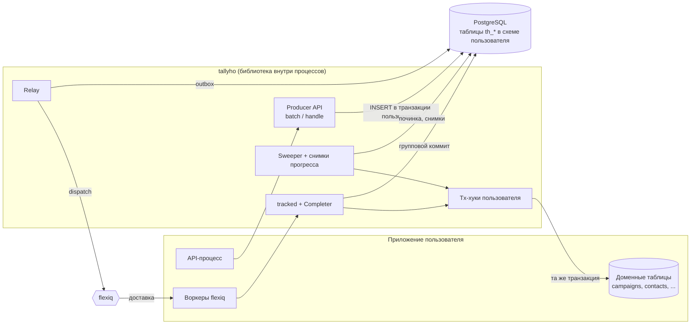

Доменные таблицы и `th_*` лежат в **одной базе PostgreSQL** (схемы могут быть разными). Это условие атомарности tx-хуков.

### 3.2 Процессы и размещение компонентов

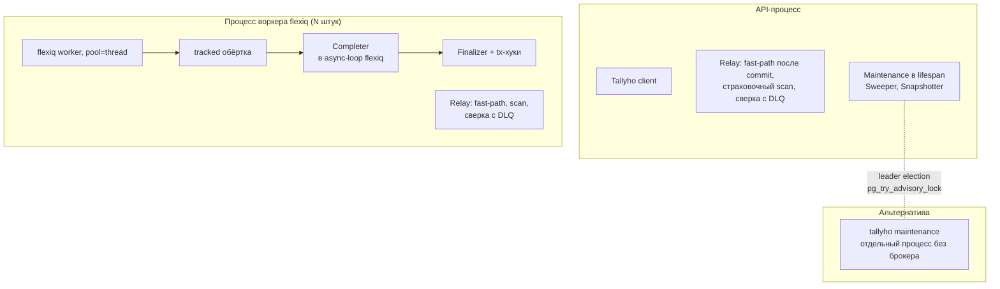

* **Relay** работает в каждом процессе, где установлен адаптер брокера (`th.install(adapter)`). Это один фоновый цикл на процесс с двумя входами:
  * **fast-path** — сразу после commit отправляет то, что этот процесс только что записал (`kick`), не дожидаясь `relay_grace`;
  * **страховочный scan** — раз в `sweep_interval` отправляет все записи старше `relay_grace`: потерянный `kick`, записи упавшего процесса, отложенный старт, возврат после `relay_claim_ttl`.

  Цикл стартует лениво, в event loop первого `kick` (как Completer), и сразу — при запуске `th.maintenance().run()` в этом процессе (тогда первый scan выполняется немедленно). Scan **не привязан к лидерству** maintenance: захват записей идёт через `FOR UPDATE SKIP LOCKED`, поэтому несколько процессов не отправляют одну запись дважды. Цикл останавливает `await th.aclose()` (насовсем, §11.1); выход из `th.maintenance().run()` тоже останавливает его, следующий `kick` запустит цикл заново.
* **Сверка с DLQ брокера** (UC-15) идёт в том же фоновом цикле, сразу после каждого страховочного scan: прочитать DLQ может только процесс с адаптером, а лидером maintenance бывает и процесс без него, поэтому к лидерству сверка тоже не привязана. Два процесса не делают одну работу: проход начинается с захвата строки курсора в `th_meta` через `FOR UPDATE SKIP LOCKED`, и процесс, не получивший строку, свой проход пропускает.
* **Процесс без адаптера** (`th.install(None)`, CLI `tallyho maintenance`) relay не создаёт: outbox не захватывает, ничего не отправляет и DLQ не сверяет. Sweeper, Finalizer и Snapshotter в нём работают; записи, которые они кладут в outbox (повтор Item, колбэк финализации), отправит scan любого процесса с адаптером.
* **Maintenance** (sweeper, снимки прогресса) работает в одном экземпляре-лидере. Лидер выбирается через advisory lock; лидером может быть и процесс без адаптера.
* **Finalizer** работает там, где завершился последний Item (воркер), либо в sweeper'е. Поэтому **модули с tx-хуками должны импортироваться и в воркерах, и в maintenance**: `Tallyho(..., hook_modules=[...])` импортирует их при инициализации (§7.5).
* **Completer** живёт в event loop исполнителя async-задач flexiq и создаётся лениво при первой задаче.
* **Фоновые задачи** у библиотеки есть в каждом процессе: цикл relay, цикл Completer и heartbeat-задачи выполняющихся Items, разовые после-коммитные задачи (финализация после `seal`, `cancel`, `retry_failed`, `complete_in`). Каждая привязана к event loop, в котором появилась. Дожидается и останавливает их `await th.aclose()` — его вызывают при остановке каждого процесса (§11.1). Без него процесс бросает задачи посреди работы: lease остаются до `lease_ttl`, а чтения незавершённой финализации сталкиваются с тем, что идёт следом (например, с `DROP SCHEMA` в тестах).

### 3.3 Модули пакета и зависимости между ними


Правило слоёв: `storage` не знает про брокер, `engine` — только про протоколы, адаптеры — только про `protocols` и `runtime`, `api` и `runtime` друг друга не импортируют. Циклов нет. Правило проверяется в CI через `import-linter`.

### 3.4 Основные классы

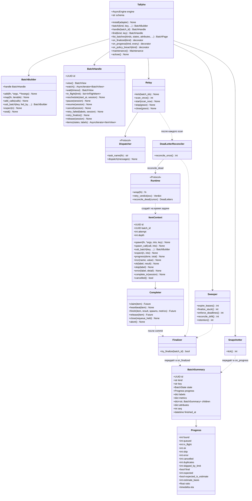

---

## 4. Зависимости

### 4.1 Внешние пакеты

| Пакет | Версия | Обязателен | Зачем |
|---|---|---|---|
| Python | ≥ 3.11 | да | `TaskGroup`, `StrEnum`, `Self`, `ExceptionGroup` |
| PostgreSQL | ≥ 14 | да | партиционирование и `MERGE` — задел на v2; всё остальное работает и на 12+ |
| `sqlalchemy[asyncio]` | ≥ 2.1 | да | Core, `postgresql_with` у `Table` (storage-параметры), приём сессии пользователя, Alembic |
| `asyncpg` или `psycopg[binary]` | ≥ 0.29 / ≥ 3.1 | один из | драйвер |
| `typing-extensions` | ≥ 4.10 | да | `ParamSpec`/`TypeVar` defaults на 3.11 |
| `flexiq` | `>=2.0,<3` | extra `flexiq` | адаптер |
| `alembic` | ≥ 1.13 | нет | встраивание миграций в проект пользователя |

UUIDv7 генерируем сами (≈30 строк). В Python 3.14+ используем `uuid.uuid7()`.

### 4.2 Точки расширения

| Протокол | Кто реализует | Для чего |
|---|---|---|
| `Dispatcher`, `Runtime`, `PayloadCodec` | адаптер брокера | отправка; обёртка исполнения, вердикт ретрая, сверка с DLQ: `reconcile_dead(cursor)` отдаёт порцию мёртвых джоб — Item и поколение отправки из служебного маркера — и новый непрозрачный курсор (UC-15, §11.3); кодек payload Items (без своего кодека — `SerializerCodec` поверх `Serializer`) |
| `RetryLimits` | адаптер брокера (необязательно) | умолчание `max_retries` задачи по её имени — для sweeper, когда у вызова нет своей опции (UC-15) |
| `RelayPolicy` | тестовый брокер | `relay_autostart = False`: relay не запускает фоновый цикл по `kick`, его проходы вызывает сам адаптер (`InlineBroker.step/drain`); так тест остаётся детерминированным |
| Tx-хуки `on_finalized / on_progress / on_policy_breach` | пользователь | перенос итога и прогресса в доменные таблицы (§7) |
| `Serializer` | пользователь (есть json/msgspec) | аргументы задач, `result` Item |
| `Observer` | пользователь | метрики, OpenTelemetry, логи — вне транзакций, fire-and-forget |
| `Clock` | тесты | управление временем |
| `IdFactory` | редко | свой формат ID |

---

## 5. Модель данных

### 5.1 ER-диаграмма

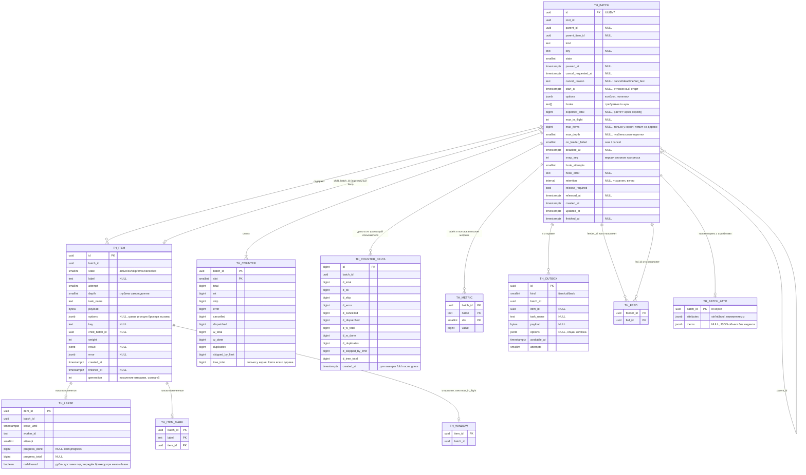

`th_meta(key PK, value)` хранит версию схемы (`schema_version`) и курсор сверки с DLQ брокера (`dead_letter_cursor`, UC-15); на диаграмме не показана.

`th_item.generation` — **поколение отправки**: сколько раз Item возвращался в outbox после первой отправки. Растёт на 1 в той же транзакции, что вставляет новую запись outbox: возврат по истёкшему lease (sweeper), `release` после подтверждённого дубля, `close(requeue_held=True)`, claim при паузе, `retry_failed()`. Это редкие пути: первая отправка и обычное завершение колонку не трогают, индекса на ней нет, finish остаётся HOT. Relay кладёт поколение в сообщение, адаптер — в служебный маркер джобы. По нему сверка с DLQ отличает мёртвую джобу текущей отправки от джобы, после которой Item уже переотправлен (UC-15).

Доменного состояния у батча нет: колонок `status` и `data` не существует, статус и данные живут у пользователя. Есть только неизменяемый контекст корреляции — `attributes` и `memo` корня. Он хранится в side-таблице `th_batch_attr`, а не в `th_batch`: строка батча часто обновляется (состояние, `snap_seq`, `updated_at`), и каждое не-HOT обновление заново писало бы jsonb в GIN-индекс. Строка `th_batch_attr` пишется один раз в транзакции создания корня и удаляется retention вместе с деревом; для корня без атрибутов и `memo` её нет.

Правила атрибутов:
* значения — только `str`, `int` (в пределах `bigint`) и `bool`; `UUID` нормализуется в строку и при записи, и в фильтре. `float`, `None`, `datetime` и коллекции отклоняются `InvalidAttributesError` (подкласс `ConfigurationError`): containment jsonb строг к типу JSON, и неявное приведение дало бы фильтр, который молча ничего не находит;
* ключ — непустая строка; префикс `tallyho.` зарезервирован за библиотекой. Обязательного пространства имён (`app.*`) нет;
* лимиты — в §15;
* атрибуты есть только у корня, как `retention` и `max_items`. `summary.attributes` и `view.attributes` любого узла дерева возвращают атрибуты корня;
* повторный `th.batch(kind, key)` возвращает существующий батч, его атрибуты и `memo` не меняются (первый выигрывает, как для остальных параметров);
* тенант — обычный атрибут. Фильтровать по нему в листинге обязано приложение: tallyho не знает, кто вызывает;
* атрибуты и `memo` не попадают в логи и телеметрию.

### 5.2 Индексы и запросы горячего пути

Принцип: **на `th_item` нет индексов по изменяемым колонкам**. Единственный UPDATE Item'а (finish) — HOT, без записи в индексы. Разреженные множества («в очереди», «выполняется», «упал с hard_bounce») живут в узких side-таблицах, размер которых ≈ объёму текущей работы, а не истории.

| Таблица | Индекс | Обслуживает запрос | Сложность |
|---|---|---|---|
| th_batch | PK | всё по id | O(log n) |
| th_batch | `UNIQUE (kind, key) WHERE parent_id IS NULL AND key IS NOT NULL` | идемпотентное создание корня, `th.find(kind, key)` | O(log n) |
| th_batch | `UNIQUE (root_id, key) WHERE parent_id IS NOT NULL` | под-батч по ключу внутри дерева: `into="cards"`, идемпотентный `sub_batch` | O(log n) + кэш в процессе |
| th_batch | `(parent_id) WHERE parent_id IS NOT NULL` | каскад pause/cancel, дерево | O(log n + k) |
| th_batch | `(updated_at) WHERE state IN (open, sealed, finalizing)` | sweeper: зависшие батчи, повтор хуков | размер = активные |
| th_batch | `(deadline_at) WHERE deadline_at IS NOT NULL AND state IN (open, sealed)` | sweeper: дедлайны | размер = активные |
| th_batch | `(id) WHERE state IN (open, sealed) AND 'progress' = ANY(hooks)` | Snapshotter: активные батчи со снимками | размер = активные с хуком |
| th_batch | `(finished_at) WHERE id = root_id AND finished_at IS NOT NULL AND retention IS NOT NULL AND (NOT release_required OR released_at IS NOT NULL)` | retention деревьями | размер = готовые к удалению |
| th_batch | `(kind, id) WHERE parent_id IS NULL` | `th.list_batches(kinds=…)`: корни одного `kind`, keyset по `id DESC` | O(log n + k) |
| th_batch_attr | PK `(batch_id)` | атрибуты корня в `view()` и сводке хука | O(log n) |
| th_batch_attr | `GIN (attributes jsonb_path_ops)` | `th.list_batches(attributes=…)`: containment `@>` | размер = корни с атрибутами; пишется один раз |
| th_item | PK | claim/finish по id | O(log n), UUIDv7 → горячие страницы справа |
| th_item | `(batch_id, id)` | листинг, `handle.items(states=…)` окнами, cancel, reconcile | O(log n + k) |
| th_item | `UNIQUE (batch_id, key) WHERE key IS NOT NULL` | дедуп spawn/add | O(log n) |
| th_outbox | `(available_at)` | relay | размер = неотправленное |
| th_outbox | `(batch_id, available_at)` | pause/resume/cancel/reschedule; окно `max_in_flight`: запаркованные (`∞`) и готовые записи батча | размер = неотправленное |
| th_window | PK `(item_id)`, `(batch_id)` | окно `max_in_flight`: сколько Items батча отправлено и не завершено | размер ≤ сумма окон активных батчей |
| th_lease | PK, `(lease_until)` | claim, истёкшие lease | размер = in-flight |
| th_lease | `(batch_id)` | `handle.in_flight()`, `in_flight` в прогрессе | размер = in-flight |
| th_feed | PK `(feeder_id, fed_id)` | при финализации источника: какие этапы он наполняет | O(log n) |
| th_feed | `(fed_id)` | все ли источники этапа финализированы; правило записи в этап | O(log n) |
| th_counter | PK `(batch_id, slot)` | прогресс, финализация | O(slots) |
| th_counter_delta | `(batch_id)` | точное чтение и свёртка | размер = несвёрнутое |
| th_counter_delta | `(created_at, id)` | sweeper: свёртка дельт старше `finalize_grace` | размер = несвёрнутое |
| th_metric | PK `(batch_id, name, slot)` | разбивка по labels | O(names × slots) |
| th_item_mark | PK `(batch_id, label, item_id)` | `handle.items(labels=…)`: «все hard_bounce батча» для экспорта | O(log n + k) |

Хранение: `th_item` `fillfactor=85` (место для HOT). `th_counter`/`th_metric` `fillfactor=50` + агрессивный per-table autovacuum. Состояния — `smallint`. FK на горячих таблицах не объявляем: целостность держит библиотека, retention удаляет деревом чанками.

---

## 6. Состояния

### 6.1 Батч

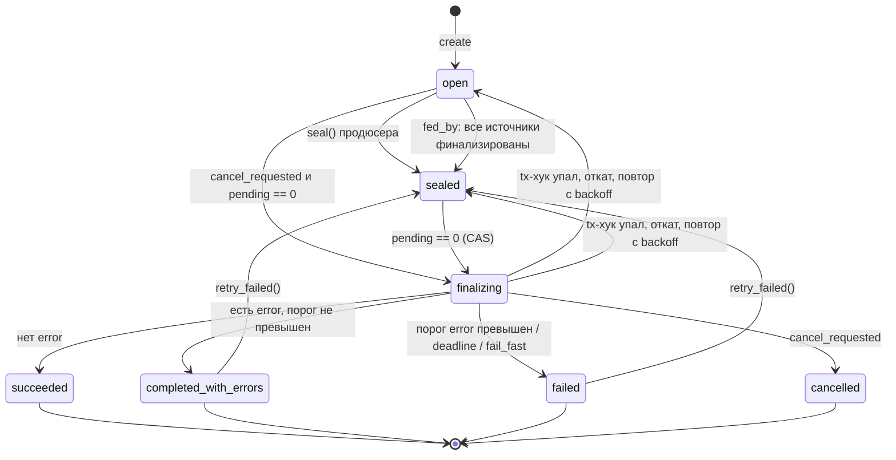

* `finalizing` существует только внутри одной транзакции: tx-хук `on_finalized` → CAS в терминальное → outbox колбэков → завершение виртуального Item родителя. Если хук упал, откатывается всё, и батч остаётся `sealed` с `hook_error`. Sweeper повторяет с backoff (§7.3).
* **Этап с `fed_by` продюсер не закрывает** — `seal()` для него ошибка. Его закрывает транзакция финализации последнего из источников (§8.1, UC-17). Источник в любом терминальном состоянии считается финализированным. Если он `completed_with_errors`/`failed`/`cancelled`, этап по умолчанию закрывается и доделывает полученное (`on_feeder_failed="seal"`) либо получает запрос отмены (`"cancel"`).
* **Пустой батч финализируется сразу.** Закрытый батч с `pending = 0` (в том числе с `found = 0`) финализируется в той же цепочке «после commit», что и любой другой, и каскадом закрывает этапы, которые он наполняет. Этап без единого Item — нормальная ситуация, а не зависание.
* **Отмена, дедлайн и `fail_fast` — не мгновенный переход, а флаг** `cancel_requested_at` (с причиной). Флаг запрещает новые `add`/`spawn`, неотправленные Items сразу становятся `cancelled`, отправленные отменяются лениво при claim, выполняющиеся доделываются. Когда `pending = 0`, срабатывает обычная финализация с `on_finalized`, и хук получает `summary.state = cancelled` или `failed` с `summary.reason`. Флаг, закоммиченный раньше финализации, определяет итог, даже если финализация уже шла: итог перепроверяется под блокировкой строки батча (§7.3). Поэтому все пути в терминальное состояние проходят через один и тот же транзакционный хук.
* **Первая причина выигрывает.** Все пути, которые ставят флаг (`cancel()`, дедлайн, `fail_fast` и политика с `action="fail"`, `on_feeder_failed="cancel"`), пишут `cancel_requested_at` и `cancel_reason` только батчу, у которого флага ещё нет (`cancel_requested_at IS NULL`). Повторный запрос с любой причиной не меняет у такого батча ни причину, ни время запроса, а значит и итог: дедлайн после `cancel()` оставляет `cancelled` с `reason=cancel`, `cancel()` после дедлайна — `failed` с `reason=deadline`. Остальная часть запроса идемпотентна и выполняется всегда: каскад проходит по всему поддереву (у `cancel()` и дедлайна — от узла вниз, у политики — по всему дереву), узлы без флага получают причину этого запроса, неотправленные Items поддерева сразу становятся `cancelled`. Причина хранится у каждого узла своя: под-батч, отменённый раньше по своему дедлайну, после ручной отмены корня остаётся `failed` с `reason=deadline`, а корень становится `cancelled`. Дедлайн проверяется у любого узла, не только у корня: просроченный под-батч получает запрос отмены вместе со своим поддеревом.
* **`retry_failed()` флаг не снимает.** Отмена необратима: переоткрытый батч, проваленный по запросу отмены (`deadline`, `fail_fast`, `policy`), сохраняет `cancel_requested_at` и причину. Повторённые Items отменяются при claim, и батч снова финализируется `failed` с той же причиной (`on_finalized` вызывается ещё раз). В работу `retry_failed()` возвращает батчи, завершившиеся без запроса отмены: `completed_with_errors` и `failed` по порогу политики, оценённому при финализации.

**Пауза и отложенный старт** — ортогональные флаги, не состояния:

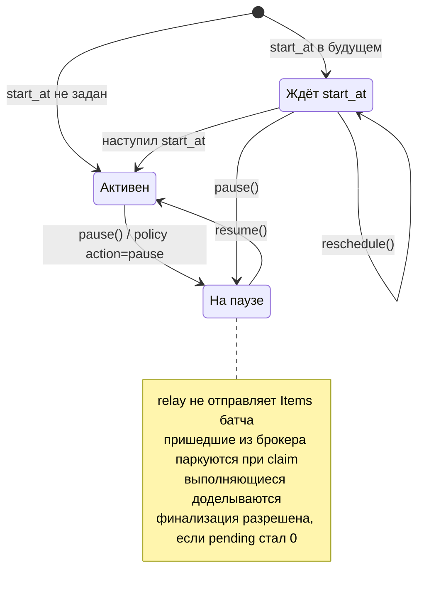

`start_at` — это просто `available_at` у записей outbox батча. Отдельного планировщика нет: relay отправляет Items, когда время наступило.

### 6.2 Item (производное состояние)

В `th_item.state` хранится только `active` или класс итога. Детальное состояние выводится из наличия строк в side-таблицах:

| Производное состояние | Признак |
|---|---|
| queued | `state=active`, есть в `th_outbox`, `available_at ≤ now` |
| parked | `state=active`, есть в `th_outbox`, `available_at` в будущем (start_at) или `∞` (пауза, окно `max_in_flight`) |
| dispatched | `state=active`, нет ни в outbox, ни в lease |
| running | `state=active`, есть в `th_lease` |
| terminal | `state ∈ {ok, skip, error, cancelled}` + `label` |

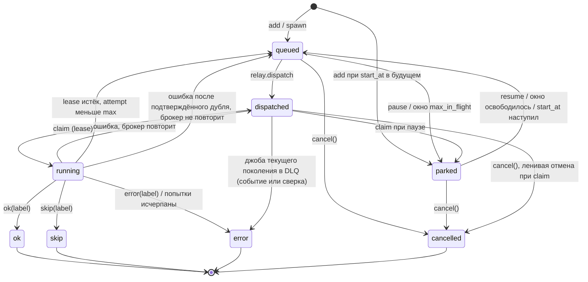

После завершения Item неизменяем. Поздние события вроде webhook «доставлено» или «bounce» — это домен пользователя (§12).

### 6.3 Запись outbox

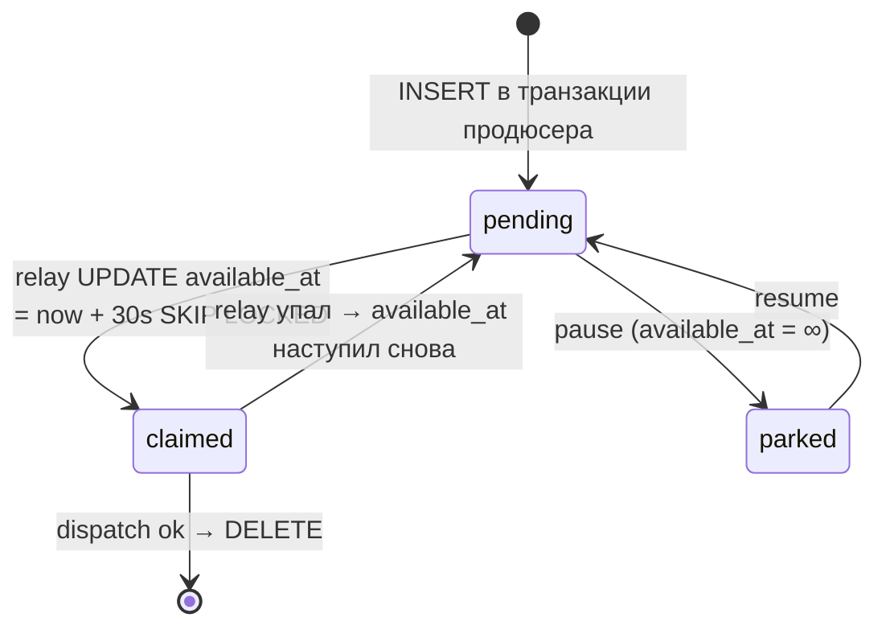

At-least-once отправка. Дубль в брокере отсекает claim по `th_lease` и состоянию Item.

Запись outbox появляется повторно, когда Item возвращается в очередь: lease истёк (sweeper), воркер останавливается (`close(requeue_held=True)`), батч на паузе при claim, `retry_failed()`, а также при `release` по вердикту `RETRY`, если за время выполнения брокеру был подтверждён дубль доставки (`th_lease.redelivered`, UC-04). Каждый такой возврат в той же транзакции увеличивает `th_item.generation` (§5.1): джоба, которую relay создаст по новой записи, несёт новое поколение.
Захватывают записи только процессы с адаптером брокера (§3.2): fast-path — записи батчей из `kick`, scan — все записи старше `relay_grace`. Параллельные проходы разных процессов расходятся по `SKIP LOCKED`, а захваченная запись невидима остальным до `relay_claim_ttl`.

---

## 7. Интеграция с доменом: прогресс, финализация, retention

### 7.1 Проблема

Пользователь хочет видеть прогресс и итог батча в **своей** доменной таблице (например, `campaigns.sent`, `campaigns.status`). У этого три причины:
1. Таблицы `th_*` чистятся retention'ом, а итог кампании нужен навсегда.
2. Списки, сортировки и фильтры по доменной таблице («кампании, отсортированные по прогрессу») не должны JOIN'ить нашу.
3. Доменный статус (`completed_with_errors`) должен меняться **ровно тогда**, когда батч реально завершился. Нельзя «батч завершён, а кампания всё ещё running» и нельзя наоборот.

Наивные решения ломаются так:

| Наивно | Что ломается |
|---|---|
| Колбэк-задача в брокере обновляет домен | Два commit'а: батч завершён, колбэк упал или ещё в очереди → домен рассинхронизирован. Retention может удалить батч раньше, чем колбэк выполнится |
| Каждый Item делает `UPDATE campaigns SET sent = sent + 1` | Горячая строка в **доменной** таблице — ровно та проблема, которую решали шардированными счётчиками (§9) |
| Пользователь сам поллит `view()` и копирует | Если поллер отстал дольше retention, данные потеряны. Лишний код в каждом проекте |

### 7.2 Решение: три механизма

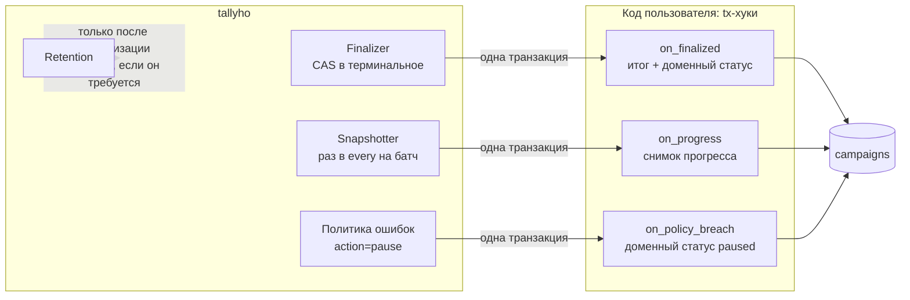

| Механизм | Когда вызывается | Гарантия |
|---|---|---|
| **`on_finalized(session, summary)`** | При переходе батча в терминальное состояние: succeeded / completed_with_errors / failed / cancelled | **Ровно один успешный commit**, атомарно с финализацией. Хук упал → финализации нет, повтор с backoff. Батч не станет терминальным, пока хук не закоммитится |
| **`on_progress(session, summary)`** | Не чаще `every` на батч и только если счётчики изменились | Снимки монотонны (`summary.seq`), устаревший снимок не перезапишет новый и не перезапишет итог финализации |
| **`on_policy_breach(session, summary, breach)`** | Политика ошибок сработала с `action="pause"` или `"fail"` | Атомарно с постановкой батча на паузу или провалом |
| **Retention + `release()`** | Удаляет только терминальные деревья старше `retention`, и только после `release()`, если `release_required=True` | Данные не исчезнут раньше, чем домен их забрал |

### 7.3 Как устроена транзакция хука

**Порядок внутри транзакции: сначала хук пользователя, потом наш CAS.**

```
BEGIN
  1. прочитать строку батча и итоговые счётчики (без блокировок): sum(th_counter) + sum(th_counter_delta), th_metric;
     проверить pending=0 AND (state=sealed OR cancel_requested_at IS NOT NULL) и выбрать итог для summary
  2. await on_finalized(session, summary)      ← пользователь блокирует и меняет СВОИ строки
  3. SELECT ... FROM th_batch WHERE id IN (:id, этапы из th_feed) ORDER BY id FOR UPDATE
     заново прочитать строку батча и счётчики и выбрать итог ещё раз — уже под блокировкой:
       батч терминален или условие шага 1 не выполняется → ROLLBACK (финализировал другой процесс
                                                           или батч снова не готов)
       итог или причина не те, что получил хук           → ROLLBACK и повтор с шага 1, хук вызывается заново
  4. UPDATE th_batch SET state=:final, finished_at=now(), snap_seq=snap_seq+1
       WHERE id=:id AND state IN ('open','sealed') AND snap_seq=:seen RETURNING      ← CAS
     0 строк → ROLLBACK и повтор с шага 1 (снимок прогресса успел увеличить snap_seq)
  5. INSERT th_outbox колбэков; завершить виртуальный Item родителя
COMMIT
```

Почему такой порядок:
* **Порядок блокировок совпадает с кодом пользователя.** В API он обычно пишет «сначала доменная строка, потом `handle.pause(session)`». Порядок «домен → tallyho» везде исключает дедлок между хуком и API-операцией пользователя.
* **Проигравший CAS откатывает и свои изменения домена.** Два процесса могут одновременно начать финализацию одного батча: хук выполнится дважды, но закоммитится ровно один раз.
* **Итог выбирается под блокировкой строки батча.** Шаг 1 читает строку и счётчики разными запросами и без блокировок, поэтому между ними и до шага 3 может закоммититься `cancel()`, дедлайн sweeper-а, `fail_fast`, порог политики или `retry_failed()` потомка. Все они меняют строку `th_batch` или блокируют её, а значит после `FOR UPDATE` шага 3 ждут нашего commit. Итог, записанный CAS, и `summary.state`/`summary.reason`, которые получил закоммиченный вызов хука, всегда совпадают и соответствуют строке под блокировкой: запрос отмены, закоммиченный раньше финализации, не даёт `succeeded`. Цена — повторная попытка с повторным вызовом хука (до 5 раз подряд, дальше — sweeper).
* **Под блокировкой итог стабилен.** Когда `pending = 0` и батч `sealed` (или запрошена отмена), новые Items появиться не могут: spawn возможен только из активного Item, внешний `add` после seal или запроса отмены запрещён, а `retry_failed` берёт `FOR UPDATE` на все строки дерева.

Правила для хука:
* Сессия — `AsyncSession`, привязанная к нашему соединению и транзакции. **`commit()`/`rollback()` внутри хука запрещены**: будет исключение. Соединение взято из движка пользователя, его опции выполнения мы не меняем: доменные таблицы хук адресует так же, как остальной код пользователя (§11.1).
* Только операции с БД. HTTP, письма, брокер — через колбэк-задачу `on_finalized_task=th.call(...)`, которая ставится в outbox той же транзакцией.
* Хук должен укладываться в `hook_timeout` (по умолчанию 10 с, через `SET LOCAL statement_timeout` и `asyncio.timeout`).
* Хук упал → откат → `hook_attempts += 1`, `hook_error` = текст ошибки, повтор с экспоненциальным backoff (1 с … 5 мин). Батч остаётся `sealed` и **не** финализируется без хука: домен и tallyho не расходятся. Наблюдаемость — метрика `th_hook_failures` и событие `Observer.hook_failed`. Починили код → sweeper повторит сам, или вызовите `handle.retry_finalize()`.

### 7.4 Снимки прогресса

* Snapshotter работает в лидере maintenance. Он хранит **в памяти** расписание «когда следующий снимок» для активных батчей с хуком `progress` (partial-индекс из §5.2). Если счётчики не менялись, в БД ничего не пишется.
* Снимок — отдельная транзакция: `on_progress(session, summary)` → `UPDATE th_batch SET snap_seq = snap_seq + 1 WHERE id AND snap_seq = :seen AND state IN (open, sealed)`. 0 строк означает, что батч финализирован или снимок уже сделан: откат, и изменения хука тоже откатываются. Поэтому **снимок никогда не перезапишет итог финализации**.
* `summary.seq` монотонно растёт в пределах батча, у финализации он тоже больше последнего снимка. Рекомендуемая защита на стороне домена — `WHERE progress_seq < :seq` (пример в §12).
* Цена: `N_активных_батчей / every` чтений счётчиков в секунду. При 10 000 активных батчей и `every=2s` это 5 000 PK-чтений по ~8 строк/с на лидере. Записи — только для изменившихся батчей.

### 7.5 Регистрация хуков

```python
th = Tallyho(
    engine, schema="app", hook_modules=["app.mailing.hooks"]
)  # импортируются при инициализации в КАЖДОМ процессе


# app/mailing/hooks.py
@th.on_finalized("campaign_deliveries")
async def save_result(session: AsyncSession, s: BatchSummary) -> None: ...


@th.on_progress("campaign_deliveries", every=timedelta(seconds=2))
async def save_progress(session: AsyncSession, s: BatchSummary) -> None: ...
```

Защита от «хук не импортирован в этом процессе»: при создании батча в `th_batch.hooks` записывается список хуков, зарегистрированных для `kind`. Если процесс-финализатор не находит у себя требуемый хук, он **не финализирует** батч, пишет ошибку в лог и метрику `th_hook_missing`. Батч дождётся процесса, в котором хук есть (sweeper в maintenance). Тихо пропустить запись итога в домен невозможно.

### 7.6 Retention

| Настройка батча | Поведение |
|---|---|
| `retention=timedelta(days=14)` (по умолчанию) | Дерево удаляется через 14 дней после `finished_at` корня |
| `retention=None` | Хранить вечно |
| `release_required=True` | Удаление только после `handle.release(session)` **и** истечения `retention`. Для случаев, когда домену нужны детали по Items (экспорт упавших получателей) |

`release()` вызывается у корня и относится к **последней финализации** дерева. `retry_failed()` на любом узле переоткрывает корень и сбрасывает его `released_at`: после новой финализации итоги Items другие, и домен должен забрать их заново и снова вызвать `release()`. Без этого retention удалил бы дерево по старому разрешению, не дожидаясь повторного экспорта. Инвариант: дерево с `release_required=True` не удаляется, пока после последней финализации корня не вызван `release()`.

Удаление идёт чанками по 1 000 Items (`DELETE ... WHERE ctid IN (SELECT ... LIMIT)`), по деревьям, от листьев к корню. `handle.view()` удалённого батча бросает `BatchPurged`. Итог к этому моменту уже в домене.

---

## 8. Use cases

### 8.1 Конвейер этапов: правила

Этап — обычный под-батч. Новых таблиц состояния нет, есть только связь «кто кого наполняет» (`th_feed`).

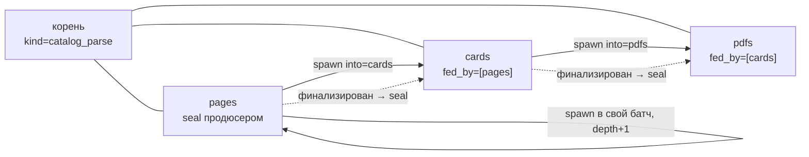

1. **Структура.** `fed_by` ссылается только на под-батчи того же родителя и образует ациклический граф: цикл → ошибка при создании. Самоподпитка (страница → страница) — это spawn в свой батч, а не `fed_by`.
2. **Кто может писать в этап.** У этапа с `fed_by` писатели только задачи самого этапа и задачи его источников (`into=`). Продюсер добавлять в него не может. Иначе spawn бросает `SpawnTargetError`: проверка по кэшу структуры дерева в процессе, без запросов к БД.
   **Почему этого достаточно без блокировок:** пишущая задача активна → её батч-источник не финализирован → этап не может быть закрыт, ведь его закрывают только после финализации **всех** источников. На нарушении этого правила обжигались Oban (гонки graft) и Sidekiq («снаружи добавлять небезопасно»).
3. **Автоматический seal.** В транзакции финализации источника F, после хука:
   ```
   Xs = th_feed WHERE feeder_id = F
   SELECT ... FROM th_batch WHERE id IN (F, Xs) ORDER BY id FOR UPDATE   -- до CAS и до th_item / th_counter;
                                                                         -- сериализует параллельных источников
   итог F перепроверяется по строке под блокировкой (§7.3 шаг 3)
   CAS F; если th_feed WHERE feeder_id = F изменился (add_feed успел раньше блокировки) → откат и повтор
   для каждого X из Xs (в порядке id):
       если все источники X терминальны (новый statement → видит закоммиченное):
           UPDATE th_batch SET state = sealed WHERE id = X AND state = open
   COMMIT → try_finalize(X) → если X пуст, он финализируется и каскадом закрывает свои этапы
   ```
   Два источника X финализируются одновременно: тот, кто взял блокировку X вторым, после commit первого видит оба источника терминальными и закрывает X. Страховка — sweeper: «этап open, все источники терминальны» → seal.
   Строки `th_batch` берутся раньше виртуального Item и слота счётчика родителя (порядок §9.2): иначе финализация источника, уже держащая слот родителя, ждёт строку этапа, а транзакция, держащая строку этапа (Completer со spawn в этап, финализация отменённого этапа), ждёт тот же слот — дедлок.
4. **Источник с ошибками** (`completed_with_errors`, `failed` или `cancelled`) тоже закрывает этап (`on_feeder_failed="seal"`, по умолчанию): этап доделывает полученное. Вариант `"cancel"` ставит этапу запрос отмены. У Dagster в такой ситуации нижние шаги просто брошены.
5. **Дедупликация до счётчиков.** `key` уникален в целевом батче (`UNIQUE (batch_id, key)`). Spawn — это `INSERT ... ON CONFLICT DO NOTHING RETURNING`: `found += вставлено`, `duplicates += отсечено`. Дедуп постоянный, пока жив батч. Повторно найденная ссылка на уже скачанный PDF не создаст Item.
6. **Лимиты разрастания** — задачи сверх лимита не вставляются и учитываются в `skipped_by_limit` целевого батча, это не ошибка:
   * `max_items` на корне — лимит Items на всё дерево. Счётчик `tree_total` в слотах корня обновляется в той же групповой транзакции. Лимит **мягкий**: параллельные flush'и могут превысить его не больше чем на размер одного flush;
   * `max_depth` на под-батче — глубина самоподпитки: `depth = depth_родителя + 1` при spawn в свой батч, `0` при `into=`.
7. **Порядок финализации в дереве.** Этап финализируется со своим `on_finalized` и завершает виртуальный Item у родителя в той же транзакции. Родитель финализируется только после всех детей: `on_finalized` детей всегда коммитится раньше родительского.
   Терминальный итог ребёнка распространяется вверх: если хотя бы один прямой ребёнок завершился как `completed_with_errors`, `failed` или `cancelled`, родитель без собственной более сильной причины завершится как `completed_with_errors`. Виртуальный Item при этом остаётся `ok`: он означает «под-батч завершён», а не «все его Items успешны».

### 8.2 Карта use cases

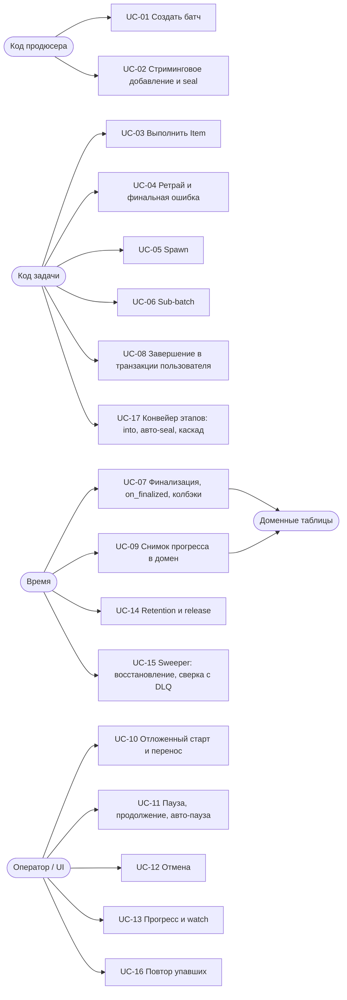

### UC-01 Создать батч в транзакции пользователя

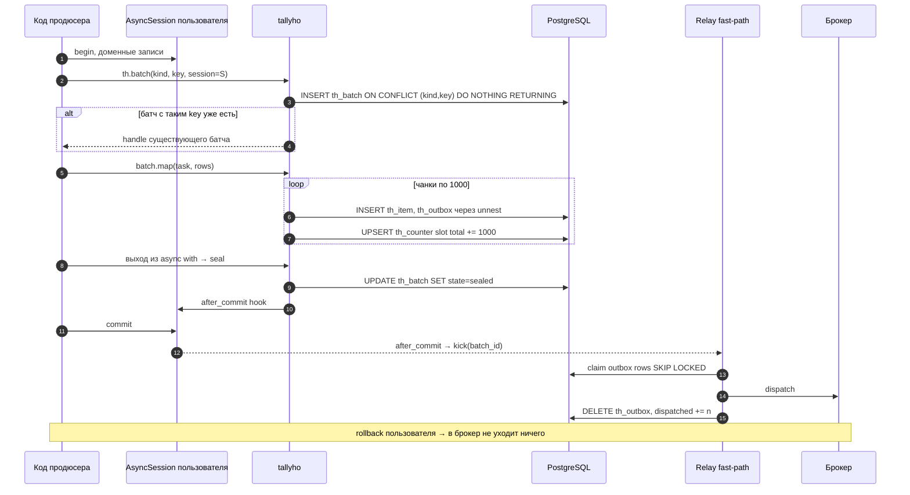

### UC-02 Стриминговое добавление и seal

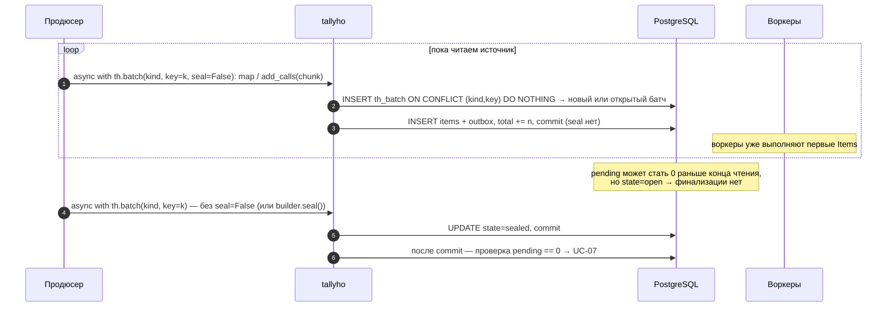

Каждая порция — отдельный вход в `th.batch(..., seal=False)` со своей транзакцией (или с `session=` пользователя): выход из `async with` коммитит Items, а батч остаётся `open`. Повторный вход по тому же `(kind, key)` находит открытый батч (UC-01) и дописывает в него. Закрывает батч вход без `seal=False` — он может и сам добавить последнюю порцию — или явный `await builder.seal()` внутри блока.

* **Параметры батча задаёт первый вход.** Колбэки, политика, `deadline`, атрибуты и прочие параметры повторных входов не применяются (как при любом повторном `th.batch` с тем же ключом, D-038).
* **`seal=False` действует на всё builder-дерево:** под-батчи, объявленные в этом блоке, при выходе тоже не закрываются. Этапы с `fed_by` по-прежнему закрывает финализация источников.
* **Закрытый батч не принимает порции:** вход после seal, финализации или запроса отмены даёт `SealError` на `add`. Продюсер, который хочет продолжить после отмены, создаёт новый батч с другим ключом.
* **Незакрытый батч не финализируется никогда.** Продюсер, упавший посреди чтения, оставляет батч `open`: дочитать и закрыть его может повторный запуск продюсера с тем же ключом, а предохранитель — `deadline` батча (UC-12).
* Ключ обязателен: без `key` каждый вход создаёт новый батч.

### UC-03 Выполнить Item

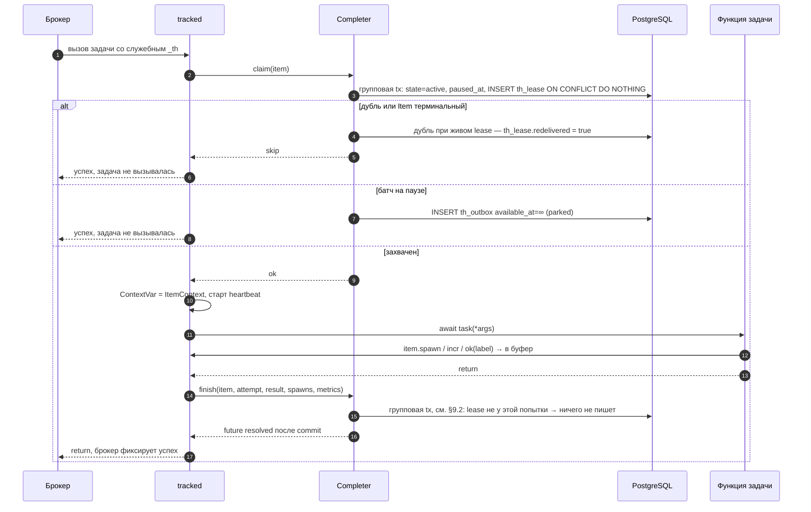

**Владение lease в пути A.** `finish` и `release` из обёртки передают номер попытки из claim. Групповая транзакция блокирует строку `th_item`, затем `th_lease` (§9.2) и применяет операцию, только если lease взят этим процессом для этой попытки: совпадают `worker_id` и `attempt` — то же условие, что у `complete_in` (UC-08). Попытка, чей lease истёк и был перехвачен (claim другого исполнителя или этого же процесса делает `attempt += 1`), удалён sweeper-ом или возвращён в outbox, ничего не пишет: ни итог в Item, ни удаление чужого lease, ни `attempt += 1`. Обёртка завершает такую попытку тихо, как при `LeaseLostError` пути B: брокеру — успех без ретрая, иначе ретрай или DLQ задели бы Item, который выполняет другой исполнитель. Истёкший, но никем не перехваченный lease завершению не мешает. Обработчик DLQ номера попытки не знает и идёт по правилу сверки (UC-15).

### UC-04 Ретрай и финальная ошибка

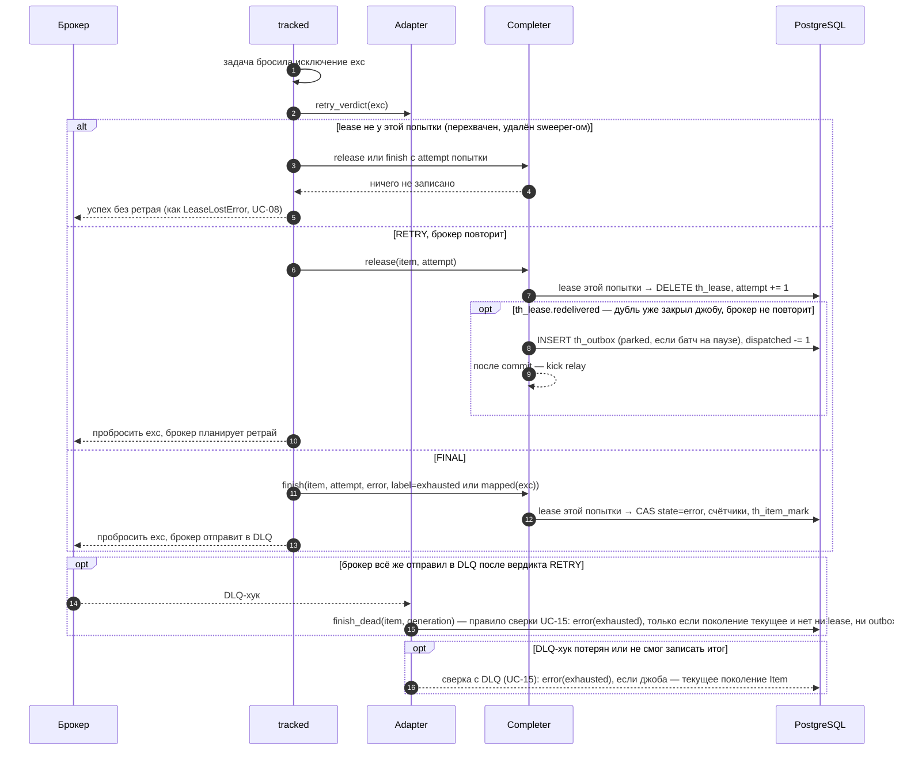

**Повторная доставка при живом lease.** Брокер может доставить ту же джобу ещё раз, пока исходное выполнение работает: `requeue_job`, реап воркера, который брокер счёл мёртвым, жёсткий таймаут (§11.3). Дубль получает успех без выполнения, и брокер закрывает джобу. Если исходное выполнение после этого упадёт с вердиктом `RETRY`, повторять его некому: джоба уже завершена, отчёт об ошибке брокер отбросит. Поэтому claim, отдавший `DUPLICATE` при живом lease, в той же транзакции ставит `th_lease.redelivered = true` (строка lease уже заблокирована `FOR UPDATE`), а `release` для такого lease сам возвращает Item в outbox: `available_at = now` или `∞`, если батч на паузе, `dispatched -= 1`, после commit — kick relay. Перехват истёкшего lease флаг сбрасывает. Отметка и её чтение сериализованы блокировкой строки `th_item`, поэтому исхода «дубль подтверждён, а Item не возвращён» нет. Если брокер всё же повторит исходную джобу (дубль был отдельной джобой — `replay`, `retry_dead`), лишнюю отправку отсечёт `idempotency_key` или claim: выполнение остаётся at-least-once, завершение — ровно одно (CAS). Остальные исходы исходного выполнения флаг не читают: `finish` завершает Item, истёкший lease возвращает sweeper.

### UC-05 Spawn: динамический fan-out

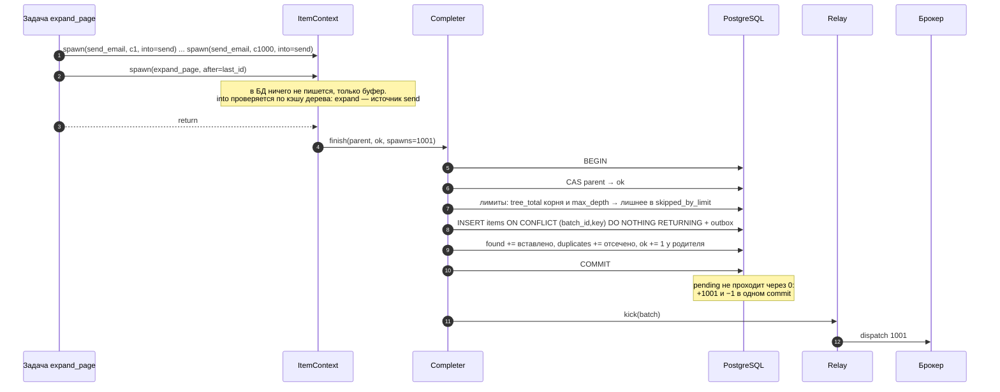

Падение до commit — нет ни детей, ни завершения родителя, и родитель перезапустится. Повтор родителя после commit невозможен: CAS вернёт 0 строк. Дубли детей при повторе исключены ключами.

### UC-06 Sub-batch

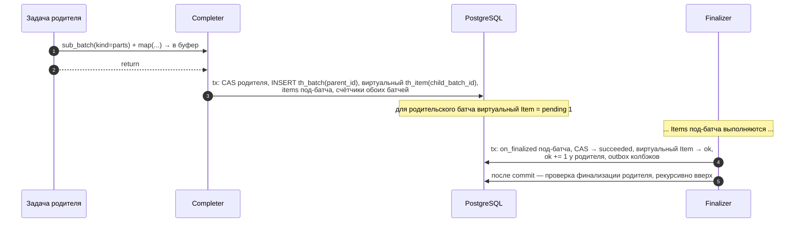

### UC-07 Финализация, `on_finalized` и колбэки

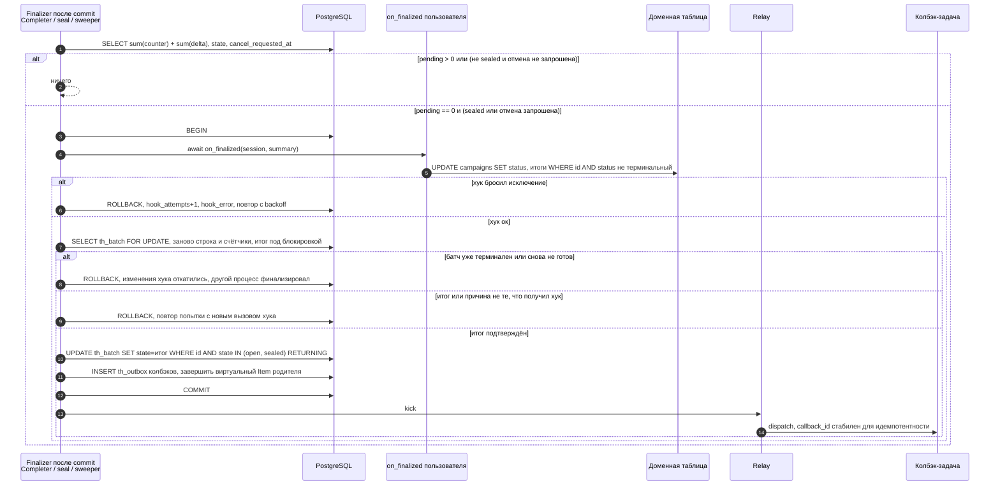

### UC-08 Завершение Item в транзакции пользователя

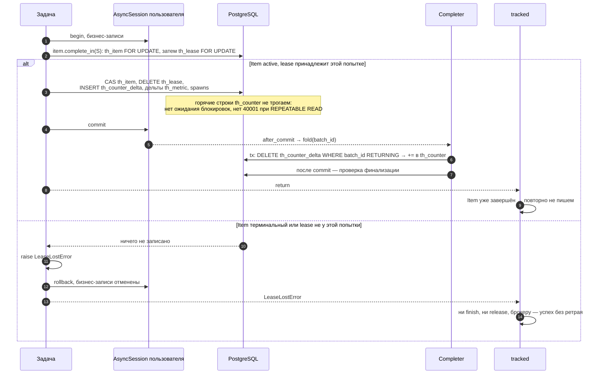

**Попытка, потерявшая Item.** Пока задача работала, Item мог уйти от неё: lease истёк, и sweeper записал `error("lease_expired")` или вернул Item в outbox; батч отменили; lease перехватил другой исполнитель. Доменная запись такой попытки не должна закоммититься, иначе нарушается «доменный эффект ⇔ Item `ok`» (I-04). Поэтому `complete_in` сначала блокирует строку `th_item`, затем строку `th_lease` (порядок §9.2) и продолжает, только если Item `active`, а lease принадлежит этой попытке: совпадают `worker_id` процесса и `attempt`, полученный при claim. Номер попытки нужен, потому что тот же процесс может получить Item заново после возврата в outbox: смена владельца после истечения lease делает `attempt += 1` (UC-03, UC-04, UC-15). Если условие не выполнено, `complete_in` ничего не пишет и бросает `LeaseLostError`.

* **Истёкший, но никем не занятый lease завершению не мешает.** Строка lease на месте и принадлежит попытке, строка Item заблокирована: sweeper пропустит её (`SKIP LOCKED`), claim дубля дождётся commit и увидит терминальный Item.
* **Проверка и запись — под одной блокировкой.** Владельца lease меняют только claim, `release`, возврат при остановке и sweeper, и все они блокируют строку `th_item` раньше строки lease. Между проверкой и commit транзакции пользователя перехват невозможен. Новых блокировок путь B не добавляет: обе строки он и так меняет (CAS и `DELETE th_lease`).
* **`LeaseLostError` — не ошибка задачи.** Ловить её не нужно: исключение должно выйти из блока транзакции, чтобы та откатилась. Обёртка `tracked` на ней не пишет ни `finish`, ни `release` и возвращает брокеру успех, как при `DUPLICATE` и `TERMINAL` в UC-03: Item уже завершён или принадлежит другому исполнителю, ретрай и DLQ ему только навредили бы. Если задача поймала `LeaseLostError` и вернулась обычным образом, бросила вместо неё другое исключение или была отменена, обёртка тоже ничего не пишет; чужое исключение уходит брокеру как есть.
* **Повторный вызов в той же попытке.** После commit — ничего не делает. До commit на том же соединении, пока первая запись в силе, — тоже ничего не делает: итог и `spawn`, накопленные после первого вызова, не записываются. До commit на другом соединении — `ConfigurationError`: Item завершается в одной транзакции. После отката транзакции или savepoint первая запись отменена вместе с удалением lease, и следующий вызов выполняет проверку и запись заново (A-DB-09).
* **Путь A проверяет то же владение.** `finish` и `release` из обёртки передают `attempt` попытки и под теми же блокировками ничего не пишут, если lease не у неё (UC-03); обёртка тогда завершает попытку тихо. Доменной записи у пути A нет, но без проверки `error("exhausted")` или `release` устаревшей попытки задели бы Item и lease другого исполнителя. Обработчик DLQ идёт по правилу сверки (UC-15).

### UC-09 Снимок прогресса в доменную таблицу

```mermaid
sequenceDiagram
    autonumber
    participant SN as Snapshotter (лидер)
    participant DB as PostgreSQL
    participant H as on_progress пользователя
    participant D as Доменная таблица

    loop каждые snapshot_tick
        SN->>SN: батчи, у которых наступил срок по расписанию в памяти
        SN->>DB: прочитать счётчики пачкой
        alt счётчики не изменились с прошлого снимка
            SN->>SN: сдвинуть срок в памяти, в БД ничего не пишем
        else изменились
            SN->>DB: BEGIN
            SN->>H: await on_progress(session, summary с seq = snap_seq + 1)
            H->>D: UPDATE campaigns SET sent, progress, progress_seq=:seq WHERE id AND progress_seq меньше :seq
            SN->>DB: UPDATE th_batch SET snap_seq=snap_seq+1 WHERE id AND snap_seq=:seen AND state IN (open, sealed)
            alt 0 строк: батч уже финализирован
                SN->>DB: ROLLBACK, снимок не перезапишет итог
            else
                SN->>DB: COMMIT
            end
        end
    end
```

### UC-10 Отложенный старт и перенос

```mermaid
sequenceDiagram
    autonumber
    participant U as API-код
    participant DB as PostgreSQL
    participant R as Relay scan
    participant B as Брокер

    U->>DB: th.batch(..., start_at=T, session) → items + outbox с available_at=T
    Note over R: relay не видит записи до T
    U->>DB: handle.reschedule(T2, session): UPDATE th_batch.start_at,<br/>UPDATE th_outbox SET available_at=T2 WHERE batch_id
    Note over DB: уже отправленные Items перенос не затрагивает, возвращается их число
    R->>DB: наступил T2 → claim SKIP LOCKED
    R->>B: dispatch
```

### UC-11 Пауза, продолжение, авто-пауза по политике

```mermaid
sequenceDiagram
    autonumber
    participant O as API-код
    participant TH as tallyho
    participant DB as PostgreSQL
    participant MW as tracked
    participant B as Брокер
    participant H as on_policy_breach

    O->>DB: UPDATE campaigns SET status=paused, в своей транзакции
    O->>TH: handle.pause(session) в той же транзакции
    TH->>DB: paused_at=now для батча и активных потомков<br/>UPDATE th_outbox SET available_at=∞ WHERE batch_id IN (...)
    B->>MW: уже отправленное сообщение Item батча на паузе
    MW->>DB: claim видит paused_at → park, ack без выполнения
    Note over MW: выполняющиеся Items доделываются
    O->>TH: handle.resume(session) + UPDATE campaigns SET status=running
    TH->>DB: paused_at=NULL, parked → available_at=now
    Note over TH,H: авто-пауза
    TH->>TH: Completer: доля error по labels выше порога после min_processed
    TH->>DB: BEGIN, on_policy_breach(session, summary, breach), paused_at=now, COMMIT
    H->>DB: UPDATE campaigns SET status=paused, pause_reason
```

### UC-12 Отмена

```mermaid
sequenceDiagram
    autonumber
    participant O as API-код
    participant DB as PostgreSQL
    participant MW as tracked
    participant T as Выполняющаяся задача
    participant F as Finalizer

    O->>DB: handle.cancel(session): cancel_requested_at=now, reason=cancel узлам поддерева без флага, add и spawn запрещены
    O->>DB: чанками: Items из outbox → cancelled, DELETE outbox, cancelled += n
    Note over MW: отправленные, но не начатые → ленивая отмена при claim
    T->>T: item.cancelled() == True → кооперативный выход
    F->>DB: когда pending = 0: on_finalized(summary.state=cancelled) + CAS → cancelled
```

### UC-13 Прогресс и watch

```mermaid
sequenceDiagram
    autonumber
    participant UI as UI / SSE
    participant H as BatchHandle
    participant DB as PostgreSQL

    UI->>H: view()
    H->>DB: один SELECT по дереву: sum(th_counter) + sum(th_counter_delta) + th_metric + th_feed + count(th_lease)
    H-->>UI: Progress на каждый батч дерева: found, done по классам, in_flight, expected, ratio, eta, labels
    UI->>H: watch()
    loop
        DB-->>H: NOTIFY th_progress, payload=batch_id, не чаще 1 раза в 500 мс на батч
        H-->>UI: новый BatchView
    end
```

Для UI, который читает доменную таблицу, `watch()` не нужен: там есть снимки из UC-09.

**Соединение подписки.** `watch()` держит одно соединение пула с `LISTEN th_progress`. Перед возвратом в пул на нём выполняется `UNLISTEN`: ни asyncpg, ни psycopg, ни пул SQLAlchemy подписку сами не снимают. `LISTEN` и `UNLISTEN` доводятся до конца, даже если поток в этот момент закрывают или отменяют; отмена применяется после них. Прерванный запрос asyncpg оставил бы на соединении подписку или Parse без Sync, то есть неявную транзакцию, и следующий `BEGIN` получил бы `now()` из прошлого. Если `LISTEN` или `UNLISTEN` упал, соединение инвалидируется и в пул не возвращается. `wait()` закрывает поток сам, поэтому к возврату из `wait()` (успех, таймаут, отмена) соединение уже в пуле и без подписки. Если пользователь выходит из `async for` по `watch()`, поток закроет сборщик мусора, позже, но с теми же гарантиями.

### UC-14 Retention и release

```mermaid
sequenceDiagram
    autonumber
    participant F as Finalizer
    participant CB as Колбэк export_failures
    participant D as Доменная таблица
    participant DB as PostgreSQL
    participant SW as Sweeper retention

    F->>DB: финализация + on_finalized, итог в домене, outbox колбэка
    CB->>DB: handle.items(labels=[hard_bounce]) страницами по th_item_mark
    CB->>D: INSERT campaign_failures ... чанками
    CB->>DB: handle.release(session) в той же транзакции, что и последний чанк
    SW->>DB: корни WHERE finished_at + retention меньше now AND (NOT release_required OR released_at IS NOT NULL)
    SW->>DB: DELETE деревом, чанками по 1000, вместе со строкой th_batch_attr
```

`retry_failed()` после `release()` отменяет разрешение (§7.6): `released_at` корня снова `NULL`, колбэк экспорта выполнится после новой финализации и вызовет `release()` ещё раз. Полный рецепт экспорта исходов — §12.9.

### UC-15 Sweeper: восстановление

```mermaid
sequenceDiagram
    autonumber
    participant SW as Sweeper (лидер)
    participant DB as PostgreSQL
    participant F as Finalizer
    participant R as Relay

    loop каждые sweep_interval
        SW->>DB: th_lease WHERE lease_until меньше now SKIP LOCKED
        SW->>DB: attempt меньше max → DELETE lease, INSERT outbox, attempt += 1
        SW->>DB: attempt исчерпан → finish error, label=lease_expired
        SW->>DB: lease у терминального Item → DELETE
        SW->>F: sealed, pending 0, updated_at старше grace или hook_error и backoff истёк → try_finalize
        SW->>DB: deadline_at меньше now, флага ещё нет → cancel_requested_at, reason=deadline для узла и потомков без флага → итог failed
        SW->>DB: этап open, все источники в th_feed терминальны → seal, страховка к UC-17
        SW->>DB: sealed, pending больше 0, но нет lease и outbox → reconcile по count(*)
        SW->>DB: несвёрнутые th_counter_delta старше grace → fold
        SW->>DB: retention (UC-14)
        SW->>R: kick
    end
```

`max` в проверке lease — эффективный лимит повторов Item, тот же, с которым relay ставит задачу в брокер (D-012): опция вызова `max_retries` из `th_item.options`, а если её нет — умолчание задачи. Умолчание знает только адаптер (у flexiq это `max_retries` декоратора `@fq.task`, у `InlineBroker` — настройка брокера), поэтому sweeper спрашивает его по `task_name` через необязательный протокол `RetryLimits` (§4.2). Адаптер без `RetryLimits` или незнакомая ему задача дают умолчание 0. Sweeper работает в процессе maintenance рядом с relay, а relay без зарегистрированных задач отправлять не может, так что реестр задач там уже есть.

Истёкший lease тратит попытку: при возврате в outbox sweeper делает `attempt += 1`, так же как claim при перехвате истёкшего lease (UC-03) и `release` при ретрае брокера (UC-04). Item, исполнитель которого погибает каждый раз, получит `error("lease_expired")` после `max` возвратов, а не будет переотправляться бесконечно.

#### Сверка с DLQ брокера

Sweeper видит только Items с lease. Джоба, которая ушла в DLQ, не взяв lease, оставляет Item `active` без lease, outbox и джобы: claim падал с `CompleterError`, пока PostgreSQL был недоступен дольше, чем брокер повторяет джобу, а обработчик события DLQ не смог записать итог по той же причине (либо событие потеряно — брокер доставляет его без гарантий). По данным tallyho такой Item неотличим от Item, который ждёт в очереди брокера, поэтому его находит только сверка с DLQ.

```mermaid
sequenceDiagram
    autonumber
    participant R as Цикл relay (процесс с адаптером)
    participant DB as PostgreSQL
    participant A as Adapter
    participant F as Finalizer

    loop после каждого scan, раз в sweep_interval
        R->>DB: BEGIN, строка курсора в th_meta FOR UPDATE SKIP LOCKED
        alt строка занята другим процессом
            R-->>R: пропустить проход
        else
            R->>A: reconcile_dead(cursor)
            A-->>R: мёртвые джобы (item, generation), новый курсор, есть ли ещё
            R->>DB: th_batch FOR SHARE → th_item FOR UPDATE → th_lease FOR UPDATE
            R->>DB: осиротевшие Items → CAS error(exhausted), счётчики, th_item_mark
            R->>DB: живой lease того же поколения → redelivered = true
            R->>DB: UPDATE курсора, COMMIT
            R->>F: try_finalize затронутых батчей
        end
    end
```

Мёртвая джоба несёт в служебном маркере Item и **поколение отправки**, с которым relay её поставил (§5.1). Под блокировками строк сверка применяет правило:

| Состояние Item | Действие | Почему |
|---|---|---|
| Item нет или он терминальный | ничего | CAS идемпотентен, итог уже записан |
| `th_item.generation` ≠ поколению джобы | ничего | после этой джобы Item вернулся в outbox: за него отвечает более новая отправка — ждёт relay, ждёт в очереди брокера, выполняется или получит свою запись DLQ. Мёртвая джоба прошлой отправки его не касается |
| поколение совпало, есть запись outbox | ничего | relay ещё не подтвердил отправку и поставит джобу снова |
| поколение совпало, lease живой | `th_lease.redelivered = true`, Item не завершается | выполнение ещё идёт (жёсткий таймаут брокера не отменяет корутину, §11.3), и его итог запишет оно само. Джоба закрыта, ретрая от брокера не будет — отметка заставит `release` вернуть Item в outbox (UC-04) |
| поколение совпало, lease истёк | ничего | переотправит или завершит sweeper |
| поколение совпало, нет ни lease, ни outbox | батч отменяется → `cancelled`, иначе `error("exhausted")` | у Item не осталось исполнителя |

Правило не зависит от времени и от того, насколько сверка отстала: запись DLQ можно разобрать через секунду или через сутки, повторный разбор той же записи ничего не меняет. Item, который переотправлен после мёртвой джобы и снова выполняется, сверка не трогает — у него другое поколение; `retry_failed()` тоже увеличивает поколение, поэтому старые записи DLQ не задевают повторённые Items.

Курсор — непрозрачная строка адаптера в `th_meta` (`dead_letter_cursor`). Он читается под блокировкой строки и записывается в той же транзакции, что и завершения Items: проход либо применён целиком вместе со сдвигом курсора, либо не применён вовсе. Адаптер не возвращает курсор назад. Один проход — до 5 порций (порция — одна страница DLQ); остаток разбирает следующий проход. Чтение DLQ ограничено 30 с и идёт внутри транзакции, которая держит только строку курсора; строки Items блокируются после чтения и на время записи.

Событие DLQ (`JOB_DEAD` у flexiq) остаётся основным путём и применяет то же правило сразу, в своей транзакции: мёртвая джоба несёт поколение в маркере, живой lease того же поколения получает `redelivered = true`, Item без lease и outbox завершается. Безусловного `finish` по событию нет: событие о джобе прошлого поколения или о джобе, которую брокер закрыл при живом выполнении, иначе завершило бы Item, который выполняет или ждёт другая отправка. Сверка — страховка с задержкой до `sweep_interval`. Сверку выполняют только процессы, где работает цикл relay: установка, в которой после рестарта нет ни одного такого процесса (только воркеры без spawn и CLI `tallyho maintenance`), DLQ не сверяет, как и не сканирует outbox.

Ключ дедупликации брокера включает поколение (у flexiq — `idempotency_key=th:{item_id}:{generation}`, §11.3). Иначе повторная отправка нового поколения слилась бы с ещё живой джобой прошлого: если та потом уйдёт в DLQ, не взяв lease, а событие DLQ потеряется, сверка увидит прошлое поколение и Item не завершит. С поколением в ключе у новой отправки своя джоба и своя запись DLQ; повтор relay в пределах одного поколения по-прежнему дедуплицируется. Ключ, заданный пользователем, передаётся как есть (§11.4): с ним слияние поколений остаётся возможным, и такой Item в этом редком случае снимает дедлайн батча (§10).

### UC-16 Повтор упавших

```mermaid
sequenceDiagram
    autonumber
    participant O as API-код
    participant DB as PostgreSQL
    participant R as Relay

    O->>DB: retry_failed(labels=[exhausted], session): CAS completed_with_errors / failed → sealed
    O->>DB: корень: finished_at = NULL, released_at = NULL
    O->>DB: чанками по th_item_mark: state=active, attempt=0, generation += 1, error −n, INSERT outbox
    O->>DB: доменный статус меняет сам пользователь в этой же транзакции
    R->>R: отправка → UC-03 … UC-07, on_finalized вызовется снова с новым итогом
```

`on_finalized` после `retry_failed` вызывается повторно. Хук должен быть написан как «установить итог», а не «прибавить к итогу». Колбэк `on_finalized_task` тоже ставится заново, а выданный ранее `release()` перестаёт действовать (§7.6): экспорт исходов Items повторяется для нового итога.

`retry_failed` у этапа, который наполняет другие (например, `cards`), возможен, только пока его этапы-получатели не финализированы. Иначе новые Items не смогут никуда добавлять, и будет ошибка `DownstreamFinalized`. Повтор всего конвейера — `retry_failed` на корне: он переоткрывает этапы от источников к получателям.

### UC-17 Конвейер этапов: into, авто-seal, каскад

```mermaid
sequenceDiagram
    autonumber
    participant U as Продюсер
    participant P as pages
    participant C as cards fed_by pages
    participant D as pdfs fed_by cards
    participant DB as PostgreSQL
    participant F as Finalizer

    U->>DB: корень + pages + cards + pdfs + th_feed, одна транзакция
    U->>P: add(parse_page, 1), seal(pages)
    loop страницы
        P->>DB: finish страницы: spawn страниц в pages, spawn карточек into=cards
    end
    Note over C: cards уже работает, пока pages ещё идут.<br/>cards open → даже при pending 0 не финализируется
    loop карточки
        C->>DB: finish карточки: spawn PDF into=pdfs, дубли отсечены ключом
    end
    F->>DB: последняя страница → финализация pages + on_finalized(pages)
    F->>DB: в той же tx: lock cards FOR UPDATE, все источники терминальны → cards sealed
    Note over C: found карточек теперь точный: все карточки<br/>закоммичены вместе с завершением своих страниц
    F->>DB: последняя карточка → финализация cards → pdfs sealed
    F->>DB: последний PDF → финализация pdfs → виртуальный Item корня ok
    F->>DB: все дети финализированы → финализация корня + on_finalized(корень)
    alt в cards не пришло ни одной карточки
        F->>DB: cards sealed при found 0 → сразу финализирован → pdfs sealed → финализирован
    end
```

---

## 9. Счётчики и групповой коммит

Подробный ресёрч — в [COUNTERS.md](COUNTERS.md); разделы про SQLite там устарели.

### 9.1 Два пути записи, одно хранилище

```mermaid
flowchart LR
    subgraph A["Путь A: 99% завершений"]
        a1["tracked"] --> a2["Completer buffer"]
        a2 -->|"тик 20 мс или 500 шт"| a3["одна короткая tx"]
        a3 --> ctr[("th_counter<br/>слот процесса")]
    end
    subgraph B["Путь B: complete_in(session)"]
        b1["tx пользователя"] --> b2[("th_counter_delta<br/>только INSERT")]
        b2 -->|"after_commit / sweeper<br/>DELETE ... RETURNING"| fold["fold в Completer"]
        fold --> ctr
    end
    ctr --> read["view / финализация / снимки:<br/>sum(counter) + sum(delta)<br/>одним SELECT"]
    b2 --> read
```

### 9.2 Транзакция Completer (путь A)

```
BEGIN; SET LOCAL lock_timeout = '5s'
 1. SELECT id FROM th_item WHERE id = ANY(:ids) ORDER BY id FOR UPDATE      -- порядок блокировок
    SELECT worker_id, attempt FROM th_lease WHERE item_id = ANY(:ids) ORDER BY item_id FOR UPDATE
      → finish/release попытки, которой lease уже не принадлежит, отбрасываются (UC-03)
 2. UPDATE th_item SET state, label, result, error, finished_at
      WHERE id = ANY(:ids) AND state = active RETURNING id, batch_id, state, label, weight
                                                                            -- считаем только вернувшиеся
 3. DELETE FROM th_lease WHERE item_id = ANY(:ids)
 4. лимиты spawn: sum(tree_total) корней затронутых деревьев (слоты, PK) и depth → лишнее в skipped_by_limit
 5. INSERT spawned items + outbox (unnest) ON CONFLICT (batch_id, key) DO NOTHING RETURNING
      → found += вставлено, duplicates += отсечено (по целевым батчам)
 6. INSERT th_item_mark для помеченных
 7. expect(n): UPDATE th_batch SET expected_total = GREATEST(expected_total, :n) — редкая запись
 8. агрегировать в памяти → UPSERT th_counter (batch_id, slot процесса) ORDER BY batch_id,
      включая tree_total у корней
 9. UPSERT th_metric (batch_id, name, slot) ORDER BY batch_id, name
COMMIT → resolve futures → kick relay → try_finalize для затронутых sealed-батчей
```

Порядок блокировок: `[доменные строки пользователя] → th_batch → th_item (по id) → th_counter (по batch_id, slot) → th_metric`. Нарушение — баг. Тот же порядок у Finalizer (§8.1 п.3) и операций над поддеревом. Ловится стресс-тестом: любой `40P01` на соединениях сценария, включая повторённый автоматически, — падение.

### 9.3 Чтение

```sql
SELECT
  sum(c.total)  + coalesce(d.total, 0)  AS total,
  sum(c.ok)     + coalesce(d.ok, 0)     AS ok,
  ...
FROM th_counter c
LEFT JOIN LATERAL (
  SELECT sum(d_total) total, sum(d_ok) ok, ... FROM th_counter_delta WHERE batch_id = :b
) d ON true
WHERE c.batch_id = :b
GROUP BY d.total, d.ok, ...;
```

* `found = total` — уникальные Items (ретраи и дубли не входят)
* `done = ok + skip + error + cancelled`, `pending = found − done`
* `in_flight` — точное число строк `th_lease` батча; `queued = pending − in_flight`

### 9.4 Модель прогресса

Прогресс батча — это `Progress` (§3.4), который собирается в Python из уже прочитанных строк счётчиков. Дополнительных запросов к БД нет, кроме `in_flight` (count по индексу `th_lease(batch_id)`).

**Ожидаемый итог (`expected`)** — по правилам, от точного к оценке:

| Условие | `expected` | `expected_is_estimate` |
|---|---|---|
| батч `sealed` или терминальный | `found` | нет |
| задан `expect(n)` или `expected_total` | `max(found, expected_total)` | да, пока не sealed |
| есть источники `fed_by`, выборка достаточна | оценка по ветвлению (ниже) | да |
| иначе | `None` — показываем только «найдено» | — |

**Оценка по ветвлению** (оценщик Кнута для размера дерева). Каждый Item этапа X закоммичен вместе с завершением своего родителя в источнике F. Поэтому `found_X / done_F` — точное среднее число детей у **завершённых** родителей:

```
ratio_X       = found_X / Σ done_F                       по всем источникам F
expected_X    = max(found_X, ratio_X × Σ expected_F)     рекурсивно вверх по fed_by
estimate_basis_X = Σ done_F                              на скольких родителях построена оценка
```

Оценку не показываем, пока `estimate_basis < min(estimate_min_basis, estimate_min_share × expected_F)`: нужно 20 завершённых родителей **или** 5% источника, что наступит раньше. У каталога из 24 страниц оценка появится со 2-й страницы, у аудитории в 10 000 — с 20-й. Неточность одна: у ещё не завершённых родителей детей может быть больше или меньше среднего. Оценка сходится по ходу работы и становится точной, когда источники закончились и этап закрыт.

**Доля (`ratio`)** — по весам задач, с оценкой объёма:

```
ratio_батча = w_done / (w_total / found × expected)        если expected известен
ratio_корня = Σ w_done_детей / Σ ожидаемый w_total_детей   по дереву
```

`ratio` может немного откатиться назад, если оценка выросла. Библиотека отдаёт честные числа; рецепт для домена — `progress = GREATEST(progress, :ratio)` в `on_progress`.

**ETA** — время до опустошения, а не процент: `(expected − done) / скорость`, где скорость — экспоненциальное скользящее среднее `done` в секунду по снимкам (окно `eta_window`, по умолчанию 60 с). Считается в Snapshotter и в `watch()`, не хранится. Без `expected` ETA нет.

**Собственный прогресс задачи.** `item.progress(done, total)` пишется в `th_lease` вместе с ближайшим heartbeat — лишних транзакций нет. Он виден в `handle.in_flight()`: id, возраст lease, попытка, `progress_done/progress_total`. На общий прогресс батча не влияет, служит для отладки долгих и застрявших задач.

---

## 10. Гарантии и отказы

**Семантика:**
* выполнение задач — at-least-once;
* учёт — идемпотентный;
* финализация — ровно один commit вместе с `on_finalized`;
* колбэки — exactly-once постановка и at-least-once выполнение со стабильным `callback_id`.

| Отказ | Защита | Время восстановления |
|---|---|---|
| Падение между commit и dispatch | Outbox + relay scan в любом процессе с адаптером | `relay_grace` + `sweep_interval` (до 10 с) |
| Брокер доставил дважды | claim через `th_lease` + CAS state | мгновенно |
| Дубль закрыл джобу брокера при живом lease, а исходное выполнение упало с вердиктом RETRY | claim помечает `th_lease.redelivered`, `release` возвращает Item в outbox (UC-04) | мгновенно (kick relay) / `relay_grace` |
| PostgreSQL недоступен при claim, release или finish | операция бросает `CompleterError`; адаптер flexiq добавляет её в `retry_on` задачи, поэтому джоба уходит в ретрай брокера, а не сразу в DLQ (§11.3) | как у брокера; незавершённый lease — `lease_ttl` |
| Джоба ушла в DLQ, не завершив Item и не оставив lease: PostgreSQL недоступен дольше ретраев брокера, событие DLQ потеряно или его обработчик тоже не смог записать итог | сверка с DLQ в процессах с адаптером: `error("exhausted")`, если мёртвая джоба — текущее поколение отправки Item (UC-15) | `sweep_interval` после восстановления PostgreSQL |
| Воркер убит посреди задачи | lease + heartbeat → sweeper | `lease_ttl` (60 с) |
| Задача пережила свой lease: Item завершён sweeper-ом (`lease_expired`), отменён или перехвачен, а задача вызывает `complete_in` или завершается (путь A: успех, `RETRY`, `FINAL`) | проверка lease попытки (`worker_id`, `attempt`) под блокировкой строки `th_item`: `complete_in` бросает `LeaseLostError`, транзакция пользователя откатывается; `finish`/`release` пути A ничего не пишут. Обёртка завершает попытку без записи итога и без ретрая (UC-03, UC-08) | мгновенно |
| Событие DLQ о джобе прошлого поколения или о джобе, закрытой при живом выполнении | обработчик события применяет правило сверки (UC-15): поколение, lease, outbox | мгновенно |
| Процесс останавливается штатно (`SIGTERM`), а задачи ещё выполняются или операции лежат в буфере | `th.aclose()`: буфер Completer досылается, удержанные Items возвращаются в outbox без траты попытки (§11.1) | мгновенно, повторная отправка — `relay_grace` + `sweep_interval`; если закрытие не уложилось в `close_timeout` — `lease_ttl` |
| Воркер убит посреди flush Completer | транзакция откатилась, задача не вернула результат → повтор брокера | как у брокера |
| Две параллельные «последние» задачи | проверка после commit + CAS финализации | мгновенно |
| Пропущенная проверка финализации | sweeper по `updated_at` | `finalize_grace` (30 с) |
| `on_finalized` упал (баг, блокировка, таймаут) | откат всей финализации, батч остаётся `sealed`, повтор с backoff | после починки ≤ 5 мин или `retry_finalize()` |
| Хук не импортирован в процессе | финализация отложена до процесса с хуком, метрика `th_hook_missing` | как только maintenance подберёт |
| Снимок прогресса опоздал и пришёл после итога | CAS по `snap_seq` и `state` → откат вместе с изменениями хука | — |
| Retention раньше, чем домен забрал детали | `release_required` + `release()` | — |
| Этап закрылся, пока в него ещё добавляют | правило записи: писать могут только сам этап и его источники, а источник с живой задачей не финализирован (§8.1) | невозможно по построению |
| Два источника этапа финализировались одновременно, и этап не закрылся | `FOR UPDATE` строки этапа сериализует проверку + sweeper | мгновенно / `sweep_interval` |
| Этап никто не наполнил (0 Items) | закрытый пустой батч финализируется сразу, каскадом дальше | мгновенно |
| Источник упал | считается финализированным: этап закрывается (`seal`) или отменяется (`cancel`) | мгновенно |
| Дубликат при spawn | `ON CONFLICT DO NOTHING RETURNING` до счётчиков, `duplicates += n` | — |
| Бесконечное разрастание (циклические ссылки, ошибка парсера) | `max_items` на дерево, `max_depth` на самоподпитку → `skipped_by_limit` | — |
| Часы воркеров расходятся | все сроки (`lease_until`, `start_at`, `deadline_at`, `available_at`, retention) считаются по `now()` БД, а не по локальным часам процесса | — |
| Колбэк не отправлен | outbox, вставлен в той же tx, что и CAS | `relay_grace` + `sweep_interval` |
| Дрейф счётчика | reconcile по `count(*)` | цикл sweeper'а |
| Дедлок | глобальный порядок блокировок + retry `40P01` | мгновенно |
| Чужая блокировка | `lock_timeout` + retry с backoff | ≤ 5 с |
| Задачи висят по бизнес-причине | `deadline` батча | как задано |
| Долгая транзакция в кластере | не ломает корректность, деградирует скорость. Мониторинг `backend_xmin`, рекомендации в доке | — |

---

## 11. Публичный API и адаптер flexiq

### 11.1 Установка

```python
from tallyho import Tallyho, item
from tallyho.adapters.flexiq import FlexiqAdapter

th = Tallyho(engine, schema="app", hook_modules=["app.mailing.hooks"])
fq = FlexiqAdapter(queue)  # flexiq.Queue пользователя
th.install(fq)  # системная задача tallyho.system и DLQ-хук


@fq.task(max_retries=4)  # = queue.task(...)(tracked(fn)), см. §11.3
async def my_task(x: int) -> None:
    item.incr("seen", x)  # фасад текущей задачи — модульный, не атрибут th


await th.migrate()  # или ревизии Alembic: upgrade(..., version=1), затем version=2, 3, 4 и 5
```

`th.install(adapter)` запускает в процессе relay (§3.2): отправка после commit не требует отдельного процесса maintenance. В том же цикле идёт сверка с DLQ брокера (UC-15). `th.install(None)` — установка без брокера для процессов обслуживания и чтения (CLI): `th.batch` и `th.call` в ней бросают `ConfigurationError`, relay не создаётся, `th.maintenance()` выполняет sweeper, финализацию и снимки.

**Фасады задачи.** `item`, `callback` и `tracked` импортируются из пакета (`from tallyho import item, callback, tracked`) и атрибутами `Tallyho` не являются. Контекст выполняемой задачи живёт в `ContextVar` процесса и к установке не привязан: тот же `item` работает с любым адаптером и вне задачи ничего не делает, поэтому модуль задач не обязан видеть объект `th`. `tracked(fn)` нужен адаптеру брокера без собственного декоратора; `@fq.task(...)` применяет его сам (§11.3). Слой `api` не импортирует `runtime` (§3.3), и атрибуты `th.item`/`th.tracked` нарушили бы это разделение.

**Схема и соединения.** `schema` записывается в сами таблицы библиотеки (`MetaData(schema=...)`), поэтому каждый её запрос содержит имя схемы и не зависит от настроек соединения. Из этого следуют три правила:

* **Соединение пользователя.** `session=` в `th.batch` и в операциях handle, `item.complete_in(session)` работают на любой `AsyncSession` / `AsyncConnection` той же базы: `search_path` и `schema_translate_map` для таблиц tallyho не нужны. Состояние чужого соединения библиотека не меняет: ни опций выполнения, ни `search_path` (никаких `SET` на горячем пути), ни границ транзакции (D-004).
* **Действия после commit.** Kick relay, финализация после seal, наблюдатели и свёртка дельт `complete_in` запускаются только после успешного COMMIT внешней транзакции; откат, ошибка COMMIT и откат savepoint, в котором была запись, их отменяют, release savepoint передаёт их внешней транзакции. Для `AsyncSession` они выполняются событием сессии после commit, для своей транзакции библиотеки — сразу по выходе из неё. Для `AsyncConnection` пользователя у SQLAlchemy нет события после COMMIT (событие `commit` срабатывает до него), поэтому действия выполняются, как только COMMIT подтверждён: в ближайшем проходе event loop или при следующем обращении к соединению (новая транзакция, `after_commit`), но не внутри самого `await conn.commit()`. Ошибку COMMIT библиотека узнаёт по событию `handle_error` движка этого соединения.
* **Таблицы пользователя.** Их адрес определяет движок пользователя — и в его транзакциях, и в tx-хуках: сессия хука работает на соединении движка, переданного в `Tallyho(engine)`, с опциями этого движка. Таблица без схемы ищется по `search_path` или по `schema_translate_map` пользователя, а не в схеме tallyho.
* **`schema=None`.** Таблицы tallyho описаны без схемы, и их адрес определяет соединение. Тогда все движки, через которые вызывается библиотека, должны быть настроены одинаково.

Если в `schema_translate_map` пользователя есть ключ, равный имени схемы tallyho, отображение действует и на таблицы tallyho — как на любые таблицы с этой схемой.

**Закрытие.** `await th.aclose()` — корректное закрытие установки в процессе. Его вызывают один раз при остановке, когда приложение уже перестало принимать работу: HTTP-сервер остановлен, воркер брокера вышел из drain. Шаги:

1. Установка помечается закрытой: новая фоновая работа не создаётся. Работающий `th.maintenance().run()` получает просьбу остановиться (`stop()`); дожидается его тот, кто его запустил.
2. `aclose` ждёт после-коммитные задачи фасада и операций: финализацию после `seal`, `cancel`, `retry_failed`, `retry_finalize`, публикацию прогресса.
3. Закрывается Completer: heartbeat-задачи выполняющихся Items отменяются, принятые операции досылаются, после-коммитная работа (политика, финализация, каскад) завершается. Items, lease которых процесс ещё держит, одной транзакцией возвращаются в outbox: lease удаляется, попытка не тратится, `dispatched -= 1` (A-CH-08). Отправит их relay любого процесса с адаптером.
4. Останавливается relay: текущий проход завершается, уже полученные `kick` отправляются.

Шаги 2 и 3 идут одновременно, шаг 4 — после них: финализация ещё может положить колбэк в outbox.

**Ограничение по времени.** На шаги 2–4 отведён общий бюджет `close_timeout` (§15). Когда он исчерпан, оставшиеся задачи отменяются: `CancelledError` доставляется задаче, и `aclose` дожидается, пока она завершится. В лог пишется предупреждение, исключения `aclose` не бросает. Ничего не теряется, восстановление лишь перестаёт быть мгновенным: незаконченную финализацию выполнит sweeper через `finalize_grace`, невозвращённые lease истекут через `lease_ttl`, захваченные записи outbox вернутся через `relay_claim_ttl`. Операции Completer, не попавшие в commit, получают `CompleterError`. Отказ транзакции возврата lease (PostgreSQL недоступен) тоже только логируется. Отмена самого вызова `aclose` пробрасывается как обычно.

**Event loop.** Компоненты привязаны к event loop, в котором начали работать: Completer и relay воркера — к loop исполнителя flexiq, а не главного потока. `aclose` можно вызвать из любого loop: каждую часть он закрывает в её loop.

| Состояние loop владельца | Что делает `aclose` |
|---|---|
| тот же, откуда вызван | выполняет закрытие напрямую |
| другой, работает (другой поток) | передаёт корутину через `run_coroutine_threadsafe` и ждёт её |
| другой, остановлен, но не закрыт (flexiq после выхода из `run_worker`) | сам докручивает этот loop в служебном потоке, пока закрытие не завершится. Запрос к БД, прерванный остановкой loop посреди выполнения, в другом потоке не возобновляется (SQLAlchemy привязывает его к потоку через greenlet) и завершается ошибкой: фоновая работа её логирует, недоделанное подбирает sweeper; запросы самого закрытия выполняются штатно |
| закрыт | пропускает с предупреждением: задачи уже не выполнятся, lease вернёт sweeper |

Поэтому воркер flexiq закрывается так: `queue.run_worker(...)`, затем `asyncio.run(th.aclose())`; вариант с остановкой, ограниченной по времени, — в §11.3.

**После закрытия.** Повторный `aclose` — no-op; второй вызов, сделанный, пока первый ещё выполняется, его не ждёт. Установка не перезапускается: `th.batch`, операции `BatchHandle`, меняющие батч (`pause`, `resume`, `cancel`, `reschedule`, `retry_failed`, `retry_finalize`, `release`), `th.maintenance()`, `th.run_maintenance_once()` и операции Completer (claim, heartbeat, finish, release, `complete_in`) бросают `ClosedError` — подкласс `InvalidStateError`. Чтение (`view`, `watch`, `wait`, `in_flight`, `items`, `find`, `list_batches`) и `migrate` работают. After-commit действия транзакций, начатых до закрытия, не бросают: `kick` только копит id, финализация не запускается — запись отправит scan другого процесса, финализацию выполнит sweeper.

### 11.2 Сводка

| Область | Методы |
|---|---|
| Батч | `th.batch(kind, key=, seal=, start_at=, on_succeeded=, on_completed_with_errors=, on_failed=, on_cancelled=, on_finalized_task=, failure_policy=, max_in_flight=, expected_total=, max_items=, deadline=, retention=, release_required=, attributes=, memo=, session=)` → `BatchBuilder`: `add`, `map`, `add_calls`, `sub_batch`, `expect`, `seal` |
| Под-батч / этап | `builder.sub_batch(key, fed_by=[...], on_feeder_failed="seal" или "cancel", max_in_flight=, max_depth=, expected_total=, failure_policy=, on_...=)` — те же параметры, что у батча, плюс `kind=`, кроме `retention`/`release_required`/`max_items`/`attributes`/`memo` (задаются только у корня) и `seal`/`session` (действуют на весь builder корня) |
| Поиск | `th.handle(batch_id)`, `th.find(kind, key)`, `handle.child(key)`, `th.list_batches(kinds=, states=, attributes=, created_after=, created_before=, limit=, cursor=)` → `BatchPage` |
| Handle | `view`, `watch`, `wait`, `in_flight(limit=)`, `reschedule`, `pause`, `resume`, `cancel`, `retry_failed(labels=)`, `retry_finalize`, `release`, `items(states=, labels=)` |
| Задача | `from tallyho import item`: `item.id()`, `spawn(fn, *args, **kwargs)`, `spawn(fn, *args, into=, key=)`, `spawn_call(call, into=)`, `sub_batch(key, kind=, start_at=, deadline=, failure_policy=, max_in_flight=, expected_total=, max_depth=, on_...=)`, `expect(n, into=)`, `progress(done, total)`, `incr`, `ok(label=, result=)`, `skip(label)`, `error(label, detail=)`, `complete_in(session)`, `cancelled()`, `current()` |
| Колбэк | `from tallyho import callback`: `callback.current()` → `CallbackContext(callback_id, batch_id)`; `None` вне колбэк-задачи |
| Вызовы | `th.call(fn, *args, **kwargs).opts(key=, weight=, queue=)` — типизировано через `ParamSpec` |
| Tx-хуки | `@th.on_finalized(kind)`, `@th.on_progress(kind, every=)`, `@th.on_policy_breach(kind)` |
| Политики | `th.FailurePolicy.continue_() / fail_fast() / threshold(ratio=, min_processed=, labels=, action="fail" или "pause")` |

`into=` — ключ под-батча внутри дерева (`"cards"`) или его id (`UUID`, например `handle.id`). `BatchHandle` целиком не принимается: `runtime` не зависит от `api` (§3.3), а id в задаче доступен и без handle. `key=` — ключ дедупликации Item в целевом батче. Для URL рекомендуем нормализованный адрес без фрагмента, как `uniqueKey` у Crawlee.

**Формы `spawn`.** Сигнатура задачи проверяется через `ParamSpec` (A-NF-04), а `ParamSpec` не умеет добавлять к чужой сигнатуре keyword-only параметры. Поэтому у `spawn` две типизированные формы: `spawn(fn, *args, **kwargs)` — аргументы задачи как есть, цель — свой батч; `spawn(fn, a1[, a2[, a3]], into=, key=)` — до трёх позиционных аргументов задачи и маршрут. Имена `into` и `key` зарезервированы: `spawn` забирает их себе и в задачу не передаёт. Остальное — именованные аргументы задачи вместе с маршрутом, вес, очередь, опции брокера — задаётся подготовленным вызовом: `item.spawn_call(th.call(fn, *args, **kwargs).opts(key=, weight=, queue=, ...), into=)`. Отдельного `opts=` у `spawn` нет: второй способ задать те же опции только расширил бы API.

**Колбэк-задача.** `callback.current()` даёт `callback_id` (стабилен при повторной доставке — ключ идемпотентности) и `batch_id` финализированного батча. Сводки в контексте нет: итоговые счётчики атомарно с финализацией пишет `on_finalized` (§7.2), а колбэку, которому они нужны, хватает `th.handle(batch_id).view()`. Возить `BatchSummary` всего дерева в payload каждой колбэк-джобы ради редкого чтения — лишний объём outbox и брокера.

**Потоковое добавление.** `th.batch(..., seal=False)`: выход из `async with` коммитит добавленное, но не закрывает ни корень, ни под-батчи этого builder. Следующий вход с тем же `(kind, key)` находит открытый батч и добавляет в него в новой транзакции; закрывает батч вход без `seal=False` или явный `await builder.seal()`. Сценарий и правила — UC-02.

`max_in_flight` действует **на этот экземпляр батча**. Глобальный лимит на тип задачи для всех батчей сразу — это забота брокера (flexiq `max_concurrent`, `rate_limit`). Это разделение важно: у Airflow `max_active_tis_per_dag` неожиданно действует на все запуски.

Окно считается по узкой таблице `th_window`: relay при захвате записи outbox вставляет строку `(item_id, batch_id)`, завершение Item её удаляет и возвращает в очередь столько запаркованных записей батча, сколько мест освободилось. Захват по батчу с окном сериализуется `pg_try_advisory_xact_lock`: занятый батч relay пропускает до следующего прохода. Записи сверх окна паркуются (`available_at = ∞`), scan relay страхует возврат мест. Строка окна ключом по `item_id`, поэтому повторный захват после падения relay место не удваивает.

`item.complete_in(session)` бросает `LeaseLostError`, если попытка больше не владеет Item (UC-08). Вне отслеживаемой задачи это no-op, как и остальные методы `item`, кроме `sub_batch`: он возвращает builder и вне задачи бросает `ConfigurationError`.

Метки итога — свободные строки. По умолчанию `ok()` без label → `"ok"`, исчерпанные попытки → `error("exhausted")`, lease истёк на последней попытке → `error("lease_expired")`, отмена → `cancelled`. `error()` по умолчанию помечается в `th_item_mark`, `ok()`/`skip()` — нет (переопределяется `mark=`).

**Атрибуты.** `attributes=` и `memo=` принимает только `th.batch(...)`; правила значений — §5.1, лимиты — §15. `BatchView.attributes`, `BatchView.memo` и `BatchSummary.attributes` у любого узла дерева — значения корня; у батча без атрибутов — пустой словарь, `memo` — `None`.

**Листинг батчей.** `th.list_batches(...)` возвращает только корни, от новых к старым (keyset по `id DESC`, UUIDv7):

| Параметр | Значение |
|---|---|
| `kinds` | коллекция `kind`; `None` — любые |
| `states` | коллекция `BatchState`; `None` — любые |
| `attributes` | словарь, все пары которого должны совпасть (containment); значения нормализуются той же функцией, что при записи |
| `created_after` / `created_before` | границы по `created_at`, полуинтервал `[after, before)` |
| `limit` | размер страницы, по умолчанию 100, не больше 1 000 |
| `cursor` | непрозрачная строка из `BatchPage.next_cursor`; чужой или испорченный курсор — `ConfigurationError` |

Результат — `BatchPage(items: tuple[BatchInfo, ...], next_cursor: str | None)`. `BatchInfo` — лёгкий DTO без прогресса: `id`, `kind`, `key`, `state`, `attributes`, `created_at`, `finished_at`. Счётчики листинг не читает: за прогрессом — `th.handle(info.id).view()`. Батч, созданный во время обхода, на уже пройденные страницы не попадает и не сдвигает их: страницы не содержат ни пропусков, ни дублей среди батчей, существовавших на момент первого запроса.

**Чтение Items.** `handle.items(*, states=None, labels=None)` — асинхронный итератор `ItemView` одного батча (не поддерева):

* хотя бы один фильтр обязателен; вызов без фильтров — `ConfigurationError`: полный обход батча не должен получаться случайно;
* `labels=` читает `th_item_mark` и находит только помеченные Items (по умолчанию — ошибки);
* `states=` (коллекция `ItemState`) находит Items в любом состоянии, включая `CANCELLED`, которые не помечаются. Батч обходится по индексу `(batch_id, id)` окнами фиксированного размера: каждый запрос читает не больше `items_scan_window` строк и отдаёт из них подходящие. Один statement не сканирует весь остаток батча при редких совпадениях и не упирается в `statement_timeout`; цена — число запросов пропорционально размеру батча, а не числу совпадений;
* оба фильтра вместе — пересечение;
* виртуальные Items под-батчей выдаются как есть и отличаются по `child_batch_id`;
* порядок выдачи контрактом не является; обход не изолирован снимком — Item, изменившийся во время обхода, может попасть в выдачу в любом из двух состояний. Для точного результата читайте финализированный батч;
* удалённый батч — `BatchPurged`.

### 11.3 Адаптер flexiq

Основано на чтении исходников `ByteVeda/flexiq` (master `7e2b5c2`, 2026-09-29) и wheel `flexiq==2.0.0`. Живой воркер не запускали — поведение подтверждаем контрактными тестами адаптера.

| Факт о flexiq | Следствие | Решение в адаптере |
|---|---|---|
| Нет своего job id при enqueue: id генерирует Rust (`Uuid::now_v7()`) | `item.id` ≠ id джобы flexiq | Relay добавляет в kwargs служебный `_th={"i": item_id, "b": batch_id, "r": effective_max_retries}` (`r` нужен runtime, потому что `current_job` лимит не показывает), а при повторной отправке — ещё и поколение `"g": generation` (у первой отправки ключа нет, это поколение 0). Обёртка `tracked` вынимает маркер до вызова функции. Kwargs переносятся в DLQ, по ним идёт сверка. **`metadata` и `notes` пользователя не трогаем** (§11.4) |
| Middleware только синхронные `before/after`, around-хука нет; `on_retry/on_dead_letter` вызываются вне задачи с `SimpleNamespace(id, task_name)` | На sync-хуках нельзя `await` Completer | **`@fq.task(...)` = `queue.task(...)(tracked(fn))`**: обёртка — `async def` в том же event loop, что и задача, то есть настоящий around. `functools.wraps` сохраняет `module.qualname`, имя задачи не меняется |
| Async-задачи идут в одном event loop на процесс (поток `flexiq-async-executor`, семафор `async_concurrency=100`) | Completer должен жить в этом loop | Completer создаётся лениво в loop первой задачи. Отслеживаемые задачи — только `async def` (проверка при декорировании) |
| Prefork-пул исполняет async-задачу через `asyncio.run` в новом event loop на каждую джобу, на Windows — `NotImplementedError` (спайк T8.0) | Completer и lease не переживают джобу | v1 поддерживает только `pool="thread"`. Prefork — ошибка при `install` |
| В задаче известен `current_job.retry_count`, но не `max_retries`; решение «ретрай или DLQ» принимает Rust **после** задачи (`retry_on/dont_retry_on`, `retry_budget`, circuit breaker) | Задача не знает точно, последняя ли это попытка | `retry_verdict(exc)` считает по конфигу `TaskWrapper` и `retry_count`. Страховка: событие `JOB_DEAD` (`queue.on_event`, пул `flexiq-events`) через `loop.call_soon_threadsafe` → `aget_job` → `_th` (Item и поколение) → правило UC-15 в транзакции события + периодическая сверка `dead_letters_after` → `get_job(original_job_id)` → `_th` из payload (D-014) → правило UC-15 |
| `dead_letters_after` листает DLQ **от новых записей к старым** (`failed_at DESC`), курсор страницы ведёт вглубь истории и равен `None` на последней странице; `failed_at` ставит воркер по своим часам | Курсором flexiq нельзя «дочитать новое»; запись воркера с отстающими часами появляется ниже уже разобранных | Курсор сверки — свой: водяной знак `failed_at` самой новой разобранной записи и позиция незаконченного обхода. Каждый обход идёт от самой новой записи вниз до `водяной знак − dead_letter_overlap` (15 мин, параметр `FlexiqAdapter`), по странице в 200 записей за вызов. Записи внутри перекрытия отдаются повторно на каждом обходе — правило UC-15 идемпотентно; соответствие «запись DLQ → Item» кэшируется в процессе. Первый обход разбирает всю сохранившуюся историю DLQ |
| Нет transactional enqueue: у flexiq свой пул соединений в Rust | Без нашего outbox — dual write | Наш outbox и relay обязательны. Это прямая ценность библиотеки для flexiq |
| `idempotency_key` дедуплицирует только пока джоба pending/running | Повтор relay после падения может создать дубль; повторная отправка нового поколения с тем же ключом слилась бы с живой джобой прошлого | Relay передаёт `idempotency_key=f"th:{item_id}:{generation}"`: повтор relay той же записи outbox дедуплицируется (D-013 — поштучный `enqueue` при дубле в пачке), новое поколение получает свою джобу (UC-15). Поздние дубли отсекает наш claim. Ключ пользователя (`idempotency_key`, `unique_key`) передаётся как есть (§11.4) |
| `aenqueue_many` — это sync `enqueue_many` в общем `ThreadPoolExecutor(max_workers=2)`; один набор `task_name, queue, priority, max_retries, timeout` на вызов; `None` берёт умолчания Queue, а не `@task`; дубль `idempotency_key` роняет всю пачку | Узкое место отправки, потеря опций задачи | Relay передаёт опции задачи явно, группирует по `(task_name, queue, priority, max_retries, timeout)`, шлёт чанками по 1 000 через **свой** executor; при дубле ключа — поштучный `enqueue`. То же умолчание `max_retries` адаптер отдаёт sweeper-у через `RetryLimits` (UC-15) |
| Нет per-job heartbeat; мёртвый воркер обнаруживается через ~43 с (порог 30 с + heartbeat воркеров + цикл reaper), его джобы уходят в retry и тратят попытку | Ретрай flexiq может прийти при ещё живом нашем lease | Claim при живом чужом lease отдаёт успех и помечает lease `redelivered`. Item остаётся за lease: если владелец lease умер, sweeper переотправит Item по истечении (задержка ≤ `lease_ttl`); если он жив и завершит попытку вердиктом `RETRY`, `release` сам вернёт Item в outbox (UC-04) |
| `requeue_job` возвращает Running-джобу в Pending, не останавливая исходное выполнение; успех повторной доставки завершает джобу, а отчёт исходного выполнения об ошибке после этого отбрасывается | После no-op дубля ретрая от брокера не будет | То же: `th_lease.redelivered` + возврат в outbox при `release`. Новая джоба получает свой бюджет ретраев |
| `retry_on` задачи — белый список: исключение не из списка сразу уводит джобу в DLQ | Отказ PostgreSQL на claim/release/finish (`CompleterError`) при `retry_on=[TransientError]` — мгновенный DLQ, хотя задача не выполнялась | `@fq.task` с непустым `retry_on` регистрирует задачу во flexiq с `retry_on + [CompleterError]`. Тем же дополненным списком пользуется `retry_verdict`, пустой список («повторять всё») не меняется. `dont_retry_on` пользователя сильнее: класс из него, покрывающий `CompleterError`, оставляет прежнее поведение |
| По `SIGTERM` воркер ждёт выполняющиеся джобы не дольше `drain_timeout`, затем останавливает (не закрывая) event loop исполнителя и выходит из `run_worker`; недоработавшие корутины остаются в этом loop. Но если по истечении `drain_timeout` ещё заняты все слоты `async_concurrency`, процесс воркера перестаёт выполнять Python-код: `run_worker` не возвращается, задачи не продвигаются, обработчики сигналов не вызываются (flexiq 2.0.0 на Linux, эксперимент Fix-11: 8 задач при `async_concurrency=8`) | Completer и relay остались в loop исполнителя — остановленном или ещё работающем; lease недоработавших Items не отпущены | После `run_worker` приложение вызывает `asyncio.run(th.aclose())`: закрытие досылает буфер и возвращает удержанные Items в outbox в loop исполнителя (§11.1). Чтобы задачи остановленного воркера не ждали `lease_ttl`, `run_worker` запускают в потоке, а срок отсчитывает главный поток: по сигналу он вызывает `queue.shutdown()`, ждёт выхода `run_worker` чуть меньше `drain_timeout`, закрывает установку, пока loop исполнителя ещё работает, и завершает процесс сам. Недоработавшая корутина на finish получит `ClosedError`; адаптер добавляет его к непустому `retry_on` наравне с `CompleterError` |
| `retry_dead`, `replay` и авто-ретраи DLQ создают **новый** job id; kwargs (и `_th`) переносятся, `metadata` пользователя — нет (`retry_dead` добавляет служебные ключи, `replay` заменяет) | Повтор из UI flexiq исполнит Item повторно | Claim видит, что Item терминальный, → no-op. Перезапуск упавших — только `handle.retry_failed()` |
| Встроенные `group/chord` — оркестрация в потоке вызывающего без записи в хранилище; `Workflow` — статичный DAG без добавления детей в работающий граф; прогресса группы нет | — | Не конфликтуем: tallyho закрывает то, чего во flexiq нет |
| Проект молодой: 7 месяцев, 2 мажорные версии за 3 недели, ~20 звёзд | Риск ломающих изменений | Адаптер изолирован, `flexiq>=2.0,<3`, контрактные тесты против каждого релиза flexiq в CI |

```mermaid
sequenceDiagram
    autonumber
    participant R as Relay
    participant Q as flexiq Queue
    participant X as flexiq async executor loop
    participant W as tracked обёртка
    participant C as Completer в том же loop
    participant F as Функция пользователя
    participant H as on_dead_letter (sync)

    R->>Q: enqueue_many(task, kwargs_list с _th={i,b,r[,g]}, metadata, idempotency_key=th:item:g)
    Q->>X: run_coroutine_threadsafe(job)
    X->>W: await wrapper(*args, _th=...)
    W->>C: claim(item)
    alt дубль / терминальный / чужой живой lease
        W-->>X: return None → flexiq: success
    else захвачен
        W->>F: await fn(*args, **kwargs без _th)
        alt успех
            W->>C: await finish(ok)
            W-->>X: return result
        else исключение
            W->>W: retry_verdict(exc, current_job.retry_count)
            alt FINAL
                W->>C: await finish(error)
            else RETRY
                W->>C: await release(item), при lease.redelivered — обратно в outbox
            end
            W-->>X: raise exc → Rust решает retry или DLQ
        end
    end
    opt Rust отправил в DLQ вопреки вердикту RETRY
        Q->>H: on_dead_letter(ctx.id)
        H->>C: call_soon_threadsafe(finish_dead(job_id)) → aget_job → kwargs._th → item, поколение → правило UC-15
    end
```

Исключение `LeaseLostError` из `complete_in` в ветку «исключение» не попадает: обёртка не вызывает `retry_verdict`, ничего не пишет и возвращает `None`, flexiq фиксирует успех (UC-08). Так же завершается ветка «исключение», если `finish` или `release` попытки ничего не записали: lease уже не у неё (UC-03).

### 11.4 Опции постановки flexiq

Отслеживаемая задача ставится через наш outbox и relay, но для пользователя это должно выглядеть как обычный `apply_async`. Все параметры постановки flexiq задаются в `th.call(...).opts(...)`; из задачи такой вызов ставится через `item.spawn_call(call, into=)` (§11.2). Они сохраняются в `payload` Item и передаются в `enqueue_many` при отправке.

| Опция flexiq | Поведение | Проверка в приёмке |
|---|---|---|
| позиционные и именованные аргументы, значения по умолчанию, `*args/**kwargs` | передаются как есть; сериализатор flexiq (cloudpickle/msgpack/cbor) | A-FQ-01 |
| `metadata` (JSON-строка) | **байт в байт**; наш служебный идентификатор туда не пишется | A-FQ-02 |
| `notes` (dict ≤ 15 ключей, ≤ 4096 байт) | **без изменений**; валидация flexiq срабатывает при постановке в продюсере, а не в relay | A-FQ-03 |
| `priority`, `queue`, `max_retries`, `timeout`, `result_ttl` | передаются как есть | A-FQ-04 |
| `expires` | передаётся как есть. Просроченную джобу flexiq не выполнит, поэтому relay при отправке пишет `th_expiry(item_id, expires_at)` — узкую side-таблицу, только для Items с `expires`. Claim удаляет строку; sweeper завершает не захваченные вовремя Items как `error("expired")`. Иначе такой Item висел бы в `dispatched` вечно | A-FQ-04 |
| `delay` | отсчитывается от момента отправки relay'ем. Отложенный старт всего батча — `start_at` | A-FQ-05 |
| `idempotency_key` / `unique_key` / `idempotent` | если пользователь задал свой ключ, передаётся его ключ, а повторную отправку отсекает наш claim. Иначе наш `th:{item_id}:{generation}`: повтор relay дедуплицируется, повторная отправка нового поколения — нет (§11.3) | A-FQ-06 |
| `depends_on` | **не поддерживается** для отслеживаемых задач: id джоб flexiq неизвестны при постановке. Явная ошибка `UnsupportedOption`, альтернатива — этапы `fed_by` | A-FQ-07 |
| `debounce*`, `@task(batch=...)` | **не поддерживается**: flexiq сливает или буферизует задачи в памяти, и это ломает правило «один Item — одна джоба». Ошибка при декорировании или постановке | A-FQ-07 |
| параметры задачи (`retry_on`, `dont_retry_on`, `retry_backoff`, `retry_delays`, `retry_budget`, `circuit_breaker`, `soft_timeout`, `rate_limit`, `max_concurrent`, `middleware`, `inject`, `serializer`, `codecs`, `predicate`) | работают как у обычной задачи flexiq; `retry_verdict` учитывает фильтры ретраев, бюджет и breaker страхуются сверкой с DLQ. К непустому `retry_on` адаптер добавляет `CompleterError` (§11.3) | A-FQ-08 … A-FQ-12 |
| `weight` в `@fq.task(...)` | **не принимается** — `UnsupportedOption` при декорировании. Вес — опция tallyho, а не flexiq: он хранится в Item и задаётся вызову, `th.call(...).opts(weight=)`; умолчание — 1. Второго источника веса (декоратор) нет, чтобы вес Item не зависел от того, какой процесс зарегистрировал задачу | — |

---

## 12. Сквозной пример: email-рассылки

### 12.1 Требования и разделение ответственности

* Пользователь создаёт **кампанию**: получатели (аудитория), отправители (почтовые ящики), письмо, дата запуска.
* У кампании есть прогресс по отправленным письмам с разбивкой по исходам.
* Статусы кампании: `draft`, `scheduled`, `running`, `paused`, `completed`, `completed_with_errors`, `failed`, `cancelled`.

| Что | Где | Кто меняет |
|---|---|---|
| Кампания: письмо, дата, аудитория, ящики, **статус**, **итоги**, **снимок прогресса** | `campaigns` пользователя | API пользователя + tx-хуки |
| Контакты, отписки, suppression list | таблицы пользователя | домен |
| Разворачивание аудитории, доставка каждому получателю, живые счётчики | дерево `th_*`: корень + этапы `expand` → `send` | tallyho |
| Список проблемных получателей навсегда (опционально) | `campaign_failures` пользователя | колбэк-экспорт + `release()` |
| События webhook (delivered, bounce, complaint) | `suppressions` / `delivery_events` пользователя | домен |

Граф статусов кампании — **код пользователя**: `if`, словарь или python-statemachine, на его выбор. tallyho о нём не знает.

**Структура дерева** — двухэтапный конвейер (§8.1):

```mermaid
flowchart LR
    R["campaign_deliveries<br/>key=campaign:42, start_at"]
    E["expand<br/>страницы аудитории по 1000"]
    S["send<br/>fed_by=[expand], max_in_flight=500,<br/>expected_total=размер аудитории"]
    R --- E
    R --- S
    E -->|"spawn следующей страницы"| E
    E -->|"spawn send_email into=send, key=email"| S
    E -. "финализирован → seal" .-> S
```

`send` начинает отправку с первой же страницы, не дожидаясь конца разворачивания. Он закрывается сам, когда разобрана последняя страница. Дубли адресов отсекаются ключом и видны в `duplicates`.

### 12.2 Статусы кампании (домен пользователя)

```mermaid
stateDiagram-v2
    [*] --> draft
    draft --> scheduled : schedule, создаётся дерево со start_at
    scheduled --> scheduled : reschedule
    scheduled --> draft : unschedule, дерево отменяется
    scheduled --> running : первая задача expand_audience
    running --> paused : pause / on_policy_breach
    paused --> running : resume
    running --> completed : on_finalized, succeeded
    running --> completed_with_errors : on_finalized
    running --> failed : on_finalized, failed
    paused --> completed : on_finalized, in-flight доделались на паузе
    paused --> completed_with_errors : on_finalized
    draft --> cancelled
    scheduled --> cancelled : cancel, дерево отменяется
    running --> cancelled : cancel
    paused --> cancelled : cancel
    completed --> [*]
    completed_with_errors --> [*]
    failed --> [*]
    cancelled --> [*]
```

Переходы `paused → completed*` обязательны: если на паузу нажали, когда оставались только выполняющиеся письма, дерево может завершиться во время паузы. `on_finalized` должен уметь закрыть кампанию из `paused`.

### 12.3 Метки итога доставки (labels)

| Label | Класс | Когда |
|---|---|---|
| `sent` | ok | провайдер принял письмо |
| `recipient_not_found` | skip | контакт удалён |
| `unsubscribed` | skip | получатель отписан |
| `suppressed` | skip | адрес в suppression list |
| `invalid_address` | error | некорректный адрес |
| `hard_bounce` | error | синхронный 5xx «ящик не существует» → в suppressions |
| `rejected` | error | провайдер отверг по политике или контенту |
| `exhausted` | error | временные ошибки (4xx) исчерпали ретраи |
| — | cancelled | кампания отменена до отправки |

Временный отказ (`421`, `451`) — это исключение `TemporaryMailError` и ретрай брокера, а не label. Поздние события (`delivered`, асинхронный bounce, `complaint`) приходят через webhook после завершения Item и живут в домене. Items tallyho неизменяемы.

### 12.4 Код

#### Доменная модель пользователя

```python
class Campaign(Base):
    __tablename__ = "campaigns"
    id: Mapped[int] = mapped_column(primary_key=True)
    title: Mapped[str]
    subject: Mapped[str]
    html_template: Mapped[str]
    audience_id: Mapped[int]
    mailbox_ids: Mapped[list[int]] = mapped_column(ARRAY(Integer))
    scheduled_at: Mapped[datetime | None]

    status: Mapped[str] = mapped_column(default="draft")
    pause_reason: Mapped[str | None]
    batch_id: Mapped[UUID | None]

    # снимок прогресса и итоги — принадлежат домену, переживают retention
    audience_size: Mapped[int | None]
    sent: Mapped[int] = mapped_column(default=0)
    skipped: Mapped[int] = mapped_column(default=0)
    failed: Mapped[int] = mapped_column(default=0)
    duplicates: Mapped[int] = mapped_column(default=0)
    breakdown: Mapped[dict] = mapped_column(JSONB, default=dict)
    progress: Mapped[float] = mapped_column(default=0.0)
    progress_seq: Mapped[int] = mapped_column(default=0)
    finished_at: Mapped[datetime | None]


class Contact(Base):  # keyset-пагинация по (audience_id, id)
    __tablename__ = "contacts"
    id: Mapped[int] = mapped_column(primary_key=True)
    audience_id: Mapped[int]
    email: Mapped[str]
    unsubscribed_at: Mapped[datetime | None]
    deleted_at: Mapped[datetime | None]
    __table_args__ = (Index("ix_contacts_audience_id_id", "audience_id", "id"),)


class Suppression(Base):
    __tablename__ = "suppressions"
    email: Mapped[str] = mapped_column(primary_key=True)
    reason: Mapped[str]
```

#### Команды кампании (API пользователя)

```python
KIND = "campaign_deliveries"
ACTIVE = ("scheduled", "running", "paused")


async def schedule(session: AsyncSession, campaign_id: int, at: datetime) -> None:
    c = await session.get(Campaign, campaign_id, with_for_update=True)
    if c.status != "draft":
        raise Conflict(c.status)
    size = await count_audience(session, c.audience_id)
    async with th.batch(kind=KIND, key=f"campaign:{c.id}", start_at=at, session=session) as root:
        expand = root.sub_batch("expand")
        send = root.sub_batch(
            "send",
            fed_by=[expand],
            expected_total=size,  # прогресс виден сразу, до конца разворачивания
            max_in_flight=500,
            failure_policy=th.FailurePolicy.threshold(
                ratio=0.05,
                min_processed=500,
                labels=["hard_bounce"],
                action="pause",
            ),
        )
        await expand.add(expand_audience, c.id, after_id=0)
    # выход из async with: seal корня и этапов без fed_by (expand); send закроется сам
    c.status, c.scheduled_at, c.batch_id, c.audience_size = "scheduled", at, root.handle.id, size
    # commit делает вызывающий: доменная запись и дерево — атомарно


async def reschedule(session, campaign_id: int, at: datetime) -> None:
    c = await session.get(Campaign, campaign_id, with_for_update=True)
    if c.status != "scheduled":
        raise Conflict(c.status)
    await th.handle(c.batch_id).reschedule(at, session=session)  # на всё дерево
    c.scheduled_at = at


async def pause(session, campaign_id: int) -> None:
    c = await session.get(Campaign, campaign_id, with_for_update=True)  # домен → tallyho
    if c.status != "running":
        raise Conflict(c.status)
    await th.handle(c.batch_id).pause(session=session)  # каскадом на expand и send
    c.status, c.pause_reason = "paused", "manual"


async def resume(session, campaign_id: int) -> None:
    c = await session.get(Campaign, campaign_id, with_for_update=True)
    if c.status != "paused":
        raise Conflict(c.status)
    await th.handle(c.batch_id).resume(session=session)
    c.status, c.pause_reason = "running", None


async def cancel(session, campaign_id: int) -> None:
    c = await session.get(Campaign, campaign_id, with_for_update=True)
    if c.status not in (*ACTIVE, "draft"):
        raise Conflict(c.status)
    if c.batch_id:
        await th.handle(c.batch_id).cancel(session=session)  # итог придёт в on_finalized(cancelled)
    else:
        c.status = "cancelled"
```

`action="pause"` у политики ставит на паузу **всё дерево**: при всплеске жёстких отказов разворачивание аудитории тоже останавливается.

#### Tx-хуки (`app/mailing/hooks.py`)

Хуки регистрируются на `kind` корня и получают сводку всего дерева: `s.children["send"]`. Хук `on_policy_breach` вызывается для `kind` батча, где сработала политика. Если там хука нет, вызывается хук `kind` корня, а `breach.batch_key` говорит, где именно.

```python
FINAL = {
    BatchState.SUCCEEDED: "completed",
    BatchState.COMPLETED_WITH_ERRORS: "completed_with_errors",
    BatchState.FAILED: "failed",
    BatchState.CANCELLED: "cancelled",
}


def _figures(s: BatchSummary) -> dict:
    send = s.children["send"]
    return {
        "sent": send.labels.get("sent", 0),
        "skipped": send.progress.skip,
        "failed": send.progress.error,
        "duplicates": send.progress.duplicates,
        "breakdown": send.labels,
        "progress": send.progress.ratio or 0.0,
        "progress_seq": s.seq,
    }


@th.on_finalized(KIND)
async def save_result(session: AsyncSession, s: BatchSummary) -> None:
    await session.execute(
        update(Campaign)
        .where(Campaign.batch_id == s.id, Campaign.status.in_(ACTIVE))
        .values(status=FINAL[s.state], finished_at=s.finished_at, **_figures(s))
    )
    # «установить итог», а не «прибавить»: после retry_failed хук вызовется снова


@th.on_progress(KIND, every=timedelta(seconds=2))
async def save_progress(session: AsyncSession, s: BatchSummary) -> None:
    f = _figures(s)
    await session.execute(
        update(Campaign)
        .where(Campaign.batch_id == s.id, Campaign.progress_seq < s.seq)  # монотонность снимков
        .values(
            **f, progress=func.greatest(Campaign.progress, f["progress"])
        )  # полоска не едет назад
    )


@th.on_policy_breach(KIND)
async def auto_pause(session: AsyncSession, s: BatchSummary, breach: PolicyBreach) -> None:
    await session.execute(
        update(Campaign)
        .where(Campaign.batch_id == s.id, Campaign.status == "running")
        .values(status="paused", pause_reason=f"{breach.labels} rate {breach.ratio:.1%}")
    )
```

#### Задачи

`fq.task(...)` принимает те же параметры, что и `queue.task(...)` flexiq, и оборачивает функцию в `tracked`. Итог и порождение детей — через модульный фасад `item` (§11.1). У `send_email` есть именованный аргумент и маршрут с ключом сразу, поэтому ребёнок ставится подготовленным вызовом `spawn_call` (§11.2, «Формы `spawn`»).

```python
from tallyho import item

PAGE = 1000


@fq.task(max_retries=5)
async def expand_audience(campaign_id: int, after_id: int) -> None:
    """Этап expand: одна страница аудитории. Число страниц заранее неизвестно."""
    async with db.begin() as s:
        c = await s.get(Campaign, campaign_id)
        if after_id == 0:  # первая страница = фактический старт кампании, доменный переход
            await s.execute(
                update(Campaign)
                .where(Campaign.id == campaign_id, Campaign.status == "scheduled")
                .values(status="running")
            )
        contacts = (
            await s.scalars(
                select(Contact)
                .where(Contact.audience_id == c.audience_id, Contact.id > after_id)
                .order_by(Contact.id)
                .limit(PAGE)
            )
        ).all()

    boxes = c.mailbox_ids
    for ct in contacts:
        call = th.call(send_email, campaign_id, ct.id, mailbox_id=boxes[ct.id % len(boxes)])
        item.spawn_call(call.opts(key=normalize_email(ct.email)), into="send")  # дедуп адресов
    if len(contacts) == PAGE:
        item.spawn(expand_audience, campaign_id, after_id=contacts[-1].id)  # в свой этап
    # всё записывается атомарно с завершением этой задачи


@fq.task(max_retries=4, retry_on=[TemporaryMailError], retry_backoff=2.0, max_retry_delay=300)
async def send_email(campaign_id: int, contact_id: int, mailbox_id: int) -> None:
    async with db.begin() as s:
        contact = await s.get(Contact, contact_id)
        if contact is None or contact.deleted_at:
            return item.skip("recipient_not_found")
        if contact.unsubscribed_at:
            return item.skip("unsubscribed")
        if await s.get(Suppression, normalize_email(contact.email)):
            return item.skip("suppressed")
        c = await s.get(Campaign, campaign_id)
    if not is_valid_email(contact.email):
        return item.error("invalid_address")
    if item.cancelled():
        return

    try:
        message_id = await mail_provider.send(
            from_=await mailbox_address(mailbox_id),
            to=contact.email,
            subject=c.subject,
            html=render(c.html_template, contact),
            headers={"X-Campaign": str(campaign_id)},
        )
    except HardBounce as e:
        async with db.begin() as s:  # suppression и итог Item — одной транзакцией
            s.add(Suppression(email=normalize_email(contact.email), reason="hard_bounce"))
            item.error("hard_bounce", detail=str(e))
            await item.complete_in(s)
        return
    except Rejected as e:
        return item.error("rejected", detail=str(e))
    # TemporaryMailError пробрасывается → ретрай flexiq → error("exhausted") на последней попытке
    item.ok("sent", result={"message_id": message_id})
```

#### Чтение прогресса

UI читает **только доменную таблицу**. Живой прогресс приходит снимками раз в 2 с, итог — атомарно с финализацией, и после retention всё остаётся на месте.

```python
@router.get("/campaigns/{id}")
async def get_campaign(id: int, session=Depends(db)):
    c = await session.get(Campaign, id)
    return {
        "status": c.status,
        "progress": c.progress,
        "sent": c.sent,
        "skipped": c.skipped,
        "failed": c.failed,
        "duplicates": c.duplicates,
        "breakdown": c.breakdown,
    }
```

### 12.5 Сквозная последовательность

```mermaid
sequenceDiagram
    autonumber
    actor User as Пользователь
    participant API as API пользователя
    participant D as campaigns
    participant TH as tallyho
    participant BR as flexiq
    participant EX as expand_audience
    participant SE as send_email
    participant MP as Mail provider (мок)

    User->>API: POST /campaigns → draft
    User->>API: POST /schedule
    API->>D: status=scheduled, batch_id
    API->>TH: корень со start_at, этапы expand и send, 1 Item expand — одна транзакция с доменом
    Note over TH: ... start_at ...
    TH->>BR: relay отправляет expand_audience
    BR->>EX: after_id=0
    EX->>D: scheduled → running
    loop страницы аудитории
        EX->>TH: spawn 1000 send_email into=send + следующая страница в expand
    end
    par send стартует с первой страницы, до 500 одновременно
        BR->>SE: send_email
        SE->>MP: send
        MP-->>SE: message_id / HardBounce / Rejected / Temporary
        SE->>TH: ok / skip / error
    end
    TH->>TH: последняя страница → expand финализирован → send sealed
    loop каждые 2 с
        TH->>D: on_progress: sent, progress, breakdown, duplicates
    end
    User->>API: POST /pause
    API->>D: running → paused
    API->>TH: handle.pause корня, каскадом на этапы, одна транзакция
    User->>API: POST /resume
    API->>D: paused → running
    API->>TH: handle.resume
    TH->>D: последний Item send → финализация send → корня → on_finalized: completed_with_errors
    Note over TH: через 14 дней retention удалит дерево, campaigns не затронуты
```

### 12.6 Реализация на моках

#### Мок-провайдер

```python
class TemporaryMailError(Exception): ...


class HardBounce(Exception): ...


class Rejected(Exception): ...


class FakeMailProvider:
    """Поведение детерминировано доменом адреса."""

    def __init__(self) -> None:
        self.sent: list[dict] = []
        self.attempts: Counter[str] = Counter()

    async def send(self, *, from_: str, to: str, subject: str, html: str, headers: dict) -> str:
        self.attempts[to] += 1
        match to.rsplit("@", 1)[1]:
            case "bounce.test":
                raise HardBounce("550 5.1.1 user unknown")
            case "reject.test":
                raise Rejected("554 5.7.1 message content rejected")
            case "flaky.test" if self.attempts[to] <= 2:
                raise TemporaryMailError("421 4.7.0 try again later")
            case "down.test":
                raise TemporaryMailError("451 4.3.0 local error")
        mid = f"msg-{len(self.sent) + 1}"
        self.sent.append({"to": to, "from": from_, "id": mid})
        return mid
```

#### Набор данных (10 000 контактов + 40 дублей адресов)

| Группа | Кол-во | Ожидаемый label |
|---|---|---|
| `user{n}@ok.test` | 9 000 | sent |
| `user{n}@flaky.test` (2 временных отказа, потом успех) | 100 | sent, attempt = 3 |
| удалённые контакты | 300 | recipient_not_found |
| отписанные | 200 | unsubscribed |
| в suppression list | 100 | suppressed |
| `not-an-email` | 50 | invalid_address |
| `@bounce.test` | 150 | hard_bounce (+ запись в suppressions) |
| `@reject.test` | 50 | rejected |
| `@down.test` (все попытки — 451) | 50 | exhausted |
| повторы уже существующих адресов (`User1@OK.test`) | 40 | не становятся Items → `duplicates = 40` |

Ошибок `300 / 10 000 = 3%`, из них `hard_bounce` — `1.5%`. Это ниже порога авто-паузы 5% → `completed_with_errors`.

```mermaid
pie showData
    title Ожидаемые исходы мок-сценария (10 000 уникальных адресов)
    "sent" : 9100
    "recipient_not_found" : 300
    "unsubscribed" : 200
    "hard_bounce" : 150
    "suppressed" : 100
    "invalid_address" : 50
    "rejected" : 50
    "exhausted" : 50
```

#### Тесты

`tallyho.testing` даёт:
* `InlineBroker` — адаптер, который выполняет отправленные сообщения в этом же процессе через `tracked` и эмулирует ретраи и дубли доставки;
* `FakeClock` — управление временем для `start_at`, lease и снимков;
* `run_maintenance_once()`.

PostgreSQL поднимается через testcontainers.

```python
@pytest.fixture
async def env(pg_url):
    engine = create_async_engine(pg_url)
    clock = FakeClock(datetime(2026, 10, 1, 9, 0, tzinfo=UTC))
    broker = InlineBroker(duplicate_delivery_rate=0.05, seed=42)  # 5% дублей доставки
    th = Tallyho(engine, schema="app", clock=clock, hook_modules=["app.mailing.hooks"])
    th.install(broker.adapter)
    await th.migrate()
    await seed(engine, MOCK_DATASET)
    mail = FakeMailProvider()
    with override(mail_provider, mail):
        yield Env(th=th, broker=broker, clock=clock, mail=mail, engine=engine)


async def test_scheduled_campaign_completes_with_errors(env):
    cid = await create_campaign(env)
    async with env.session() as s:
        await schedule(s, cid, at=env.clock.now() + timedelta(hours=1))
        await s.commit()
    await env.drain()
    assert (await get(env, cid)).status == "scheduled" and env.mail.sent == []

    env.clock.advance(hours=1)
    await env.drain()  # expand → send → финализация этапов → корня → on_finalized

    c = await get(env, cid)
    assert c.status == "completed_with_errors"
    assert (c.sent, c.skipped, c.failed, c.duplicates) == (9100, 600, 300, 40)
    assert c.breakdown == {
        "sent": 9100,
        "recipient_not_found": 300,
        "unsubscribed": 200,
        "suppressed": 100,
        "invalid_address": 50,
        "hard_bounce": 150,
        "rejected": 50,
        "exhausted": 50,
    }
    assert len(env.mail.sent) == 9100  # никто не получил письмо дважды


async def test_send_starts_before_expand_finishes(env):
    cid = await start_now(env)
    await env.broker.step(3)  # 1-я страница expand + 2 письма
    v = await env.th.handle((await get(env, cid)).batch_id).view()
    assert v.children["expand"].progress.final is False
    assert v.children["send"].progress.done > 0
    assert (
        v.children["send"].progress.expected == 10_000
        and v.children["send"].progress.expected_is_estimate
    )


async def test_empty_audience_completes_immediately(env):
    cid = await create_campaign(env, audience=[])
    async with env.session() as s:
        await schedule(s, cid, at=env.clock.now())
        await s.commit()
    await env.drain()  # expand: 1 пустая страница → send sealed при found 0 → финализирован
    c = await get(env, cid)
    assert c.status == "completed" and c.sent == 0


async def test_progress_snapshots_are_monotonic(env):
    cid = await start_now(env)
    seen = []
    for _ in range(10):
        await env.broker.step(1_000)
        env.clock.advance(seconds=2)
        await env.th.run_maintenance_once()
        seen.append((await get(env, cid)).progress)
    assert seen == sorted(seen)


async def test_result_survives_retention(env):
    cid = await start_now(env)
    await env.drain()
    env.clock.advance(days=15)
    await env.th.run_maintenance_once()
    c = await get(env, cid)
    with pytest.raises(BatchPurged):
        await env.th.handle(c.batch_id).view()
    assert c.status == "completed_with_errors" and c.sent == 9100  # домен не пострадал


async def test_failing_hook_blocks_finalization_then_recovers(env, monkeypatch):
    cid = await start_now(env)
    monkeypatch.setattr(hooks, "FINAL", {})  # хук падает с KeyError
    await env.drain()
    c = await get(env, cid)
    assert c.status == "running"  # домен не ушёл вперёд без итога
    assert (await env.th.handle(c.batch_id).view()).state == BatchState.SEALED
    monkeypatch.undo()
    env.clock.advance(minutes=5)
    await env.th.run_maintenance_once()
    assert (await get(env, cid)).status == "completed_with_errors"


async def test_pause_stops_sending_and_resume_finishes(env):
    cid = await start_now(env)
    await env.broker.step(3_000)
    async with env.session() as s:
        await pause(s, cid)
        await s.commit()
    sent_at_pause = len(env.mail.sent)
    await env.drain()
    assert len(env.mail.sent) == sent_at_pause  # сообщения из брокера паркуются
    async with env.session() as s:
        await resume(s, cid)
        await s.commit()
    await env.drain()
    assert (await get(env, cid)).status == "completed_with_errors"


async def test_auto_pause_on_bounce_rate(env):
    await seed(env.engine, bounce_heavy_dataset(bounce_ratio=0.08))
    cid = await start_now(env)
    await env.drain()
    c = await get(env, cid)
    assert c.status == "paused" and c.pause_reason.startswith("['hard_bounce'] rate")


async def test_worker_crash_mid_flight_recovers(env):
    cid = await start_now(env)
    env.broker.kill_worker_after(500)  # эмуляция kill -9
    await env.drain()
    env.clock.advance(seconds=61)
    await env.th.run_maintenance_once()
    await env.drain()
    assert (await get(env, cid)).status == "completed_with_errors"
```

### 12.7 Как выглядит прогресс

Иллюстрация поведения (не замер): кампания на 10 000 писем, пауза с 12-й по 16-ю минуту. Доменная таблица обновляется снимками раз в 2 с. Итог известен сразу благодаря `expected_total=size`, поэтому полоска не прыгает, пока expand ещё разворачивает аудиторию.

```mermaid
xychart-beta
    title "campaigns.progress, % (иллюстрация)"
    x-axis "минуты" [0, 2, 4, 6, 8, 10, 12, 14, 16, 18, 20, 22, 24]
    y-axis "progress %" 0 --> 100
    line [0, 8, 17, 26, 35, 44, 52, 53, 53, 62, 75, 90, 100]
```

```mermaid
gantt
    title Кампания: домен и дерево батчей (иллюстрация)
    dateFormat YYYY-MM-DD HH:mm
    axisFormat %d.%m %H:%M
    section campaigns.status
    draft                 :done, d1, 2026-10-01 08:00, 40m
    scheduled             :done, d2, after d1, 80m
    running               :active, d3, 2026-10-01 10:00, 12m
    paused                :crit, d4, after d3, 4m
    running               :active, d5, after d4, 8m
    completed_with_errors :milestone, d6, after d5, 0m
    section th_batch
    ждёт start_at          :b1, 2026-10-01 08:40, 80m
    этап expand            :b2, 2026-10-01 10:00, 3m
    этап send              :b3, 2026-10-01 10:00, 24m
    хранение до retention  :b4, 2026-10-01 10:24, 14d
```

### 12.8 Исполняемая проверка

Полная реализация раздела находится в `tests/examples/mailing/`. Этот smoke-блок извлекается
из документа и буквально выполняется в CI через `InlineBroker`.

<!-- tallyho-example: architecture-mailing -->
```python
from tallyho.model.states import BatchState
from tests.examples.mailing.app import MailingApp
from tests.examples.mailing.dataset import compact_dataset

app = await MailingApp.create(engine, schema)
try:
    campaign_id = await app.create_campaign(compact_dataset(12))
    batch_id = await app.start_now(campaign_id)
    await app.drain()

    campaign = await app.get(campaign_id)
    view = await app.th.handle(batch_id).view()
    assert campaign.status == "completed"
    assert campaign.sent == 12
    assert view.state is BatchState.SUCCEEDED
finally:
    await app.close()
```

### 12.9 Вариант: строка на каждого получателя

Пример выше хранит в домене только итоговые числа. Если приложение ведёт строку на каждого получателя (`mailing_delivery`), в неё должны попасть **все** исходы, включая те, при которых код задачи не выполнялся или упал: `exhausted`, `lease_expired`, `expired`, отмена. Отдельного хука на исход Item в v1 нет (§16). Задача решается существующими механизмами в два шага: нормальный исход задача пишет сама, остальные переносит колбэк финализации.

```python
class Delivery(Base):
    __tablename__ = "mailing_delivery"
    campaign_id: Mapped[int] = mapped_column(primary_key=True)
    email: Mapped[str] = mapped_column(primary_key=True)  # = ключ Item в этапе send
    status: Mapped[str] = mapped_column(
        default="pending"
    )  # pending / sent / skipped / failed / cancelled
    reason: Mapped[str | None]


async def schedule(session: AsyncSession, campaign_id: int, at: datetime) -> None:
    ...
    async with th.batch(
        kind=KIND,
        key=f"campaign:{c.id}",
        start_at=at,
        attributes={"campaign_id": c.id, "tenant": c.tenant},  # корреляция и листинг
        release_required=True,  # дерево ждёт экспорта
        on_finalized_task=th.call(settle_campaign, c.id),
        session=session,
    ) as root:
        ...


@fq.task(max_retries=4, retry_on=[TemporaryMailError])
async def send_email(campaign_id: int, contact_id: int, mailbox_id: int) -> None:
    ...
    async with db.begin() as s:  # строка доставки и исход Item — один commit
        await set_delivery(s, campaign_id, email, status="sent")
        item.ok("sent")
        await item.complete_in(s)


@th.on_finalized(KIND)
async def save_result(session: AsyncSession, s: BatchSummary) -> None:
    await session.execute(
        update(Campaign)
        .where(Campaign.batch_id == s.id, Campaign.status.in_((*ACTIVE, "settling")))
        .values(status="settling", outcome=FINAL[s.state], finished_at=s.finished_at, **_figures(s))
    )  # счётчики точные уже здесь; терминальный статус поставит settle


@fq.task(max_retries=10)
async def settle_campaign(campaign_id: int) -> None:
    async with db.begin() as s:
        c = await s.get(Campaign, campaign_id, with_for_update=True)
        if c.status != "settling":
            return  # повторная доставка колбэка
        root = th.handle(c.batch_id)
        send = await root.child("send")  # Items лежат в этапе, не в корне
        async for page in chunks(send.items(states={ItemState.ERROR, ItemState.CANCELLED}), 1000):
            await mark_deliveries(s, campaign_id, page)  # bulk UPDATE по item.key
        await s.execute(  # получатели, не ставшие Items
            update(Delivery)
            .where(Delivery.campaign_id == campaign_id, Delivery.status == "pending")
            .values(status="cancelled", reason="not_dispatched")
        )
        c.status = c.outcome
        await root.release(session=s)  # release — у корня, в той же транзакции
```

Условия, без которых рецепт некорректен:

* **Нормальный путь пишет строку в самой задаче**, через `complete_in`. Если Item к этому моменту уже завершён без участия задачи (`lease_expired`, отмена), `complete_in` бросает `LeaseLostError`, и строка `sent` не коммитится (UC-08): исход перенесёт экспорт. Экспорт читает только `ERROR` и `CANCELLED`. Item, который после `retry_failed()` завершился успешно, исправит свою строку сам, тем же кодом задачи.
* **Последний шаг — запрос по остатку.** Получатели, которые так и не стали Items (отмена посреди разворачивания, дубли по ключу, `skipped_by_limit`), в `items()` не появятся; их строки закрывает один `UPDATE ... WHERE status = 'pending'`.
* **Счётчики ставит `on_finalized`**, а не колбэк: `summary` уже содержит точные абсолютные числа, и они атомарны с финализацией.
* **Терминальный доменный статус ставит колбэк.** Между финализацией и экспортом кампания находится в промежуточном `settling`. Поэтому кампания не бывает «завершена, а строки доставок ещё не обновлены».
* **Колбэк идемпотентен.** Экспорт, итоговый статус и `release()` — одна транзакция. Падение посередине оставляет `settling` и неосвобождённое дерево; повтор безопасен. Для аудиторий, где одна транзакция слишком велика, чанки коммитятся отдельно, а `release()` идёт в транзакции последнего.
* **`retry_failed()` повторяет цикл**: `released_at` сбрасывается (§7.6), `on_finalized` снова ставит `settling` и новый итог, колбэк экспортирует оставшиеся ошибки и вызывает `release()` ещё раз.

Что рецепт не даёт: инфраструктурные исходы видны в домене только после финализации батча, а не по мере появления. Доставка исходов «по ходу» отложена (§16).

Исполняемая версия — отдельное приложение `tests/examples/mailing/delivery_app.py` и сценарии `test_delivery_export.py`: исчерпанные ретраи, отмена посреди разворачивания, падение колбэка посередине и повтор, `retry_failed()` после экспорта. Эталонный сценарий §12.6 при этом не меняется. Smoke-блок ниже извлекается из документа и выполняется в CI.

<!-- tallyho-example: architecture-delivery -->
```python
from tallyho.model.states import BatchState, ItemState
from tests.examples.mailing.delivery_app import KIND, DeliveryApp

app = await DeliveryApp.create(engine, schema)
try:
    campaign_id = await app.create_campaign(
        ["ada@ok.test", "grace@ok.test", "gone@bounce.test", "later@down.test"]
    )
    batch_id = await app.start(campaign_id)
    await app.drain()

    campaign = await app.campaign(campaign_id)
    assert campaign["status"] == "completed_with_errors"  # терминальный статус поставил settle
    assert await app.delivery(campaign_id, "ada@ok.test") == ("sent", None)
    # hard_bounce записала сама задача, exhausted — колбэк экспорта:
    assert await app.delivery(campaign_id, "gone@bounce.test") == ("failed", "hard_bounce")
    assert await app.delivery(campaign_id, "later@down.test") == ("failed", "exhausted")

    send = await app.th.handle(batch_id).child("send")
    failed = [entry.key async for entry in send.items(states={ItemState.ERROR})]
    assert sorted(failed) == ["gone@bounce.test", "later@down.test"]

    page = await app.th.list_batches(kinds=[KIND], attributes={"campaign_id": campaign_id})
    assert [(info.id, info.state) for info in page.items] == [
        (batch_id, BatchState.COMPLETED_WITH_ERRORS)
    ]
finally:
    await app.close()
```

---

## 13. Второй пример: конвейер парсинга

Задача: разобрать каталог. Число страниц становится известно после первой, число карточек на странице неизвестно, число PDF в карточке неизвестно, каждый PDF нужно скачать. Доменная таблица пользователя — `catalog_imports` со статусом и jsonb-снимком прогресса этапов.

### 13.1 Дерево

```mermaid
flowchart LR
    R["catalog_parse<br/>key=catalog:7, max_items=200 000"]
    P["pages<br/>max_depth=1"]
    C["cards<br/>fed_by=[pages], max_in_flight=100"]
    D["pdfs<br/>fed_by=[cards], max_in_flight=50"]
    R --- P
    R --- C
    R --- D
    P -->|"страница 1 → страницы 2..N"| P
    P -->|"into=cards, key=url"| C
    C -->|"into=pdfs, key=url"| D
    P -. "seal" .-> C
    C -. "seal" .-> D
```

### 13.2 Код

```python
async def start_import(session: AsyncSession, catalog_id: int, url: str) -> None:
    imp = CatalogImport(catalog_id=catalog_id, status="running")
    session.add(imp)
    await session.flush()
    async with th.batch(
        kind="catalog_parse", key=f"catalog:{imp.id}", max_items=200_000, session=session
    ) as root:
        pages = root.sub_batch(
            "pages", max_depth=1
        )  # страница 1 порождает остальные, глубже нельзя
        cards = root.sub_batch("cards", fed_by=[pages], max_in_flight=100)
        pdfs = root.sub_batch("pdfs", fed_by=[cards], max_in_flight=50)
        await pages.add(parse_page, url, page=1)
    imp.batch_id = root.handle.id


@fq.task(max_retries=3)
async def parse_page(url: str, page: int) -> None:
    html = await fetch(url, page)
    if page == 1:
        n = total_pages(html)
        item.expect(n)  # у pages будет n
        for p in range(2, n + 1):
            item.spawn(parse_page, url, p)
    for card in cards_of(html):
        call = th.call(parse_card, card.url).opts(key=normalize_url(card.url), weight=2)
        item.spawn_call(call, into="cards")  # вес — опция вызова, не декоратора


@fq.task(max_retries=3)
async def parse_card(url: str) -> None:
    for pdf in pdf_links(await fetch(url)):
        call = th.call(download_pdf, pdf).opts(key=normalize_url(pdf), weight=4)
        item.spawn_call(call, into="pdfs")


@fq.task(max_retries=5)
async def download_pdf(url: str) -> None:
    async for done, total in stream_download(url):
        item.progress(done, total)  # видно в handle.in_flight()
    item.ok("downloaded")


@th.on_progress("catalog_parse", every=timedelta(seconds=2))
async def save_progress(session: AsyncSession, s: BatchSummary) -> None:
    stages = {
        k: {
            "done": c.progress.done,
            "found": c.progress.found,
            "expected": c.progress.expected,
            "estimate": c.progress.expected_is_estimate,
            "final": c.progress.final,
            "duplicates": c.progress.duplicates,
            "eta_s": c.progress.eta and c.progress.eta.seconds,
        }
        for k, c in s.children.items()
    }
    await session.execute(
        update(CatalogImport)
        .where(CatalogImport.batch_id == s.id, CatalogImport.progress_seq < s.seq)
        .values(
            stages=stages,
            progress_seq=s.seq,
            progress=func.greatest(CatalogImport.progress, s.progress.ratio or 0.0),
        )
    )


@th.on_finalized("catalog_parse")
async def save_result(
    session: AsyncSession, s: BatchSummary
) -> None: ...  # статус импорта + итоговые stages, как в on_progress
```

### 13.3 Как меняется прогресс

Один прогон: 24 страницы, в среднем около 30 карточек на страницу и около 2,5 PDF на карточку. Заранее это неизвестно. Веса: страница 1, карточка 2, PDF 4.

| Момент | pages | cards | pdfs | Общий % |
|---|---|---|---|---|
| t1: разобрана страница 1 | 1 / 24 (из `expect`) | 0 / —, найдено 30. Оценки нет: выборка 1 страница меньше min(20, 5% × 24 = 1,2) | 0 / — | — |
| t2 | 12 / 24 | 200 / ≈700 (по 12 страницам), найдено 350 | 300 / ≈1 785 (по 200 карточкам), найдено 510 | ≈19% |
| t3: pages финализирован | 24 / 24 ✓ | 600 / 712 ✓ — точный, этап закрыт | 1 300 / ≈1 827, найдено 1 540 | ≈73% |
| t4: cards финализирован | ✓ | 712 / 712 ✓ | 1 700 / 1 810 ✓ — точный | ≈95% |
| t5 | ✓ | ✓ | ✓ | 100% → `on_finalized` |

Расчёт t2:
* `ratio_cards = 350 / 12`, `expected_cards = 29,2 × 24 ≈ 700`;
* `ratio_pdfs = 510 / 200`, `expected_pdfs = 2,55 × 700 ≈ 1 785`;
* общий % = `(12·1 + 200·2 + 300·4) / (24·1 + 700·2 + 1785·4) = 1 612 / 8 564 ≈ 19%`.

Что увидит UI из `catalog_imports.stages`:

```
Импорт каталога                                   ≈73% (оценка) · ETA ~6 мин
  pages  24 / 24                ✓
  cards  600 / 712              ✓ · в работе 40/100 · дублей 18
  pdfs   1 300 / 1 540 найдено  · ≈1 827 ожидается (по 600 карточкам) · в работе 50/50 · ETA 5 мин
```

### 13.4 Исполняемая проверка

Полное приложение и детерминированный генератор находятся в `tests/examples/catalog/`.
Маркированный блок запускается в CI на настоящем PostgreSQL и `InlineBroker`.

<!-- tallyho-example: architecture-catalog -->
```python
from tallyho.model.states import BatchState
from tests.examples.catalog.app import CatalogApp
from tests.examples.catalog.generator import CatalogSite

app = await CatalogApp.create(engine, schema)
try:
    batch_id = await app.start_import(CatalogSite.small())
    await app.drain()

    result = await app.get()
    view = await app.th.handle(batch_id).view()
    assert result.status == "completed"
    assert view.state is BatchState.SUCCEEDED
    assert view.children["cards"].progress.found == 8
    assert view.children["pdfs"].progress.found == 8
finally:
    await app.close()
```

---

## 14. Производительность и критерии релиза

**Правила приёмки — отдельный документ [ACCEPTANCE.md](ACCEPTANCE.md).** Ниже — только архитектурные цели производительности. Методика счётчиков — [COUNTERS.md §4](COUNTERS.md).

**Матрица масштаба**: 1k батчей × 1k Items, **50k × 1k**, **1k × 50k**, конвейер из трёх этапов на 5M Items. Каждый профиль гоняется в режимах «живая нагрузка» и «50M Items истории».

**Критерий**: p99 каждой операции в конце прогона ≤ 1.5× p99 в начале.

```mermaid
xychart-beta
    title "Целевой профиль: p99 finish не зависит от объёма (критерий, не замер)"
    x-axis "Items в таблице, млн" [1, 5, 10, 20, 30, 40, 50]
    y-axis "p99, отн. ед." 0 --> 2
    line [1.0, 1.0, 1.05, 1.1, 1.1, 1.15, 1.2]
    line [1.5, 1.5, 1.5, 1.5, 1.5, 1.5, 1.5]
```

Вторая линия — допустимый предел. Если реальный замер её пересекает, релиз блокируется.

Дополнительно:
* EXPLAIN-гард в CI: нет `Seq Scan` по горячим таблицам на БД ≥ 1M строк.
* 0 дедлоков в стресс-тесте, включая параллельные `pause`/`cancel` из API, финализацию с хуками и одновременную финализацию нескольких источников одного этапа.
* Конвейер: 1 000 прогонов со случайными пустыми этапами, падениями источников и `kill -9` воркеров. Ни одного этапа, оставшегося `open`, когда все его источники терминальны; ровно одна финализация на батч.
* Дедупликация: `found + duplicates` равно числу вызовов spawn с учётом `skipped_by_limit`.
* 0 `40001` в тесте с REPEATABLE READ у пользователя.
* Snapshotter: 10 000 активных деревьев с `every=2s` — лидер укладывается в интервал, без накопления отставания.
* 5% дублей доставки → ровно 1 успешная финализация на батч и 0 повторных писем в тесте кампании.

---

## 15. Конфигурация по умолчанию

| Параметр | Значение | Комментарий |
|---|---|---|
| `schema` / `prefix` | `None` / `"th_"` | |
| `hook_modules` | `[]` | модули с tx-хуками, импортируются в каждом процессе |
| `counter_slots` | 8 | слот = процесс, строки создаются лениво |
| `completer_tick` / `completer_max_batch` | 20 мс / 500 | задержка возврата результата задачи брокеру |
| `completer_backpressure` | 10 000 | как у River |
| `lease_ttl` / `heartbeat_every` | 60 с / 20 с | |
| `relay_grace` / `relay_claim_ttl` | 5 с / 30 с | возраст записи для страховочного scan / срок захвата записи |
| `finalize_grace` | 30 с | |
| `hook_timeout` | 10 с | `statement_timeout` + `asyncio.timeout` |
| `hook_backoff` | 1 с → 5 мин, экспонента | повтор упавшего `on_finalized` |
| `snapshot_tick` | 500 мс | цикл Snapshotter; `every` задаётся в хуке |
| `estimate_min_basis` / `estimate_min_share` | 20 / 5% | минимальная выборка родителей для оценки итога |
| `eta_window` | 60 с | окно скользящего среднего скорости |
| `max_items` | `None` | лимит на дерево, задаётся на корне |
| `sweep_interval` | 5 с | период sweeper у лидера, страховочного scan relay и сверки с DLQ в каждом процессе с адаптером |
| `lock_timeout` | 5 с | retry на `55P03/40P01/40001` |
| `close_timeout` | 10 с | общий бюджет `th.aclose()` на ожидание фоновых задач, закрытие Completer и остановку relay; по истечении оставшиеся задачи отменяются, их работу подбирает sweeper (§11.1) |
| `retention` | 14 дней | `None` — вечно; учитывает `release_required` |
| `watch_throttle` | 500 мс | NOTIFY не чаще на батч |
| `attributes_max_keys` | 32 | число атрибутов корня |
| `attributes_max_key_bytes` / `attributes_max_value_bytes` | 128 / 512 | длина ключа и строкового значения в UTF-8 |
| `attributes_max_bytes` | 8 КиБ | размер всего словаря атрибутов в JSON |
| `memo_max_bytes` | 16 КиБ | размер `memo` в JSON |
| `items_scan_window` | 5 000 | сколько строк `th_item` читает один запрос `handle.items(states=…)` |

---

## 16. Roadmap и открытые вопросы

**v1**: всё из §§5–13 на PostgreSQL.
* батчи, spawn, под-батчи, конвейеры этапов (`fed_by`, `into=`, каскад пустых этапов, `max_items`/`max_depth`), labels;
* модель прогресса: найдено / сделано / оценка / ETA, `in_flight`, `item.progress`;
* отложенный старт, pause/resume/cancel, retry_failed;
* групповой коммит, sweeper;
* tx-хуки `on_finalized / on_progress / on_policy_breach`, retention + release;
* неизменяемые атрибуты и `memo` корня, листинг батчей, чтение Items по состояниям и меткам;
* миграции, адаптер flexiq, `tallyho.testing`, бенчмарк-стенд.

**v1.x**: `watch()` + SSE-хелпер, admin read-only эндпоинты. Отложено сознательно, всё добавляется без поломки совместимости:

| Что | Когда возвращаться | Чем обходиться в v1 |
|---|---|---|
| Read Model: стабильные PG views поверх `th_*` | появился потребитель, которому мало `view()` и листинга | `th.list_batches`, `handle.view()`, доменные таблицы через tx-хуки |
| Operational API (`th.health()`, очереди, отставание) | нужен программный доступ, а не метрики | `Observer` и метрики §10, CLI `inspect` |
| Изменяемые search attributes | доказан сценарий, который нельзя выразить доменной таблицей | неизменяемые `attributes` + доменная таблица |
| Tx-хук `on_started` / `on_started_task` | появилось правило, которое должно сработать строго до первой задачи | доменный переход в первой задаче (§12.4, `expand_audience`) |
| Очередь результатов `th.results.take(session=)` и хук `on_terminal_items` | нужно видеть инфраструктурные исходы Items в домене, пока батч ещё идёт | рецепт финального экспорта (§12.9) |

CLI v1 предоставляет `migrate`, отдельный процесс `maintenance` и read-only
`inspect` дерева. CLI работает без брокера (`th.install(None)`): relay в нём нет,
outbox он не захватывает; recovery, финализация и tx-хуки продолжают работать, а
сообщения отправляет relay любого процесса с настоящим адаптером (§3.2).

OpenTelemetry поставляется отдельным верхнеуровневым пакетом
`tallyho.observability` (extra `otel`): он реализует `Observer`, не участвует в
транзакциях и не передаёт в телеметрию payload/аргументы задач.

**v2**:
* SQLite (сниппеты из COUNTERS.md §3.7 как отправная точка);
* барьерная зависимость `after=[batch]` — этап стартует только после финализации другого, без наполнения. Сейчас она выражается через `on_finalized_task`;
* партиционирование `th_item`, chunk-режим, сессии не-SQLAlchemy (asyncpg).

**Открытые вопросы**
1. **Адаптер flexiq** — закрыт спайком T8.0 ([plan/FLEXIQ_SPIKE.md](plan/FLEXIQ_SPIKE.md)): обёртка сохраняет имя задачи, `_th` проходит сериализацию и доходит до DLQ, `on_dead_letter`/`JOB_DEAD` срабатывают при исчерпании `retry_budget`, prefork с async не поддерживается. Остаётся подтверждать контрактными тестами на каждом релизе flexiq.
2. **`on_progress` из Completer.** Сейчас снимки делает только лидер maintenance. Если нужно обновлять домен чаще раза в секунду на тысячах деревьев, можно добавить второй источник снимков в Completer с тем же CAS по `snap_seq`.
3. **Хранение `payload` Items**: сжатие больших аргументов или правило «в payload только id, данные в БД пользователя», как в примерах.
4. **Мягкий `max_items`.** Превышение не больше одного flush на процесс. Если нужен жёсткий лимит, это блокировка строки корня на каждый flush, то есть горячая строка. Предлагаю оставить мягким и задокументировать.
