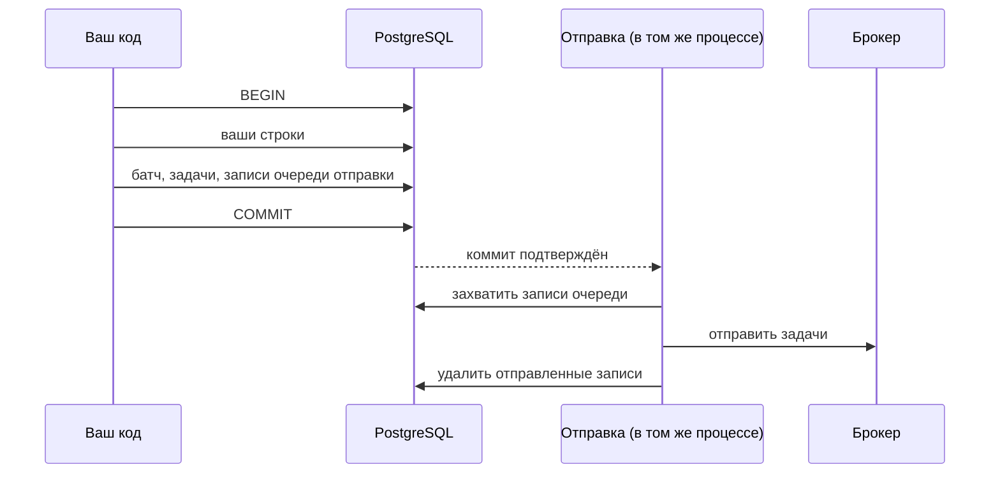

# Запись и отправка в брокер

Задачу нужно записать в базу и отправить в брокер. Это две разные системы, и одной транзакцией
их не охватить. Если сначала отправить, а потом откатить транзакцию, воркер получит задачу,
которой нет. Если сначала закоммитить, а потом упасть, задача останется в базе навсегда.

tallyho решает это очередью отправки в базе.

## Очередь отправки

Вместе с задачей в той же транзакции появляется запись в таблице `th_outbox`. Она означает «эту
задачу ещё нужно отправить». Откат транзакции убирает и задачу, и запись. Коммит сохраняет обе.

Отправляет каждый процесс, в котором установлен адаптер брокера, двумя способами.

Сразу после коммита процесс отправляет то, что сам только что записал. Задержка измеряется
миллисекундами.

Раз в `sweep_interval` тот же процесс делает страховочный проход: отправляет все записи старше
`relay_grace`, кто бы их ни создал. Так уходят записи процесса, упавшего между коммитом и
отправкой, задачи с наступившим отложенным стартом и задачи, возвращённые после истёкшей аренды.

Несколько процессов друг другу не мешают. Запись захватывает один из них, остальные её
пропускают. Если процесс упал, уже захватив запись, она вернётся в очередь через
`relay_claim_ttl`.

## Отправка может повториться

Процесс отправил задачу в брокер и упал, не успев удалить запись. Другой процесс отправит её
ещё раз, и в брокере окажутся два сообщения об одной задаче. Это нормальная ситуация, отправка
работает по принципу at-least-once.

Второе сообщение ничего не испортит. Когда воркер получает задачу, он сверяется с базой: если
задача уже выполняется или завершена, сообщение отбрасывается. Выполняется задача по тому
сообщению, которое первым взяло аренду.

У каждой задачи есть номер отправки. Он растёт, когда задача возвращается в очередь: после
истёкшей аренды, штатной остановки воркера или `retry_failed()`. Номер уходит в брокер вместе с
сообщением. По нему библиотека отличает сообщение текущей отправки от старого, которое всё ещё
лежит в брокере или в его DLQ.

## Что откладывает отправку

У записи в очереди есть время, раньше которого её не отправляют. Этим временем управляют три
механизма.

| Механизм | Что происходит с записью |
|---|---|
| отложенный старт `start_at` | время отправки равно `start_at`; `reschedule()` его переносит |
| пауза | время отодвигается в бесконечность, `resume()` возвращает его |
| `max_in_flight` | запись ждёт, пока в окне батча освободится место |

Окно `max_in_flight` считает задачи, которые отправлены и ещё не завершены. Отправка добавляет
задачу в окно, запись итога убирает. Поэтому лимит ограничивает и очередь брокера, и
выполнение сразу.

Задача, пришедшая из брокера в батч на паузе, не выполняется. Она возвращается в очередь
отправки с отодвинутым временем и уйдёт в брокер заново после `resume()`.

## Процесс без брокера

Процесс, созданный с `th.install(None)`, очередь отправки не трогает. Так работает команда
`tallyho maintenance`. Всё, что его проверки ставят в очередь (возврат задачи умершего воркера,
колбэк пропущенной финализации), отправят процессы с адаптером своим страховочным проходом.

Отсюда практическое следствие: хотя бы один процесс с адаптером должен работать всегда. Иначе
записи копятся в базе, и задачи никуда не уходят.
