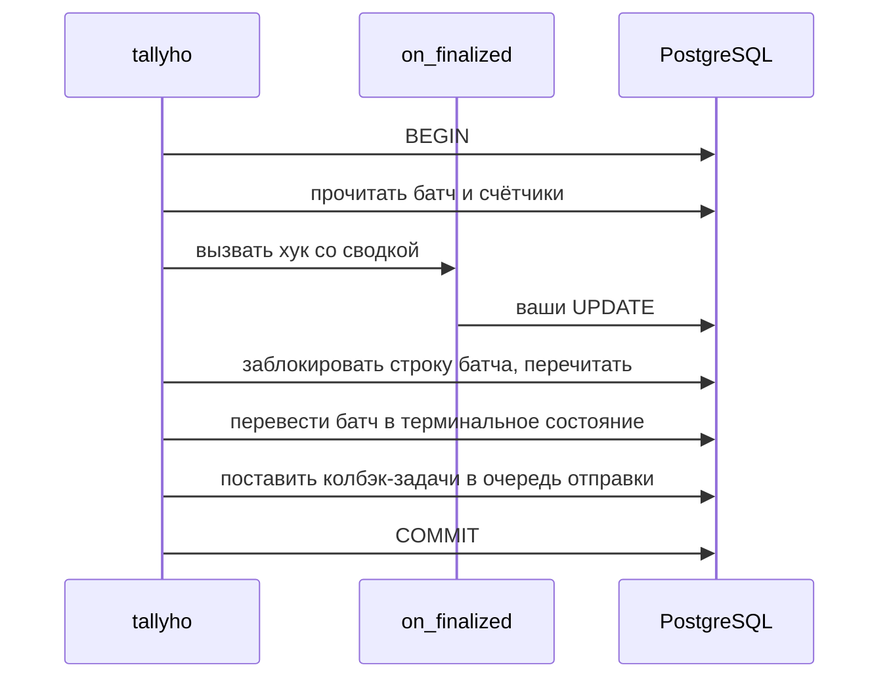

# Финализация и хуки

Финализация переводит батч в терминальное состояние. Обещание библиотеки звучит так: ваш хук
`on_finalized` закоммичен ровно один раз, и только вместе с этим переходом. На этой странице
разобрано, за счёт чего обещание выполняется.

## Одна транзакция

Порядок здесь главный: сначала ваш хук, потом переход батча. У него три следствия.

Блокировки берутся в одном порядке везде. Хук блокирует ваши строки раньше, чем tallyho
блокирует свою. Если в API вы пишете так же, сначала своя строка, потом
`handle.pause(session=...)`, то хук и API-операция не образуют дедлок.

Проигравший откатывает и ваши изменения. Два процесса могут начать финализацию одного батча
одновременно, и хук выполнится в обоих. Перевести батч в терминальное состояние удастся только
одному. Второй получит отказ и откатит транзакцию вместе со всем, что записал его хук.

Итог выбирается под блокировкой. Между первым чтением и блокировкой строки батча мог
закоммититься `cancel()`, дедлайн или политика. Тогда итог, который получил хук, устарел.
Транзакция откатывается, и хук вызывается заново, уже с новым итогом. Сводка, которую получил
закоммиченный вызов хука, всегда совпадает с тем, что записано в батче.

Отсюда же требование к хуку: только работа с базой, и запись в форме «установить итог». Хук
может выполниться больше одного раза, а закоммитится один.

## Когда хук падает

Исключение или таймаут в хуке откатывают транзакцию целиком. Батч остаётся `SEALED`, счётчик
попыток растёт, текст ошибки сохраняется в `view.hook_error`. Фоновые проверки повторяют
финализацию с растущей паузой: она удваивается от `hook_backoff_initial` до `hook_backoff_max`,
по умолчанию от секунды до пяти минут.

Без успешного хука батч терминальным не станет. Это сознательный выбор: зависший батч заметен и
чинится, а разошедшиеся статусы в вашей таблице и в библиотеке можно не заметить никогда.

То же происходит, когда хук в процессе не зарегистрирован. При создании батча запоминается,
какие хуки есть у его `kind`. Процесс, в котором нужного хука нет, батч не финализирует и
оставляет его процессу, где хук есть.

## Кто запускает финализацию

Обычно это процесс, записавший итог последней задачи: после группового коммита он проверяет
затронутые батчи. После операций (`seal`, `cancel`, `retry_failed`) финализацию запускает
процесс, который их выполнил.

Если проверка не случилась, например процесс упал сразу после коммита, батч подберут фоновые
проверки через `finalize_grace`.

## Дерево и конвейер

Этап с `fed_by` закрывает библиотека, и делает это внутри транзакции финализации его источника.
Источник финализирован, и в той же транзакции проверяется, все ли источники этапа уже
терминальны. Если все, этап переходит в `SEALED`.

Писать в этап могут только его собственные задачи и задачи его источников. Этого правила
хватает, чтобы этап не закрылся раньше времени. Пока задача источника жива, источник не
финализирован, а значит этап открыт. Закрыть его и добавить в него задачу одновременно нельзя по
построению.

Пустой этап зависанием не считается. Этап, в который не пришло ни одной задачи, закрывается и
сразу финализируется, каскадом закрывая следующие.

Родитель финализируется после всех детей. Финализация под-батча в той же транзакции завершает
задачу, которой он представлен у родителя. Поэтому хуки детей всегда коммитятся раньше
родительского, и это верно при отмене, дедлайне и провале по политике.

Итог распространяется вверх. Если хотя бы один прямой ребёнок завершился с ошибками, провалом
или отменой, родитель без собственной более сильной причины станет `COMPLETED_WITH_ERRORS`.

## Снимки прогресса

Хук `on_progress` вызывает лидер maintenance. Он держит в памяти расписание активных батчей с
этим хуком и раз в `every` читает счётчики каждого. Если числа не изменились, в базу ничего не
пишется.

Снимок выполняется отдельной транзакцией: ваш хук, затем увеличение номера снимка у батча с
условием «батч ещё не финализирован и номер не изменился». Если условие не выполнено, транзакция
откатывается вместе с изменениями хука. Поэтому опоздавший снимок не может перезаписать итог
финализации.

Номер снимка приходит в `summary.seq`. У финализации он больше, чем у любого снимка прогресса.

## Колбэк-задачи

Колбэк ставится в очередь отправки внутри транзакции финализации. Поэтому постановка происходит
ровно один раз на финализацию и не теряется при падении процесса. Дальше колбэк ведёт себя как
обычная задача брокера: доставка at-least-once, а идентификатор `callback_id` при повторной
доставке не меняется.

## Удаление по retention

Завершённые деревья удаляет лидер maintenance: порциями, от листьев к корню, по тысяче задач за
раз. Корень становится кандидатом, когда истёк `retention` и, если задан `release_required`,
вызван `release()`.

С этого момента дерево закрыто для операций, даже если до него ещё не дошла очередь на удаление.
`retry_failed`, `cancel`, `pause` и остальные бросают `BatchPurged`. Иначе `retry_failed` мог бы
переоткрыть дерево посреди удаления и вернуть успех, а дерево всё равно исчезло бы.

Следа удалённое дерево не оставляет. Удалённый батч неотличим от несуществовавшего.
