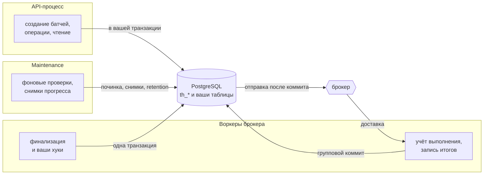

# Архитектура

Раздел объясняет, что происходит внутри, от общего к частному. Для работы с библиотекой читать
его не обязательно. Он пригодится, когда нужно понять, что tallyho создал в вашей базе, почему
батч ведёт себя так, а не иначе, и чего ждать при сбое.

## Общая картина

tallyho не сервер. Это библиотека внутри ваших процессов, а всё её состояние лежит в таблицах
`th_*` той же базы PostgreSQL, где живут ваши данные.



Четыре вещи, которые библиотека делает в ваших процессах:

| Что | Где работает | Страница |
|---|---|---|
| Записывает задачи и отправляет их в брокер после коммита | в каждом процессе с адаптером брокера | [Запись и отправка](dispatch.md) |
| Учитывает выполнение и записывает итоги пачками | в воркерах | [Счётчики и прогресс](counters.md) |
| Финализирует батч и вызывает ваши хуки | там, где завершилась последняя задача, или в maintenance | [Финализация и хуки](finalization.md) |
| Чинит последствия сбоев, делает снимки, удаляет старое | в одном экземпляре maintenance, лидере | [Модель отказов](failures.md) |

## Три решения, на которых всё держится

Состояние в вашей базе. Библиотека пишет в ту же базу, что и вы, поэтому создание батча, запись
итога задачи и финализация могут попасть в одну транзакцию с вашими данными. Отсюда требование
одной базы PostgreSQL.

Брокер только доставляет. Что задача существует, кому она принадлежит и чем закончилась, знает
база, а не брокер. Поэтому повторная доставка не выполняет задачу дважды, а потерянное сообщение
отправляется заново.

Ничего не ждёт вечно. У каждого шага есть срок, после которого фоновые проверки доводят его до
конца: неотправленное отправляют, потерянную задачу возвращают в очередь, пропущенную финализацию
выполняют.

## Страницы раздела

::::{grid} 1 1 2 3
:class-row: surface
:padding: 0
:gutter: 2

:::{grid-item-card} Жизненный цикл
:link: lifecycle
:link-type: doc

Состояния батча и задачи, флаги паузы и отложенного старта.
:::

:::{grid-item-card} Запись и отправка
:link: dispatch
:link-type: doc

Как задача попадает из вашей транзакции в брокер и почему не теряется.
:::

:::{grid-item-card} Счётчики и прогресс
:link: counters
:link-type: doc

Откуда берутся числа в `view()` и как считаются оценка объёма и ETA.
:::

:::{grid-item-card} Финализация и хуки
:link: finalization
:link-type: doc

Что происходит в транзакции, которая завершает батч.
:::

:::{grid-item-card} Хранилище
:link: storage
:link-type: doc

Таблицы, колонки и индексы, которые библиотека создаёт в вашей базе.
:::

:::{grid-item-card} Модель отказов
:link: failures
:link-type: doc

Каждый сбой: что случится и через сколько всё восстановится.
:::

:::{grid-item-card} Точки расширения
:link: extension
:link-type: doc

Протоколы для своего брокера, наблюдателя, часов и сериализации.
:::

::::

Этот раздел описывает поведение, на которое можно опираться. Подробности реализации (порядок
блокировок, запросы горячего пути, принятые решения) лежат во внутреннем документе
`docs/ARCHITECTURE.md` в репозитории.

```{toctree}
:hidden:

lifecycle
dispatch
counters
finalization
storage
failures
extension
```
