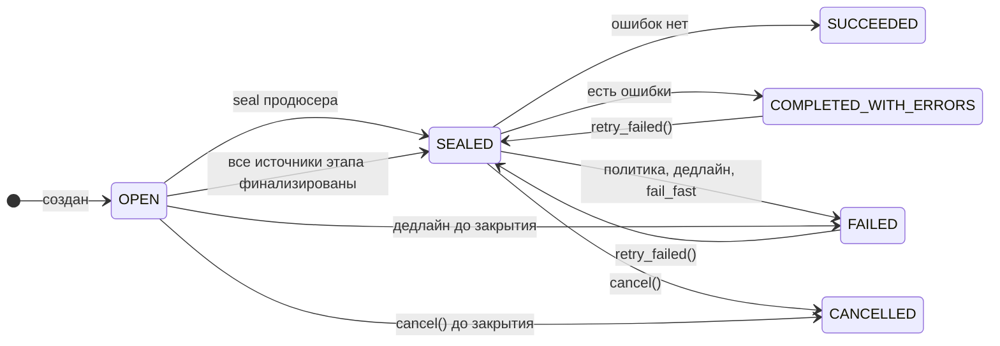
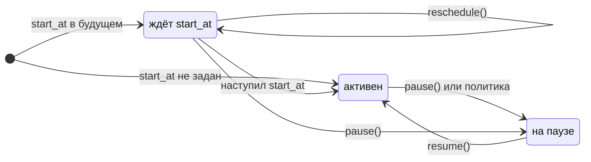
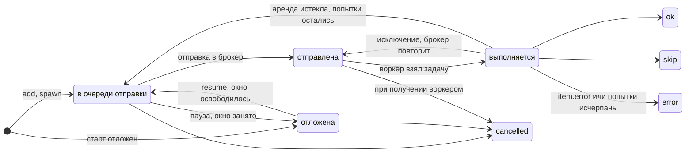

# Жизненный цикл

## Батч

Батч финализируется, когда в нём не осталось незавершённых задач и новых быть не может. Второе
условие выполняется в двух случаях: батч закрыт (`SEALED`) или у него запрошена отмена. Поэтому
открытый батч без запроса отмены не завершится никогда, даже если все его задачи сделаны.

Переход в терминальное состояние происходит в одной транзакции с вашим хуком `on_finalized`. Если
хук упал, транзакция откатывается целиком, и батч остаётся `SEALED` до следующей попытки. Как это
устроено, разобрано на странице [Финализация и хуки](finalization.md).

### Отмена ставит флаг

`cancel()`, дедлайн, `fail_fast` и политика с действием «провалить» не переводят батч в
терминальное состояние сами. Они записывают запрос отмены с причиной, и дальше происходит вот что:

1. новые задачи в батч не принимаются;
2. неотправленные задачи сразу получают итог `cancelled`;
3. отправленные отменяются, когда их получает воркер;
4. выполняющиеся доделываются;
5. когда незавершённых не осталось, батч финализируется обычным путём, через тот же хук.

Итог определяет причина: `cancel()` даёт `CANCELLED`, а дедлайн, `fail_fast` и политика дают
`FAILED`. Первая причина выигрывает. Дедлайн, наступивший после `cancel()`, не превратит `CANCELLED` в `FAILED`.

`retry_failed()` запрос отмены не снимает. Батч, проваленный по дедлайну или политике, после
повтора снова завершится `FAILED` с той же причиной.

### Пауза и отложенный старт

Это флаги, а не состояния. Батч на паузе остаётся `OPEN` или `SEALED`.

На паузе новые задачи не уходят в брокер, пришедшие из брокера откладываются без выполнения, а
выполняющиеся доделываются. Финализация при этом разрешена: если на момент паузы оставались только
выполняющиеся задачи, батч завершится, не дожидаясь `resume()`.

Отдельного планировщика для отложенного старта нет. У каждой записи в очереди отправки есть время,
раньше которого её не отправляют, и `start_at` попросту задаёт это время.

## Задача

В таблице задач хранится только одно из пяти значений: `active` или класс итога. Подробное
состояние живой задачи видно по тому, в каких служебных таблицах у неё есть строка.

| Где задача | Признак |
|---|---|
| в очереди отправки | есть запись в `th_outbox`, время отправки наступило |
| отложена | есть запись в `th_outbox`, время отправки в будущем: отложенный старт, пауза, окно `max_in_flight` |
| отправлена в брокер | нет записи ни в `th_outbox`, ни в `th_lease` |
| выполняется | есть аренда в `th_lease` |
| завершена | итог `ok`, `skip`, `error` или `cancelled` и метка |

Завершённая задача неизменяема. Единственное исключение из этого правила явное:
`retry_failed()` возвращает ошибочные задачи в работу.

### Аренда

Когда воркер берёт задачу, он записывает аренду: кто выполняет, какая попытка и до какого момента.
Пока задача работает, аренда продлевается раз в `heartbeat_every`. Аренда отвечает на два вопроса.

Жив ли исполнитель. Если аренда не продлена до `lease_ttl`, фоновые проверки считают задачу
потерянной. При оставшихся попытках она возвращается в очередь отправки, иначе получает итог
`error` с меткой `"lease_expired"`.

Чья это задача. Повторная доставка того же сообщения, пока аренда жива, задачу второй раз не
запускает. А задача, пережившая свою аренду, не может записать итог: он уже принадлежит другой
попытке или записан без неё.
