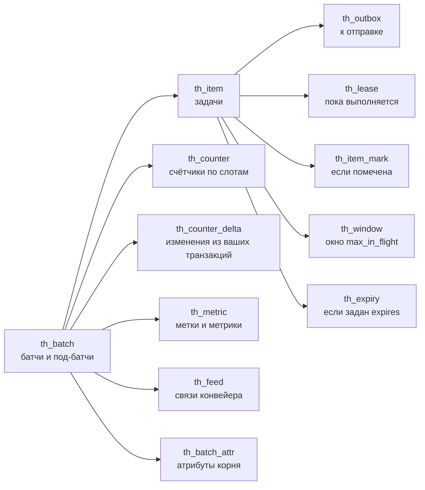

# Хранилище

Всё состояние tallyho лежит в таблицах вашей базы PostgreSQL. Схему и префикс имён задаёте вы:
`Tallyho(engine, schema="app", prefix="th_")`. На этой странице таблицы показаны с префиксом по
умолчанию.

Страница собирается из кода схемы при сборке сайта, поэтому колонки, типы и индексы на ней
совпадают с тем, что создаёт миграция.

## Как таблицы связаны



Стрелка ведёт от строки к строкам, которые на неё ссылаются. Под-батч ссылается на родителя в
той же таблице `th_batch`. Внешние ключи не объявлены. Целостность держит библиотека, а retention удаляет дерево целиком.

## Таблицы

```{tallyho-schema}
```

Колонка без пометки обязательна. `PK` означает первичный ключ, `NULL` означает, что значение может
отсутствовать.

## Почему так много маленьких таблиц

Строка задачи обновляется один раз за жизнь, когда записывается итог. Чтобы это обновление было
дешёвым, на таблице задач нет индексов по изменяемым колонкам: PostgreSQL записывает новую версию
строки на ту же страницу и не трогает индексы.

Но выборки «что в очереди», «что выполняется», «что упало с такой-то меткой» всё равно нужны
быстрыми. Для них есть узкие служебные таблицы: `th_outbox`, `th_lease`, `th_item_mark`,
`th_window`. Строка в такой таблице появляется, когда задача попадает в соответствующее
состояние, и удаляется, когда покидает его. Размер этих таблиц равен объёму текущей работы, а
не истории.

Атрибуты корня вынесены в `th_batch_attr` по той же причине. Строка батча меняется часто, а
JSON с индексом для поиска рядом с ней переписывался бы при каждом изменении.

## Параметры хранения

Миграция сама задаёт параметры таблицам с частой записью. Менять их вручную не нужно, достаточно
не выключать autovacuum.

| Таблицы | Параметры | Зачем |
|---|---|---|
| `th_counter`, `th_metric` | `fillfactor=50`, очистка по порогу в тысячу мёртвых строк | счётчики обновляются постоянно; свободное место на странице позволяет обновлять без записи в индексы, а ранняя очистка не даёт страницам распухать |
| `th_outbox`, `th_lease`, `th_counter_delta`, `th_window` | очистка по порогу в тысячу мёртвых строк | в эти таблицы вставляют и тут же удаляют; их размер должен отражать текущую работу |
| `th_item` | `fillfactor=85` | место на странице для единственного обновления задачи |

Что проверить на своей стороне и как найти транзакцию, которая мешает очистке, описано на
странице [PostgreSQL](../guide/operations/postgres.md).

## Время и идентификаторы

Идентификаторы батчей и задач имеют формат UUIDv7: они растут со временем, поэтому новые строки
ложатся в конец индекса, а не в случайное место.

Все сроки (аренда, отложенный старт, дедлайн, retention) сверяются по часам базы. Расхождение
часов между серверами приложения на учёт не влияет.

## Миграции

Версия схемы хранится в `th_meta`. Создать и обновить таблицы можно тремя способами:
`th.migrate()`, ревизии [Alembic](../integrations/alembic.md) и команда
[`tallyho migrate`](../reference/cli.md). Обратных миграций нет.
