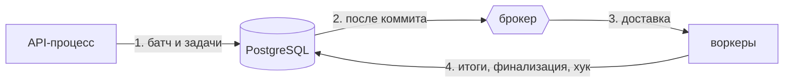
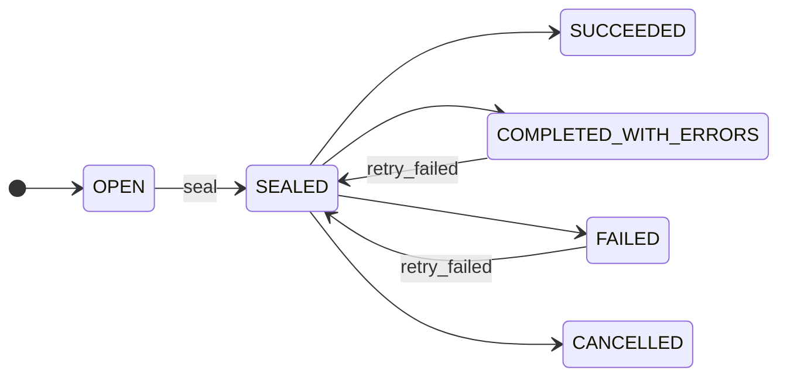
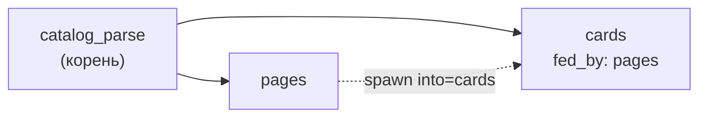

# Основные понятия

tallyho - библиотека, отдельного сервера у неё нет. Она работает внутри ваших процессов: в API,
который создаёт батчи, и в воркерах брокера, которые выполняют задачи. Состояние лежит в
таблицах `th_*` вашей базы PostgreSQL.

Батч и задачи записываются в вашей транзакции. В брокер они уходят только после коммита, а итоги,
финализация и ваш хук возвращаются в ту же базу.

Задачи исполняет брокер. tallyho считает, что с ними произошло, и в нужный момент вызывает
ваш код.

## Словарь

| Термин | Значение |
|---|---|
| Батч | группа задач с общим учётом: счётчики, состояние, прогресс, финализация |
| `kind` | строковый тип батча (`"campaign_deliveries"`). По нему находятся [хуки](hooks.md) |
| `key` | ключ идемпотентного создания и связи с вашей сущностью. У корня уникален в пределах `kind` (`"campaign:42"`), у под-батча в пределах дерева (`"send"`) |
| Item | одна задача брокера внутри батча |
| Под-батч | батч внутри батча. Для родителя выглядит одной задачей |
| Этап конвейера | под-батч, который наполняют задачи других под-батчей (`fed_by`) |
| Seal | «новых задач не будет». Без этого батч не завершится |
| Класс итога | технический итог задачи: `ok`, `skip`, `error`, `cancelled` |
| Метка (label) | свободная строка-категория итога (`"sent"`, `"hard_bounce"`). По меткам ведутся счётчики |
| Хук | ваша функция, которую tallyho выполняет внутри своей транзакции на событии батча |
| Аренда (lease) | отметка «эту задачу сейчас выполняет такой-то воркер». Воркер её продлевает, а если перестал, задача считается потерянной и возвращается в очередь |
| Maintenance | фоновые проверки: возвращают задачи умерших воркеров, подбирают пропущенные финализации, делают снимки прогресса, удаляют старые деревья |

## Жизнь батча

| Состояние | Когда |
|---|---|
| `OPEN` | создан, задачи ещё могут добавляться |
| `SEALED` | закрыт для добавления, задачи выполняются |
| `SUCCEEDED` | все задачи завершены, ошибок нет |
| `COMPLETED_WITH_ERRORS` | все задачи завершены, есть ошибки, политика ошибок не сработала |
| `FAILED` | сработала политика ошибок с действием «провалить» или истёк дедлайн |
| `CANCELLED` | батч отменён |

Четыре последних состояния терминальные (`state.is_terminal`). Переход в любое из них называется
финализацией. Она происходит ровно один раз и атомарно с вашим хуком `on_finalized`: если хук
упал, батч остаётся `SEALED` и финализация повторяется.

Пауза и отложенный старт - флаги, в этот список они не входят. Батч на паузе остаётся `OPEN` или
`SEALED`, его задачи не уходят в брокер. Отмена, дедлайн и `fail_fast` тоже срабатывают не
мгновенно. Они ставят запрос отмены, выполняющиеся задачи доделываются, и батч финализируется
обычным путём, через тот же хук.

## Жизнь задачи

Задача - обычная `async def`. Её итог попадает в один из четырёх классов.

| Класс | Как получается |
|---|---|
| `ok` | задача вернулась или вызвала `item.ok(label)` |
| `skip` | `item.skip(label)`: работа не понадобилась, это не ошибка |
| `error` | `item.error(label)` либо брокер исчерпал ретраи (метка `"exhausted"`) |
| `cancelled` | батч отменили раньше, чем задача начала выполняться |

Исключение в задаче ведёт к ретраю. Когда и сколько раз повторять, решает брокер. После завершения задача неизменяема: повторная доставка того же сообщения её не
запустит.

## Дерево и конвейер

Батч может содержать под-батчи, а те свои под-батчи. Родитель завершится только после всех
детей. Если под-батчу указать источники (`fed_by`), он становится этапом конвейера: задачи
источников добавляют в него работу через `item.spawn(..., into="этап")`, а закрывает его сама
библиотека, когда источники финализированы.

Этапы работают одновременно: `cards` начинает разбирать карточки с первой найденной, пока
`pages` ещё листает страницы. Подробнее - [Под-батчи и конвейеры](batches/pipelines.md).

## Что гарантируется

* Задачи выполняются at-least-once. Задача может начаться повторно после падения воркера или по
  ретраю брокера, но успешно завершиться может только один раз.
* Финализация - ровно один коммит вместе с `on_finalized`. Сам хук при этом может выполниться
  дважды (второе выполнение откатится), поэтому в нём допустима только работа с базой.
* Колбэк-задачи ставятся ровно один раз на финализацию, а выполняются at-least-once.

Это не durable execution. tallyho не воспроизводит код задачи с сохранённого места, как
Temporal или DBOS. Полный список оговорок - в [ограничениях](limitations.md#гарантии-выполнения).

## Что происходит при сбоях

| Сбой | Что делает tallyho | Сколько ждать |
|---|---|---|
| Процесс упал между коммитом и отправкой задач в брокер | задачи отправит страховочный проход любого процесса с адаптером | до 10 секунд (`relay_grace` и `sweep_interval`) |
| Брокер доставил сообщение дважды | дубль распознаётся, задача второй раз не выполняется | сразу |
| Воркер убит посреди задачи | аренда истекает, фоновые проверки возвращают задачу в очередь | `lease_ttl`, 60 секунд |
| Процесс остановлен штатно, задачи ещё идут | `th.aclose()` дописывает итоги и возвращает недоработавшие задачи в очередь, попытка не тратится | сразу |
| Финализацию никто не выполнил | её подбирают фоновые проверки | `finalize_grace`, 30 секунд |
| Хук `on_finalized` упал | финализация откатывается целиком и повторяется с растущей паузой | до 5 минут между попытками или сразу по `retry_finalize()` |
| Хук не зарегистрирован в процессе | этот процесс батч не финализирует, оставляет тому, где хук есть | пока не подберёт maintenance |
| Джоба ушла в DLQ брокера, итог задачи не записан | сверка с DLQ завершает задачу с меткой `"exhausted"` | `sweep_interval`, 5 секунд |
| Часы серверов приложения расходятся | все сроки считаются по часам базы | не влияет |

Все сроки здесь - значения по умолчанию, они меняются [настройками](../reference/settings.md).
Как устроены процессы и кто что подбирает, описано на странице
[Процессы и maintenance](operations.md).
