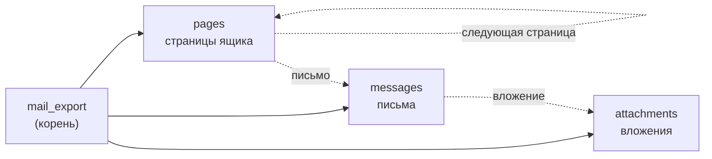

# Экспорт почты

Нужно выгрузить почту из нескольких ящиков вместе с вложениями. Заранее известно только число
ящиков. Сколько страниц в каждом, сколько писем на странице и вложений в письме, выясняется по
ходу: страницу надо прочитать, чтобы узнать, есть ли следующая.

При этом хочется видеть прогресс каждого шага, а в конце получить честный ответ, выгружено всё
или нет. Одного батча здесь мало, нужен конвейер.

## Дерево



Корневой батч и три этапа. Сплошные стрелки показывают, кто кому родитель. Пунктирные ведут от
этапа, который добавляет работу, к этапу, который её получает.

Этапы работают одновременно. Первое вложение начнёт скачиваться, когда листание ящиков ещё в
разгаре.

## Запуск

<!-- tallyho-noexec: фрагмент app/api.py; таблица export_runs принадлежит вашему приложению -->
```python
# app/api.py
async def start_export(session: AsyncSession, run_id: int, mailbox_ids: list[int]) -> None:
    async with th.batch(
        "mail_export",
        key=f"run:{run_id}",
        max_items=2_000_000,
        session=session,
    ) as root:
        pages = root.sub_batch("pages", max_depth=5_000)
        messages = root.sub_batch("messages", fed_by=[pages])
        root.sub_batch("attachments", fed_by=[messages], max_in_flight=20)
        await pages.add_calls(
            th.call(list_page, mailbox_id).opts(key=f"{mailbox_id}:first") for mailbox_id in mailbox_ids
        )
    await session.execute(
        insert(export_runs).values(id=run_id, batch_id=root.handle.id, status="running")
    )
    # commit делает вызывающий: строка запуска и всё дерево появятся вместе
```

Продюсер кладёт по одной задаче на ящик, первую страницу, и только в этап `pages`. Остальные
этапы он объявляет пустыми.

`fed_by` говорит, откуда этап получает работу: `messages` наполняют задачи `pages`, а
`attachments` наполняют задачи `messages`. У такого этапа есть важное свойство. Его нельзя закрыть
руками, это делает библиотека, когда все его источники финализированы. Раньше закрывать нельзя,
ведь источник ещё может добавить работу. Позже незачем: новой работе взяться неоткуда.

`max_in_flight` у каждого этапа свой. Скачиваний одновременно не больше двадцати, и медленные
вложения не мешают листать страницы.

`max_items` и `max_depth` здесь предохранители, к ним вернёмся [ниже](#предохранители).

## Страницы

<!-- tallyho-noexec: фрагмент app/tasks.py; mail принадлежит вашему приложению -->
```python
# app/tasks.py
@fq.task(max_retries=4, retry_on=[MailTemporaryError], queue="mail", timeout=120)
async def list_page(mailbox_id: int, cursor: str | None = None) -> None:
    page = await mail.list_page(mailbox_id, cursor)
    for message_id in page.message_ids:
        item.spawn(fetch_message, mailbox_id, message_id, into="messages", key=f"{mailbox_id}/{message_id}")
    if page.next_cursor is not None:
        item.spawn(list_page, mailbox_id, page.next_cursor)  # следующая страница, в свой же этап
```

`item.spawn(..., into="messages")` заказывает задачу в этапе `messages`. Сам вызов ничего не пишет
в базу: он кладёт заказ в буфер. Буфер записывается одной транзакцией с итогом задачи. Отсюда
главная гарантия конвейера: либо страница завершена и все её письма заказаны, либо не случилось
ни того, ни другого. Если воркер умер посреди страницы, она выполнится заново, и письма не
задвоятся.

`spawn` без `into=` добавляет задачу в собственный этап. Так выражается пагинация по курсору: одна
страница заказывает следующую, и цепочка обрывается, когда курсора больше нет.

Ключ `key=f"{mailbox_id}/{message_id}"` защищает от повторов. Почтовые API любят отдать одно
письмо на двух соседних страницах, если между запросами пришла новая почта. Вторая находка задачей
не станет, она увеличит счётчик `duplicates`.

## Письма

<!-- tallyho-noexec: фрагмент app/tasks.py; mail и storage принадлежат вашему приложению -->
```python
@fq.task(max_retries=4, retry_on=[MailTemporaryError], queue="mail", timeout=120)
async def fetch_message(mailbox_id: int, message_id: str) -> None:
    try:
        message = await mail.fetch(mailbox_id, message_id)
    except MessageNotFound:
        item.skip("deleted")  # письмо удалили, пока шла выгрузка
        return

    await storage.save_message(mailbox_id, message)
    for attachment in message.attachments:
        item.spawn(download, mailbox_id, attachment.id, into="attachments", key=attachment.sha256)
    item.ok("with_files" if message.attachments else "plain")
```

Письмо, удалённое между листанием и разбором, для выгрузки не ошибка. Задача ловит
`MessageNotFound` и завершается итогом `skip`: работа не понадобилась. `MailTemporaryError` она не
ловит, с ним разберутся ретраи flexiq.

Ключ вложения здесь его хеш. Один и тот же файл, приложенный к сорока письмам рассылки, скачается
один раз.

## Вложения

<!-- tallyho-noexec: фрагмент app/tasks.py; mail и storage принадлежат вашему приложению -->
```python
@fq.task(max_retries=6, retry_on=[MailTemporaryError], queue="files", timeout=600)
async def download(mailbox_id: int, attachment_id: str) -> None:
    if await storage.has_file(attachment_id):
        item.skip("already_saved")
        return
    body = await mail.download(mailbox_id, attachment_id)
    await storage.save_file(attachment_id, body)
    item.incr("bytes", len(body))
    item.ok("saved")
```

`item.incr("bytes", ...)` ведёт собственную метрику этапа. Сумма по всем задачам видна в
`view.metrics["bytes"]`, считать её отдельным запросом не нужно.

:::{warning}
Задача может начаться повторно: воркер упал после `storage.save_file`, но до записи итога.
tallyho гарантирует, что задача успешно завершится один раз, а не что её код выполнится один раз.
Поэтому `download` сначала спрашивает хранилище, а `save_message` должен спокойно переживать
повторную запись того же письма.
:::

## Предохранители

Объём неизвестен, значит, ошибка в коде листания способна породить бесконечную работу. На это есть
два ограничителя.

`max_items` у корня ограничивает число задач во всём дереве. Задачи сверх лимита не создаются и
ошибкой не считаются, они попадают в счётчик `skipped_by_limit`. Лимит мягкий: под нагрузкой
дерево может немного его превысить, так что это страховка, а не квота.

`max_depth` у этапа ограничивает длину цепочки «задача заказала задачу в своём этапе». Для `pages`
это число страниц одного ящика. Если курсор зациклился, листание оборвётся на пятитысячной
странице.

После выгрузки `skipped_by_limit` должен быть нулём. Иначе выгрузка неполная, хотя ошибок в ней
нет.

## Что получилось

<!-- tallyho-noexec: фрагмент app/api.py; th из app/tasks.py -->
```python
handle = await th.find("mail_export", "run:7")
view = await handle.view()
print(view.state.name)
for key, stage in view.children.items():
    print(key, stage.state.name, stage.progress.done, dict(stage.labels))

# SUCCEEDED
# pages SUCCEEDED 312 {'ok': 312}
# messages SUCCEEDED 15480 {'with_files': 2210, 'plain': 13262, 'deleted': 8}
# attachments SUCCEEDED 3904 {'saved': 3904}
```

Продюсер положил в дерево по задаче на ящик. Остальные девятнадцать тысяч нашлись сами, и все
этапы закрылись без единого вызова `seal()`.

Дальше два вопроса, ради которых конвейер и затевался: [что видно, пока выгрузка
идёт](export-progress.md), и [как понять, что она закончилась](export-finalization.md).
